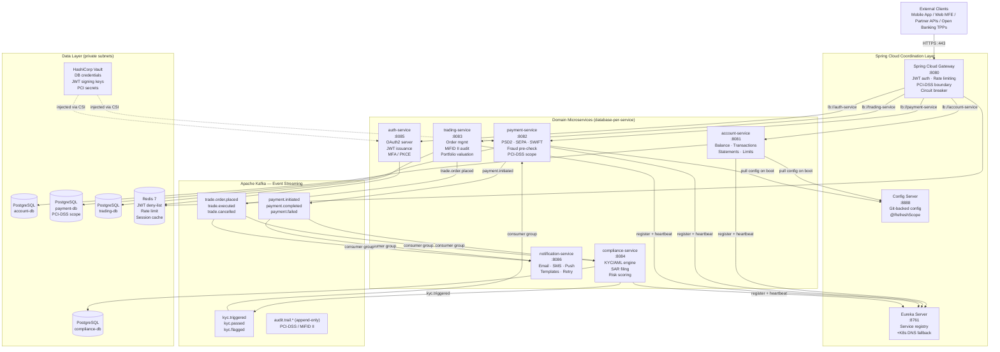
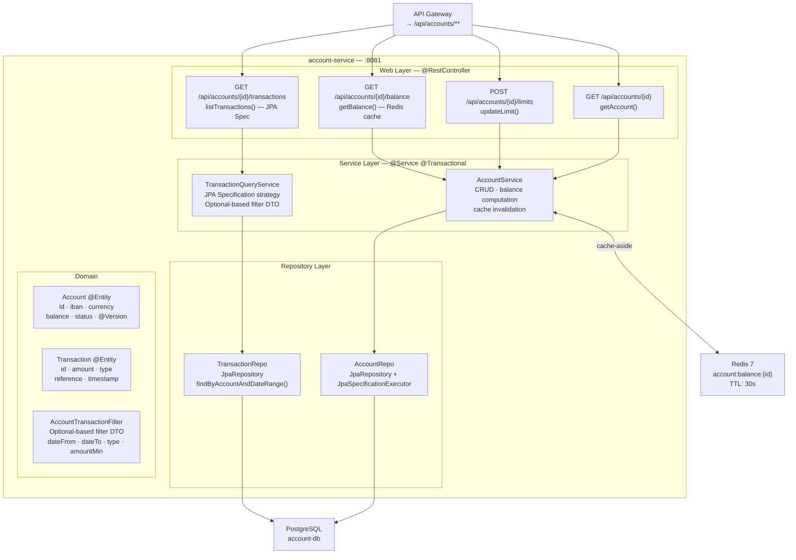
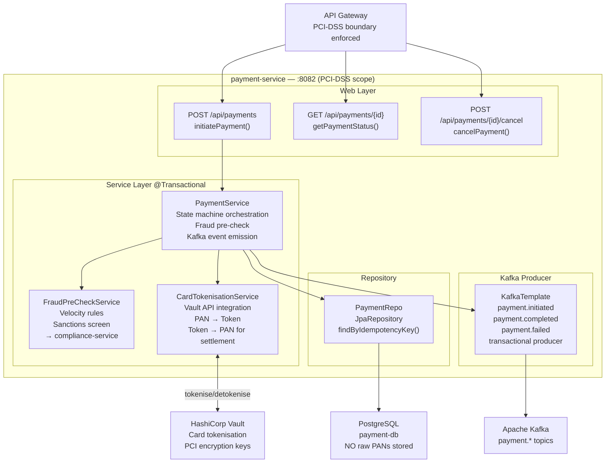
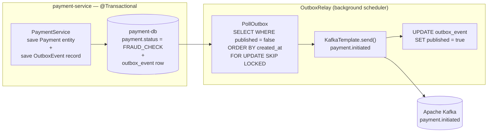
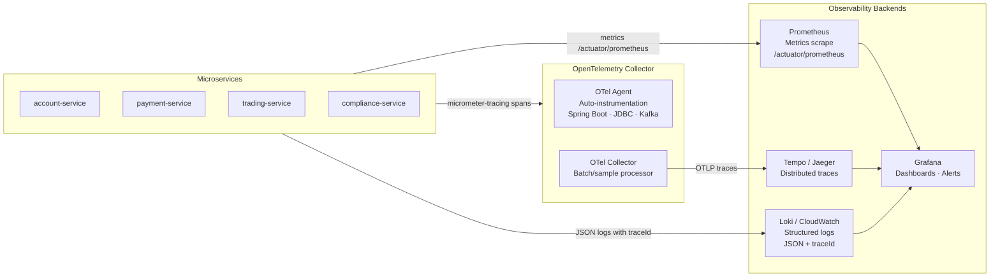

# Digital Banking & Wealth Platform — Back-End Microservices Architecture

> **Platform:** Digital Banking & Wealth Platform — Back-End Engineering Reference  
> **Stack:** Java 21 · Spring Boot 3.3 · Spring Cloud 2023 · Apache Kafka · PostgreSQL 16 · Redis 7 · Kubernetes  
> **Regulatory scope:** PCI-DSS Level 1 · SOC 2 Type II · PSD2/Open Banking · MiFID II · WCAG 2.1 AA  
> **Perspective:** Principal Back-End Engineer · Solution Architect · Data Engineer · QE · Product Owner

---

## Table of Contents

1. [Overall System Architecture](#1-overall-system-architecture)
2. [API Gateway Layer](#2-api-gateway-layer)
3. [Domain Microservices](#3-domain-microservices)
4. [Event Streaming Layer — Apache Kafka](#4-event-streaming-layer--apache-kafka)
5. [Data Layer](#5-data-layer)
6. [Security Architecture](#6-security-architecture)
7. [Observability & Monitoring](#7-observability--monitoring)
8. [Infrastructure & Deployment](#8-infrastructure--deployment)
9. [Testing Strategy](#9-testing-strategy)
10. [Architecture Decision Records (ADRs)](#10-architecture-decision-records-adrs)

---

## 1. Overall System Architecture

Six domain microservices behind a Spring Cloud Gateway, coordinated by Spring Cloud Config, Eureka, and Apache Kafka. All services run on Kubernetes (AWS EKS / Azure AKS). The PCI-DSS boundary is enforced at the API Gateway and the Payment Service.



---

### 1.1 Spring Boot vs Spring Cloud Responsibility Split

> **Mental model:** Spring Boot builds **one service** that runs perfectly alone. Spring Cloud coordinates **many services working together** reliably.

```
┌─────────────────────────────────────────────────────────────────┐
│  Spring Cloud  — Distributed System Coordination Layer          │
│  Config Server · Eureka · API Gateway · LoadBalancer            │
│  Circuit Breaker (Resilience4j) · Distributed Tracing           │
│  ┌───────────────────────────────────────────────────────────┐  │
│  │  Spring Boot  — Individual Service Platform               │  │
│  │  Embedded Tomcat (Virtual Threads) · Actuator · Starters  │  │
│  │  ┌─────────────────────────────────────────────────────┐  │  │
│  │  │  Business Application Code                          │  │  │
│  │  │  Web · Service · Repository · Domain Layer          │  │  │
│  │  └─────────────────────────────────────────────────────┘  │  │
│  └───────────────────────────────────────────────────────────┘  │
└─────────────────────────────────────────────────────────────────┘
```

---

## 2. API Gateway Layer

Spring Cloud Gateway is the **single ingress point** for all external traffic. It enforces JWT validation, rate limiting, PCI-DSS boundary isolation, and circuit breakers before any request reaches a domain microservice.


### 2.1 Gateway Route Configuration

```yaml
# gateway-service/src/main/resources/application.yml
spring:
  cloud:
    gateway:
      default-filters:
        - name: RequestRateLimiter
          args:
            redis-rate-limiter.replenishRate: 100
            redis-rate-limiter.burstCapacity: 200
            redis-rate-limiter.requestedTokens: 1
            key-resolver: "#{@clientIdKeyResolver}"
        - AddResponseHeader=X-Content-Type-Options, nosniff
        - AddResponseHeader=X-Frame-Options, DENY
        - AddResponseHeader=Strict-Transport-Security, max-age=31536000; includeSubDomains
        - DedupeResponseHeader=Access-Control-Allow-Origin

      routes:
        - id: account-service
          uri: lb://account-service
          predicates:
            - Path=/api/accounts/**
            - Method=GET,POST,PUT,DELETE
          filters:
            - name: CircuitBreaker
              args:
                name: account-cb
                fallbackUri: forward:/fallback/accounts
            - name: Retry
              args:
                retries: 2
                statuses: SERVICE_UNAVAILABLE,GATEWAY_TIMEOUT
                methods: GET
                backoff: { firstBackoff: 50ms, maxBackoff: 500ms }
            - AddRequestHeader=X-Source-Gateway, fintechbank-gateway
            - AddRequestHeader=X-Correlation-Id, "#{T(java.util.UUID).randomUUID().toString()}"

        - id: payment-service
          uri: lb://payment-service
          predicates:
            - Path=/api/payments/**
          filters:
            - name: CircuitBreaker
              args:
                name: payment-cb
                fallbackUri: forward:/fallback/payments
            # PCI-DSS: strip card data from logs, enforce TLS 1.3
            - RemoveRequestHeader=X-Card-Number
            - RemoveRequestHeader=X-CVV

        - id: trading-service
          uri: lb://trading-service
          predicates:
            - Path=/api/trading/**
          filters:
            - name: CircuitBreaker
              args:
                name: trading-cb
                fallbackUri: forward:/fallback/trading
```

### 2.2 JWT Authentication Filter

```java
// gateway-service — global pre-filter; runs before routing
@Component
@Order(-100)
public class JwtAuthenticationFilter implements GlobalFilter {

    private final JwtService      jwtService;
    private final RedisTemplate<String, String> redis;

    @Override
    public Mono<Void> filter(ServerWebExchange exchange, GatewayFilterChain chain) {
        String path = exchange.getRequest().getPath().value();

        // Public paths bypass JWT validation
        if (path.startsWith("/api/auth/") || path.startsWith("/actuator/health")) {
            return chain.filter(exchange);
        }

        String authHeader = exchange.getRequest().getHeaders().getFirst(HttpHeaders.AUTHORIZATION);
        if (authHeader == null || !authHeader.startsWith("Bearer ")) {
            return unauthorized(exchange, "Missing or malformed Authorization header");
        }

        String token = authHeader.substring(7);

        // Check Redis deny-list (logout / revoked tokens)
        if (Boolean.TRUE.equals(redis.hasKey("jwt:denied:" + jwtService.extractJti(token)))) {
            return unauthorized(exchange, "Token has been revoked");
        }

        try {
            Claims claims = jwtService.validateAndExtract(token);
            ServerHttpRequest mutated = exchange.getRequest().mutate()
                    .header("X-Authenticated-UserId",  claims.getSubject())
                    .header("X-Authenticated-Roles",   claims.get("roles", String.class))
                    .header("X-Client-Id",             claims.get("client_id", String.class))
                    .build();
            return chain.filter(exchange.mutate().request(mutated).build());
        } catch (JwtException ex) {
            return unauthorized(exchange, "Invalid or expired token: " + ex.getMessage());
        }
    }

    private Mono<Void> unauthorized(ServerWebExchange exchange, String detail) {
        exchange.getResponse().setStatusCode(HttpStatus.UNAUTHORIZED);
        exchange.getResponse().getHeaders().set(HttpHeaders.CONTENT_TYPE, "application/problem+json");
        String body = """
                {"type":"https://api.fintechbank.com/errors/unauthorized",
                 "title":"Unauthorized","status":401,"detail":"%s"}
                """.formatted(detail);
        DataBuffer buffer = exchange.getResponse().bufferFactory()
                .wrap(body.getBytes(StandardCharsets.UTF_8));
        return exchange.getResponse().writeWith(Mono.just(buffer));
    }
}
```

---

## 3. Domain Microservices

### 3.0 Service Topology

| Service | Port | Primary Responsibility | PCI Scope | MiFID II | DB |
|---|---|---|---|---|---|
| `account-service` | 8081 | Balance · Transactions · Statements · Account limits | ❌ | ❌ | `account-db` |
| `payment-service` | 8082 | SEPA/SWIFT initiation · PSD2 SCA · Fraud pre-check · Card tokenisation | ✅ | ❌ | `payment-db` |
| `trading-service` | 8083 | Order placement · Portfolio valuation · MiFID II audit trail | ❌ | ✅ | `trading-db` |
| `compliance-service` | 8084 | KYC/AML engine · SAR filing · Risk scoring · Sanctions screening | ❌ | ❌ | `compliance-db` |
| `auth-service` | 8085 | OAuth2 Authorization Server · JWT issuance · MFA/PKCE · Token rotation | ✅ | ❌ | (Redis-backed) |
| `notification-service` | 8086 | Email · SMS · Push notifications · Template management · Retry | ❌ | ❌ | `notification-db` |

---

### 3.1 Account Service

> **Role:** Core account management — balances, transaction history, account limits, and statement generation.  
> **Pattern:** CQRS-lite — read queries use Redis cache-aside; write commands go directly to PostgreSQL and invalidate cache.  
> **Key Features:** Virtual threads (Java 21) · Spring Data JPA Specification for dynamic transaction filtering · Redis cache-aside · RFC-7807 ProblemDetail error responses.



#### 3.1a — Account Domain Entities

| Entity | Table | PK | Key Fields | Java Feature |
|---|---|---|---|---|
| `Account` | `account` | `UUID id` | `iban`, `currency`, `balance`, `status`, `@Version version` | `@Version` optimistic locking prevents concurrent balance corruption |
| `Transaction` | `transaction` | `UUID id` | `accountId`, `amount`, `type`, `reference`, `valueDate`, `bookingDate` | Java 21 records for projection DTOs |
| `AccountLimit` | `account_limit` | `UUID id` | `accountId`, `limitType`, `dailyAmount`, `singleAmount` | Embedded `@Embeddable MonetaryAmount` record |

#### 3.1b — Balance Cache-Aside Pattern

```java
// AccountService.java
@Service
@Transactional(readOnly = true)
public class AccountService {

    private static final String CACHE_KEY = "account:balance:";
    private static final Duration CACHE_TTL = Duration.ofSeconds(30);

    private final AccountRepo        accountRepo;
    private final RedisTemplate<String, BigDecimal> redis;

    /**
     * Cache-aside: try Redis first → fall through to DB on miss → populate cache.
     * @Version on Account entity ensures concurrent writes are caught via optimistic locking.
     */
    public BigDecimal getBalance(UUID accountId) {
        String key = CACHE_KEY + accountId;
        BigDecimal cached = redis.opsForValue().get(key);
        if (cached != null) {
            return cached;
        }

        BigDecimal balance = accountRepo.findById(accountId)
                .map(Account::getBalance)
                .orElseThrow(() -> new AccountNotFoundException(accountId));

        redis.opsForValue().set(key, balance, CACHE_TTL);
        return balance;
    }

    @Transactional  // write path — invalidate cache after commit
    public void updateBalance(UUID accountId, BigDecimal delta) {
        Account account = accountRepo.findByIdForUpdate(accountId)  // SELECT FOR UPDATE
                .orElseThrow(() -> new AccountNotFoundException(accountId));
        account.applyDelta(delta);  // @Version incremented on save
        accountRepo.save(account);
        redis.delete(CACHE_KEY + accountId);  // invalidate after write
    }
}
```

---

### 3.2 Payment Service (PCI-DSS Scope)

> **Role:** Initiates, validates, and settles financial payments (SEPA Credit Transfer, SWIFT, PSD2 SCA). Handles card tokenisation via Vault. All card data is tokenised before persistence — raw PANs never touch the database.  
> **Pattern:** Saga (orchestration pattern) via Kafka — payment state machine transitions emit events consumed by compliance-service and notification-service.  
> **Key Features:** PCI-DSS isolation · Vault card tokenisation · Kafka event emission · Exactly-once semantics · @Version optimistic locking · ProblemDetail RFC-7807.



#### 3.2a — Payment State Machine

```
CREATED ──► FRAUD_CHECK ──► SCA_REQUIRED ──► AUTHORISED ──► SETTLED
   │              │                               │               │
   │          REJECTED                         FAILED         REVERSED
   │          (fraud)                          (timeout)
   └──► CANCELLED (by customer before AUTHORISED)
```

#### 3.2b — Idempotency Guard

```java
// PaymentService.java — idempotency key prevents duplicate payment submission
@Service
@Transactional
public class PaymentService {

    @KafkaProducer(transactional = true)
    public PaymentDTO initiatePayment(InitiatePaymentRequest req) {
        // Idempotency guard — if same key already processed, return existing result
        return paymentRepo.findByIdempotencyKey(req.idempotencyKey())
                .map(PaymentDTO::from)
                .orElseGet(() -> createNewPayment(req));
    }

    private PaymentDTO createNewPayment(InitiatePaymentRequest req) {
        // Tokenise card if present (PCI-DSS: never persist raw PAN)
        String paymentRef = req.cardDetails() != null
                ? cardTokenisationService.tokenise(req.cardDetails())
                : null;

        Payment payment = Payment.builder()
                .id(UUID.randomUUID())
                .idempotencyKey(req.idempotencyKey())
                .amount(req.amount())
                .currency(req.currency())
                .cardToken(paymentRef)     // token only — no raw PAN
                .status(PaymentStatus.FRAUD_CHECK)
                .createdAt(Instant.now())
                .build();

        Payment saved = paymentRepo.save(payment);

        // Emit Kafka event transactionally (same DB transaction)
        kafkaTemplate.executeInTransaction(ops ->
                ops.send("payment.initiated", saved.getId().toString(),
                        PaymentInitiatedEvent.from(saved)));

        return PaymentDTO.from(saved);
    }
}
```

---

### 3.3 Trading Service (MiFID II Scope)

> **Role:** Order management for equity, bond, and fund trades. Every order placement and execution generates an immutable MiFID II audit record (Transaction Reporting). Optimistic locking prevents overselling.  
> **Pattern:** Write-through to audit Kafka topic on every order lifecycle transition — audit records are append-only and cannot be modified.  
> **Key Features:** `@Version` optimistic locking on `Order` entity · MiFID II Transaction Report generation · Kafka audit trail · Portfolio valuation via market data service.

#### 3.3a — Trading Domain Entities

| Entity | Table | Key Fields | Constraint |
|---|---|---|---|
| `Order` | `trade_order` | `id`, `customerId`, `instrument`, `side`, `quantity`, `limitPrice`, `status`, `@Version version` | `@Version` prevents concurrent execution of same order |
| `Execution` | `trade_execution` | `id`, `orderId`, `executedQuantity`, `executedPrice`, `venue`, `timestamp` | Immutable after creation — no updates |
| `MifidReport` | `mifid_transaction_report` | `id`, `orderId`, `reportType`, `reportedAt`, `regulatoryBody` | Append-only — no deletes |
| `Portfolio` | `portfolio` | `customerId`, `instrumentId`, `quantity`, `averageCost`, `@Version version` | Optimistic lock on portfolio update |

#### 3.3b — Optimistic Locking + MiFID II Audit

```java
// TradingService.java
@Service
@Transactional
public class TradingService {

    public OrderDTO placeOrder(PlaceOrderRequest req) {
        // Validate against account balance / margin requirements
        accountServiceClient.validateFunds(req.accountId(), req.estimatedCost());

        Order order = Order.builder()
                .id(UUID.randomUUID())
                .customerId(req.customerId())
                .instrument(req.instrument())
                .side(req.side())
                .quantity(req.quantity())
                .limitPrice(req.limitPrice())
                .status(OrderStatus.PENDING)
                .mifidOrderId(generateMifidOrderId())  // LEI-based MiFID II identifier
                .build();

        Order saved = orderRepo.save(order);

        // MiFID II: emit order placement report within T+1
        kafkaTemplate.send("audit.trail.mifid",
                MifidOrderReport.orderPlaced(saved));

        // Emit for portfolio evaluation
        kafkaTemplate.send("trade.order.placed",
                TradeOrderPlacedEvent.from(saved));

        return OrderDTO.from(saved);
    }

    /**
     * Execute order — optimistic locking prevents double execution.
     * If two execution attempts arrive concurrently, @Version collision throws
     * ObjectOptimisticLockingFailureException → Kafka retry handles re-processing.
     */
    public void executeOrder(UUID orderId, ExecutionDetails execution) {
        Order order = orderRepo.findByIdForUpdate(orderId)  // loads with @Version
                .orElseThrow(() -> new OrderNotFoundException(orderId));

        if (order.getStatus() != OrderStatus.PENDING) {
            throw new OrderAlreadyProcessedException(orderId, order.getStatus());
        }

        order.execute(execution);  // @Version incremented by Hibernate
        orderRepo.save(order);     // throws OptimisticLockingFailureException on conflict

        // MiFID II Transaction Report — must be filed within T+1
        mifidReportService.generateTransactionReport(order, execution);

        kafkaTemplate.send("trade.executed", TradeExecutedEvent.from(order, execution));
    }
}
```

---

### 3.4 Compliance Service (KYC/AML)

> **Role:** KYC (Know Your Customer) identity verification and AML (Anti-Money Laundering) transaction monitoring. Integrates with third-party sanctions screening APIs (Refinitiv, WorldCheck). Files Suspicious Activity Reports (SARs) per regulatory requirement.  
> **Pattern:** Event-driven — primarily reacts to `payment.initiated` and `trade.order.placed` Kafka events via consumer group. Also exposes synchronous API for onboarding KYC checks.  
> **Key Features:** Kafka consumer group `compliance.group` · Third-party screening resilience (circuit breaker) · SAR state machine · Risk score calculation.

```java
// ComplianceEventConsumer.java
@Component
@Slf4j
public class ComplianceEventConsumer {

    @KafkaListener(
        topics    = {"payment.initiated", "trade.order.placed"},
        groupId   = "compliance.group",
        containerFactory = "kafkaListenerContainerFactory"
    )
    @Transactional
    public void onFinancialEvent(ConsumerRecord<String, FinancialEvent> record) {
        FinancialEvent event = record.value();
        log.info("Compliance check: eventType={} entityId={} traceId={}",
                event.type(), event.entityId(), MDC.get("traceId"));

        RiskAssessment assessment = riskEngine.assess(event);

        switch (assessment.outcome()) {
            case PASS   -> publishCompliancePass(event, assessment);
            case REVIEW -> createManualReviewTask(event, assessment);
            case BLOCK  -> publishComplianceBlock(event, assessment);
            case SAR    -> {
                sarService.fileReport(event, assessment);
                publishComplianceBlock(event, assessment);
            }
        }
    }
}
```

---

### 3.5 Auth Service (OAuth2 Authorization Server)

> **Role:** OAuth2 Authorization Server using Spring Authorization Server 1.x. Issues JWTs (RS256) for user authentication and service-to-service M2M tokens. Supports PKCE for MFE clients and client credentials for backend services.  
> **Key Features:** Spring Authorization Server 1.x · PKCE flow for MFEs · Client credentials for service-to-service · MFA (TOTP/WebAuthn) gate · JWT deny-list on Redis · Key rotation via Vault.

```yaml
# auth-service/src/main/resources/application.yml
spring:
  security:
    oauth2:
      authorizationserver:
        issuer: https://auth.fintechbank.com
        token:
          access-token-time-to-live: 15m       # short-lived for PCI compliance
          refresh-token-time-to-live: 8h
          reuse-refresh-tokens: false           # rotate refresh tokens
        authorization-code:
          code-time-to-live: 5m
        client:
          registration:
            mfe-shell:
              client-id: ${MFE_CLIENT_ID}
              client-secret: "{noop}"            # PKCE — no client secret
              authorization-grant-types:
                - authorization_code
                - refresh_token
              redirect-uris:
                - https://app.fintechbank.com/callback
              scopes:
                - openid
                - profile
                - accounts:read
                - payments:write
                - trading:read
            service-m2m:
              client-id: ${M2M_CLIENT_ID}
              client-secret: ${M2M_CLIENT_SECRET}
              authorization-grant-types:
                - client_credentials
              scopes:
                - internal:read
                - internal:write
```

---

## 4. Event Streaming Layer — Apache Kafka

### 4.0 Topic Architecture

| Topic | Producers | Consumer Groups | Retention | Partitions | Key Strategy |
|---|---|---|---|---|---|
| `payment.initiated` | payment-service | compliance.group · notification.group | 7 days | 12 | `customerId` |
| `payment.completed` | payment-service | notification.group · account.group | 7 days | 12 | `customerId` |
| `payment.failed` | payment-service | notification.group | 7 days | 6 | `customerId` |
| `trade.order.placed` | trading-service | compliance.group | 90 days (MiFID II) | 6 | `customerId` |
| `trade.executed` | trading-service | notification.group · portfolio.group | 90 days | 6 | `customerId` |
| `kyc.triggered` | compliance-service | payment-service | 24h | 3 | `customerId` |
| `kyc.passed` | compliance-service | payment-service · trading-service | 24h | 3 | `customerId` |
| `kyc.flagged` | compliance-service | payment-service · trading-service | 7 days | 3 | `customerId` |
| `audit.trail.*` | all services | audit-archiver (S3/WORM) | 7 years (regulatory) | 24 | `entityId` |
| `notification.dispatch` | all services | notification.group | 48h | 6 | `customerId` |

### 4.1 Producer Configuration (Exactly-Once Semantics)

```java
// KafkaProducerConfig.java
@Configuration
public class KafkaProducerConfig {

    @Bean
    public ProducerFactory<String, Object> producerFactory(KafkaProperties props) {
        Map<String, Object> config = new HashMap<>(props.buildProducerProperties(null));

        // Exactly-once semantics (idempotent + transactional)
        config.put(ProducerConfig.ENABLE_IDEMPOTENCE_CONFIG,  true);
        config.put(ProducerConfig.ACKS_CONFIG,                "all");   // all ISR must ack
        config.put(ProducerConfig.RETRIES_CONFIG,             Integer.MAX_VALUE);
        config.put(ProducerConfig.MAX_IN_FLIGHT_REQUESTS_PER_CONNECTION, 1);
        config.put(ProducerConfig.TRANSACTIONAL_ID_CONFIG,    "payment-service-tx-");

        // Serialisation — Avro schema registry for schema evolution
        config.put(ProducerConfig.VALUE_SERIALIZER_CLASS_CONFIG,
                "io.confluent.kafka.serializers.KafkaAvroSerializer");
        config.put("schema.registry.url", "${kafka.schema-registry-url}");

        return new DefaultKafkaProducerFactory<>(config);
    }

    @Bean
    public KafkaTemplate<String, Object> kafkaTemplate(ProducerFactory<String, Object> pf) {
        KafkaTemplate<String, Object> template = new KafkaTemplate<>(pf);
        template.setObservationEnabled(true);  // OpenTelemetry auto-instrumentation
        return template;
    }
}
```

### 4.2 Consumer Configuration (At-Least-Once + Idempotency)

```java
// KafkaConsumerConfig.java
@Configuration
public class KafkaConsumerConfig {

    @Bean
    public ConsumerFactory<String, Object> consumerFactory(KafkaProperties props) {
        Map<String, Object> config = new HashMap<>(props.buildConsumerProperties(null));

        config.put(ConsumerConfig.AUTO_OFFSET_RESET_CONFIG,   "earliest");
        config.put(ConsumerConfig.ENABLE_AUTO_COMMIT_CONFIG,  false);       // manual ack
        config.put(ConsumerConfig.MAX_POLL_RECORDS_CONFIG,    50);
        config.put(ConsumerConfig.ISOLATION_LEVEL_CONFIG,     "read_committed"); // EOS
        config.put(ConsumerConfig.VALUE_DESERIALIZER_CLASS_CONFIG,
                "io.confluent.kafka.serializers.KafkaAvroDeserializer");
        config.put("specific.avro.reader", true);

        return new DefaultKafkaConsumerFactory<>(config);
    }

    @Bean
    public ConcurrentKafkaListenerContainerFactory<String, Object> kafkaListenerContainerFactory(
            ConsumerFactory<String, Object> cf) {

        var factory = new ConcurrentKafkaListenerContainerFactory<String, Object>();
        factory.setConsumerFactory(cf);
        factory.getContainerProperties().setAckMode(ContainerProperties.AckMode.MANUAL_IMMEDIATE);
        factory.setConcurrency(3);

        // Dead Letter Topic for poison messages
        factory.setCommonErrorHandler(new DefaultErrorHandler(
                new DeadLetterPublishingRecoverer(kafkaTemplate()),
                new FixedBackOff(1000L, 3)));  // retry 3× with 1s backoff → DLT

        factory.getContainerProperties().setObservationEnabled(true);
        return factory;
    }
}
```

### 4.3 Outbox Pattern (Transactional Outbox)

> **Problem:** Publishing a Kafka event and saving to PostgreSQL must be atomic. If the service crashes between the two operations, state becomes inconsistent.  
> **Solution:** Write-to-outbox table in the same DB transaction. A separate relay process polls the outbox and publishes to Kafka.



---

## 5. Data Layer

### 5.0 Database-per-Service Pattern

Each domain service owns its database exclusively. No cross-service joins. Cross-service data sharing happens via Kafka events or synchronous API calls with circuit breakers.

```
account-service    ──► account-db    (PostgreSQL 16 — accounts, transactions, limits)
payment-service    ──► payment-db    (PostgreSQL 16 PCI-DSS scope — payments, outbox)
trading-service    ──► trading-db    (PostgreSQL 16 — orders, executions, portfolios, MiFID reports)
compliance-service ──► compliance-db (PostgreSQL 16 — KYC records, AML cases, SARs)
notification-service ──► notification-db (PostgreSQL 16 — message logs, templates)
```

### 5.1 Schema Migration — Liquibase

```yaml
# application.yml — all services use Liquibase for schema versioning
spring:
  liquibase:
    change-log: classpath:db/changelog/db.changelog-master.yaml
    contexts: ${SPRING_PROFILES_ACTIVE:dev}
    default-schema: public
    enabled: true
```

```yaml
# db/changelog/db.changelog-master.yaml (payment-service)
databaseChangeLog:
  - include:
      file: db/changelog/001-initial-schema.yaml
  - include:
      file: db/changelog/002-add-idempotency-key.yaml
  - include:
      file: db/changelog/003-add-outbox-table.yaml
  - include:
      file: db/changelog/004-add-pci-audit-columns.yaml
```

### 5.2 Connection Pooling — HikariCP

```yaml
# application.yml — tuned for 3-replica K8s deployment
spring:
  datasource:
    hikari:
      pool-name:             ${spring.application.name}-pool
      maximum-pool-size:     20    # 20 connections × 3 replicas = 60 max per service
      minimum-idle:          5
      idle-timeout:          300000   # 5 min
      connection-timeout:    30000    # 30s
      max-lifetime:          1800000  # 30 min (< PostgreSQL server timeout)
      leak-detection-threshold: 60000 # 1 min — alerts on unreturned connections
      connection-test-query: SELECT 1
```

### 5.3 Read/Write Separation (Trading Service)

```java
// DataSourceConfig.java — trading-service read replica for portfolio queries
@Configuration
public class DataSourceConfig {

    @Bean
    @Primary
    @ConfigurationProperties("spring.datasource.write")
    public DataSource writeDataSource() {
        return DataSourceBuilder.create().build();  // primary — handles writes
    }

    @Bean
    @ConfigurationProperties("spring.datasource.read")
    public DataSource readDataSource() {
        return DataSourceBuilder.create().build();  // read replica — portfolio queries
    }

    @Bean
    public DataSource routingDataSource(
            @Qualifier("writeDataSource") DataSource write,
            @Qualifier("readDataSource") DataSource read) {
        Map<Object, Object> targets = Map.of(
                DataSourceType.WRITE, write,
                DataSourceType.READ, read);
        var routing = new RoutingDataSource();
        routing.setTargetDataSources(targets);
        routing.setDefaultTargetDataSource(write);
        return routing;
    }
}

// @Transactional(readOnly = true) → routes to read replica automatically
@Service
public class PortfolioQueryService {

    @Transactional(readOnly = true)   // RoutingDataSource selects read replica
    public PortfolioSummaryDTO getPortfolioSummary(UUID customerId) {
        return portfolioRepo.findSummaryByCustomerId(customerId);
    }
}
```

### 5.4 Redis Usage

| Usage | Key Pattern | TTL | Service |
|---|---|---|---|
| Account balance cache | `account:balance:{accountId}` | 30s | account-service |
| JWT deny-list (logout/revoke) | `jwt:denied:{jti}` | Token remaining TTL | auth-service |
| Rate limit token bucket | `rl:{clientId}:{window}` | 60s | gateway |
| Session cache | `session:{sessionId}` | 30min | auth-service |
| KYC result cache | `kyc:result:{customerId}` | 1h | compliance-service |
| Idempotency cache | `idem:{idempotencyKey}` | 24h | payment-service |

---

## 6. Security Architecture

### 6.0 Defence-in-Depth Layers

```
Internet
    │
    ▼ TLS 1.3 (CloudFront / Azure Front Door)
WAF (AWS WAF / Azure Front Door WAF)
    │ SQL injection · XSS · Bot mitigation
    ▼
Spring Cloud Gateway
    │ JWT validation · Rate limiting · CORS · Security headers
    ▼
Kubernetes Network Policies
    │ East-west traffic: only declared service-to-service routes
    ▼
Spring Security (per microservice)
    │ OAuth2 Resource Server · Method-level @PreAuthorize
    ▼
PostgreSQL Row-Level Security (PCI-DSS scope)
    │ Payment service: RLS isolates card tokens per tenant
    ▼
HashiCorp Vault (secrets + PCI key management)
```

### 6.1 OAuth2 Resource Server Configuration (per microservice)

```java
// SecurityConfig.java — applied in account-service, payment-service, trading-service
@Configuration
@EnableWebSecurity
@EnableMethodSecurity
public class SecurityConfig {

    @Bean
    public SecurityFilterChain filterChain(HttpSecurity http) throws Exception {
        http
            .csrf(AbstractHttpConfigurer::disable)           // stateless JWT — no CSRF needed
            .sessionManagement(sm -> sm.sessionCreationPolicy(SessionCreationPolicy.STATELESS))
            .authorizeHttpRequests(auth -> auth
                .requestMatchers("/actuator/health", "/actuator/info").permitAll()
                .requestMatchers(HttpMethod.GET, "/api/accounts/**").hasAnyRole("CUSTOMER", "ADVISOR")
                .requestMatchers(HttpMethod.POST, "/api/payments/**").hasRole("CUSTOMER")
                .requestMatchers("/api/trading/admin/**").hasRole("TRADING_ADMIN")
                .anyRequest().authenticated()
            )
            .oauth2ResourceServer(oauth2 -> oauth2
                .jwt(jwt -> jwt
                    .jwkSetUri("${spring.security.oauth2.resourceserver.jwt.jwk-set-uri}")
                    .jwtAuthenticationConverter(jwtAuthenticationConverter())
                )
            );
        return http.build();
    }

    private JwtAuthenticationConverter jwtAuthenticationConverter() {
        var converter = new JwtGrantedAuthoritiesConverter();
        converter.setAuthoritiesClaimName("roles");
        converter.setAuthorityPrefix("ROLE_");
        var authConverter = new JwtAuthenticationConverter();
        authConverter.setJwtGrantedAuthoritiesConverter(converter);
        return authConverter;
    }
}
```

### 6.2 Method-Level Security

```java
// PaymentController.java
@RestController
@RequestMapping("/api/payments")
public class PaymentController {

    // Only the account holder can initiate payments from their account
    @PostMapping
    @PreAuthorize("hasRole('CUSTOMER') and #req.customerId().toString() == authentication.name")
    public ResponseEntity<PaymentDTO> initiatePayment(
            @RequestBody @Valid InitiatePaymentRequest req) {
        return ResponseEntity.status(HttpStatus.CREATED)
                .body(paymentService.initiatePayment(req));
    }

    // Only COMPLIANCE_OFFICER or FRAUD_ANALYST can view flagged payments
    @GetMapping("/flagged")
    @PreAuthorize("hasAnyRole('COMPLIANCE_OFFICER', 'FRAUD_ANALYST')")
    public ResponseEntity<List<PaymentDTO>> getFlaggedPayments() {
        return ResponseEntity.ok(paymentService.getFlaggedPayments());
    }
}
```

### 6.3 Secrets Management — HashiCorp Vault

```yaml
# application.yml — Vault integration via Spring Cloud Vault
spring:
  cloud:
    vault:
      host:              vault.fintechbank-infra.svc.cluster.local
      port:              8200
      scheme:            https
      authentication:    KUBERNETES            # K8s service account auto-auth
      kubernetes:
        role:            payment-service-role
        kubernetes-path: auth/kubernetes
      kv:
        enabled:        true
        backend:        secret
        default-context: payment-service
      # Secrets injected as Spring properties:
      # secret/payment-service/spring.datasource.password → DB password
      # secret/payment-service/vault.card-encryption.key → PCI encryption key
      # secret/payment-service/kafka.sasl.password       → Kafka credentials
```

---

## 7. Observability & Monitoring

### 7.0 Observability Stack



### 7.1 Structured Logging Pattern

```java
// application.yml — structured JSON logs with trace correlation
logging:
  pattern:
    console: >-
      {"timestamp":"%d{ISO8601}","level":"%p","service":"${spring.application.name}",
       "traceId":"%X{traceId}","spanId":"%X{spanId}","customerId":"%X{customerId}",
       "logger":"%logger{36}","message":"%msg"}%n
  level:
    root: INFO
    com.fintechbank: DEBUG
    # PCI-DSS: never log raw card data
    com.fintechbank.payment.card: WARN   # suppress verbose card processing logs
```

### 7.2 Actuator Endpoints

| Endpoint | HTTP | Purpose | K8s Probe |
|---|---|---|---|
| `/actuator/health/liveness` | `GET` | JVM alive | `livenessProbe.httpGet` |
| `/actuator/health/readiness` | `GET` | DB + Kafka + dependencies ready | `readinessProbe.httpGet` |
| `/actuator/prometheus` | `GET` | Prometheus metric scrape | — |
| `/actuator/info` | `GET` | Build version + git commit | Deployment dashboard |
| `/actuator/circuitbreakers` | `GET` | Per-service CB state (CLOSED/OPEN) | Alertmanager |
| `/actuator/env` | `GET` | _(restricted to ADMIN role in prod)_ | Config debugging |

### 7.3 SLA Alerting (Grafana Alertmanager)

| Alert | Condition | Severity | Notification |
|---|---|---|---|
| Payment service error rate | `rate(http_server_requests_seconds_count{status="5xx",service="payment-service"}[5m]) > 0.01` | CRITICAL | PagerDuty + Slack |
| Circuit breaker OPEN | `resilience4j_circuitbreaker_state{state="open"} > 0` | HIGH | Slack |
| Kafka consumer lag | `kafka_consumer_lag_sum > 10000` | HIGH | Slack |
| P99 payment latency | `histogram_quantile(0.99, ...) > 2.0` | HIGH | Slack |
| Vault seal detected | `vault_core_unsealed == 0` | CRITICAL | PagerDuty |

---

## 8. Infrastructure & Deployment

### 8.0 Container Image — Multi-Stage Dockerfile

```dockerfile
# ---- Stage 1: Build ----
FROM maven:3.9-eclipse-temurin-21 AS build
WORKDIR /app
COPY pom.xml .
RUN mvn dependency:go-offline -B          # cache deps layer
COPY src ./src
RUN mvn package -DskipTests -B           # ~700 MB build image — discarded

# ---- Stage 2: Runtime (~120 MB) ----
FROM eclipse-temurin:21-jre-alpine AS runtime
RUN addgroup -S appgroup && adduser -S appuser -G appgroup   # non-root user
WORKDIR /app
COPY --from=build /app/target/*.jar app.jar

# Security hardening
RUN chmod 500 app.jar
USER appuser

EXPOSE 8080

# Virtual threads enabled; JVM tuned for containers
ENTRYPOINT ["java",
  "-XX:MaxRAMPercentage=75.0",
  "-XX:+UseZGC",
  "-Dspring.threads.virtual.enabled=true",
  "-jar", "app.jar"]
```

### 8.1 Kubernetes Deployment (payment-service example)

```yaml
# k8s/payment-service/deployment.yaml
apiVersion: apps/v1
kind: Deployment
metadata:
  name: payment-service
  labels:
    app: payment-service
    version: "{{ .Values.image.tag }}"
    pci-scope: "true"
spec:
  replicas: 3
  selector:
    matchLabels:
      app: payment-service
  template:
    metadata:
      labels:
        app: payment-service
      annotations:
        prometheus.io/scrape: "true"
        prometheus.io/port: "8080"
        prometheus.io/path: "/actuator/prometheus"
        vault.hashicorp.com/agent-inject: "true"
        vault.hashicorp.com/role: "payment-service-role"
    spec:
      serviceAccountName: payment-service-sa
      securityContext:
        runAsNonRoot: true
        runAsUser: 1001
        fsGroup: 1001
      containers:
        - name: payment-service
          image: "registry.fintechbank.com/payment-service:{{ .Values.image.tag }}"
          ports:
            - containerPort: 8080
          env:
            - name: SPRING_PROFILES_ACTIVE
              value: "prod"
            - name: SPRING_DATASOURCE_URL
              valueFrom:
                secretKeyRef:
                  name: payment-db-secret
                  key: url
            - name: SPRING_THREADS_VIRTUAL_ENABLED
              value: "true"
          livenessProbe:
            httpGet:
              path: /actuator/health/liveness
              port: 8080
            initialDelaySeconds: 30
            periodSeconds: 10
            failureThreshold: 3
          readinessProbe:
            httpGet:
              path: /actuator/health/readiness
              port: 8080
            initialDelaySeconds: 20
            periodSeconds: 5
            failureThreshold: 3
          resources:
            requests:
              memory: "512Mi"
              cpu: "250m"
            limits:
              memory: "1Gi"
              cpu: "1000m"
---
apiVersion: autoscaling/v2
kind: HorizontalPodAutoscaler
metadata:
  name: payment-service-hpa
spec:
  scaleTargetRef:
    apiVersion: apps/v1
    kind: Deployment
    name: payment-service
  minReplicas: 3      # HA minimum for PCI-DSS
  maxReplicas: 20
  metrics:
    - type: Resource
      resource:
        name: cpu
        target:
          type: Utilization
          averageUtilization: 60    # conservative for payment processing
    - type: External
      external:
        metric:
          name: kafka_consumer_lag_payment_initiated
        target:
          type: AverageValue
          averageValue: "1000"      # scale when consumer lag grows
```

### 8.2 CI/CD Pipeline — GitHub Actions

```yaml
# .github/workflows/payment-service.yml
name: payment-service CI/CD

on:
  push:
    paths: ["services/payment-service/**"]
  pull_request:
    paths: ["services/payment-service/**"]

jobs:
  build-and-test:
    runs-on: ubuntu-latest
    services:
      postgres:
        image: postgres:16
        env:
          POSTGRES_DB: payment_test
          POSTGRES_USER: test
          POSTGRES_PASSWORD: test
        options: >-
          --health-cmd pg_isready
          --health-interval 10s
          --health-retries 5
      kafka:
        image: confluentinc/cp-kafka:7.6.0
    steps:
      - uses: actions/checkout@v4
      - uses: actions/setup-java@v4
        with:
          java-version: '21'
          distribution: 'temurin'
          cache: maven

      - name: Run unit tests
        run: mvn test -pl services/payment-service -Dtest="**Unit*"

      - name: Run integration tests (Testcontainers)
        run: mvn failsafe:integration-test -pl services/payment-service
        env:
          SPRING_PROFILES_ACTIVE: test

      - name: OWASP dependency check
        run: mvn org.owasp:dependency-check-maven:check -pl services/payment-service
        continue-on-error: false

      - name: Build and push container image
        if: github.ref == 'refs/heads/main'
        run: |
          docker build -t registry.fintechbank.com/payment-service:${{ github.sha }} .
          docker push registry.fintechbank.com/payment-service:${{ github.sha }}

  deploy-staging:
    needs: build-and-test
    if: github.ref == 'refs/heads/main'
    runs-on: ubuntu-latest
    steps:
      - name: Helm upgrade payment-service (staging)
        run: |
          helm upgrade --install payment-service ./helm/payment-service \
            --namespace staging \
            --set image.tag=${{ github.sha }} \
            --wait --timeout 10m

      - name: Run smoke tests (staging)
        run: mvn failsafe:integration-test -Dtest.profile=staging

      - name: Promote to production (canary 10%)
        run: |
          helm upgrade payment-service ./helm/payment-service \
            --namespace production \
            --set image.tag=${{ github.sha }} \
            --set canary.weight=10 \
            --wait
```

---

## 9. Testing Strategy

### 9.0 Testing Pyramid

```
                ┌─────────────────────────────────────────────────────────┐
                │  E2E / Load Tests — k6 · OWASP ZAP (nightly)           │
                │  Full payment journey · Performance baseline             │
                └─────────────────────────────────────────────────────────┘
              ┌────────────────────────────────────────────────────────────┐
              │  Contract Tests — Pact Provider Verification (on PR)       │
              │  Consumer-Driven Contracts · MFE ↔ account-service         │
              └────────────────────────────────────────────────────────────┘
            ┌──────────────────────────────────────────────────────────────┐
            │  Integration Tests — Testcontainers (on PR)                  │
            │  Real PostgreSQL · Real Kafka · Real Redis containers         │
            └──────────────────────────────────────────────────────────────┘
          ┌────────────────────────────────────────────────────────────────┐
          │  Unit Tests — JUnit 5 · Mockito · AssertJ (every commit)       │
          │  Service logic · Domain entities · Kafka consumer handlers      │
          └────────────────────────────────────────────────────────────────┘
```

**Target ratio:** 70% unit · 20% integration · 8% contract · 2% E2E/load

### 9.1 Unit Tests — JUnit 5 + Mockito

```java
// PaymentServiceTest.java
@ExtendWith(MockitoExtension.class)
class PaymentServiceTest {

    @Mock PaymentRepo            paymentRepo;
    @Mock KafkaTemplate<String, Object> kafkaTemplate;
    @Mock CardTokenisationService cardTokenService;
    @Mock FraudPreCheckService   fraudService;

    @InjectMocks PaymentService  paymentService;

    @Test
    @DisplayName("idempotent: duplicate idempotency key returns existing payment")
    void initiatePayment_duplicateIdempotencyKey_returnsExisting() {
        var existingPayment = buildPayment(PaymentStatus.AUTHORISED);
        when(paymentRepo.findByIdempotencyKey("IDEM-001")).thenReturn(Optional.of(existingPayment));

        var req = buildRequest("IDEM-001");
        var result = paymentService.initiatePayment(req);

        assertThat(result.id()).isEqualTo(existingPayment.getId());
        verifyNoInteractions(kafkaTemplate);    // no duplicate Kafka event
    }

    @Test
    @DisplayName("fraud rejected: payment transitions to REJECTED status")
    void initiatePayment_fraudDetected_rejectsPayment() {
        when(paymentRepo.findByIdempotencyKey(any())).thenReturn(Optional.empty());
        when(fraudService.check(any())).thenReturn(FraudResult.BLOCK);

        assertThatThrownBy(() -> paymentService.initiatePayment(buildRequest("IDEM-002")))
                .isInstanceOf(PaymentRejectedException.class)
                .hasMessageContaining("Fraud pre-check blocked");

        verify(kafkaTemplate).send(eq("payment.failed"), any(), any(PaymentFailedEvent.class));
    }
}
```

### 9.2 Integration Tests — Testcontainers

```java
// PaymentServiceIntegrationTest.java
@SpringBootTest
@Testcontainers
@ActiveProfiles("test")
@Transactional
class PaymentServiceIntegrationTest {

    @Container
    @ServiceConnection
    static PostgreSQLContainer<?> postgres =
            new PostgreSQLContainer<>("postgres:16")
                    .withInitScript("db/schema.sql");

    @Container
    @ServiceConnection
    static KafkaContainer kafka =
            new KafkaContainer(DockerImageName.parse("confluentinc/cp-kafka:7.6.0"));

    @Container
    @ServiceConnection
    static GenericContainer<?> redis =
            new GenericContainer<>("redis:7-alpine").withExposedPorts(6379);

    @Autowired PaymentService paymentService;
    @Autowired PaymentRepo    paymentRepo;

    @Test
    @DisplayName("full payment lifecycle: initiated → compliance-check → completed")
    void paymentLifecycle_happyPath() {
        var req = InitiatePaymentRequest.builder()
                .customerId(UUID.randomUUID())
                .amount(new BigDecimal("500.00"))
                .currency("GBP")
                .idempotencyKey("TEST-IDEM-001")
                .build();

        var payment = paymentService.initiatePayment(req);

        assertThat(payment.status()).isEqualTo(PaymentStatus.FRAUD_CHECK);
        assertThat(paymentRepo.findById(payment.id())).isPresent();

        // Verify Kafka event was published (Testcontainers kafka)
        await().atMost(5, SECONDS)
                .untilAsserted(() ->
                        assertThat(kafkaConsumerTest.getLastEvent("payment.initiated"))
                                .isNotNull()
                                .extracting(e -> e.idempotencyKey())
                                .isEqualTo("TEST-IDEM-001"));
    }

    @Test
    @DisplayName("optimistic locking: concurrent payment update throws exception")
    void paymentUpdate_concurrentModification_throwsOptimisticLockException() {
        var payment = paymentRepo.save(buildPayment());

        // Simulate two concurrent reads of same @Version entity
        var copy1 = paymentRepo.findById(payment.getId()).orElseThrow();
        var copy2 = paymentRepo.findById(payment.getId()).orElseThrow();

        copy1.setStatus(PaymentStatus.AUTHORISED);
        paymentRepo.save(copy1);   // first write succeeds

        copy2.setStatus(PaymentStatus.FAILED);
        assertThatThrownBy(() -> paymentRepo.saveAndFlush(copy2))
                .isInstanceOf(ObjectOptimisticLockingFailureException.class);
    }
}
```

### 9.3 Contract Tests — Pact (Consumer-Driven)

```java
// AccountServicePactProviderTest.java — verifies MFE shell's expectations are met
@Provider("account-service")
@PactBroker(url = "${PACT_BROKER_URL}", authentication = @PactBrokerAuth(token = "${PACT_TOKEN}"))
@SpringBootTest(webEnvironment = SpringBootTest.WebEnvironment.RANDOM_PORT)
class AccountServicePactProviderTest {

    @MockBean FraudPreCheckService fraudService;   // isolate provider test

    @State("account ABC123 exists with balance £1500")
    public void accountWithBalance() {
        when(accountRepo.findById(UUID.fromString("ABC123")))
                .thenReturn(Optional.of(buildAccount("ABC123", new BigDecimal("1500.00"))));
    }

    @TestTemplate
    @ExtendWith(PactVerificationInvocationContextProvider.class)
    void pactVerificationTestTemplate(PactVerificationContext context) {
        context.verifyInteraction();
    }
}
```

### 9.4 Load Tests — k6

```js
// load-tests/payment-initiation.js
import http from 'k6/http';
import { check, sleep } from 'k6';
import { Rate } from 'k6/metrics';

const errorRate = new Rate('errors');

export const options = {
    stages: [
        { duration: '2m', target: 100 },   // ramp up to 100 VUs
        { duration: '5m', target: 100 },   // sustain
        { duration: '1m', target: 200 },   // spike
        { duration: '2m', target: 0 },     // ramp down
    ],
    thresholds: {
        http_req_duration: ['p(99)<2000'],  // P99 < 2s SLA
        errors: ['rate<0.01'],              // < 1% error rate
    },
};

export default function () {
    const payload = JSON.stringify({
        customerId: 'TEST-CUSTOMER-001',
        amount: '100.00',
        currency: 'GBP',
        idempotencyKey: `k6-${__VU}-${__ITER}`,
    });

    const res = http.post(`${__ENV.BASE_URL}/api/payments`, payload, {
        headers: {
            'Content-Type': 'application/json',
            'Authorization': `Bearer ${__ENV.TEST_JWT}`,
        },
    });

    const ok = check(res, {
        'status 201': (r) => r.status === 201,
        'response time < 2s': (r) => r.timings.duration < 2000,
    });

    errorRate.add(!ok);
    sleep(1);
}
```

### 9.5 OWASP Security Testing

```yaml
# .github/workflows/security.yml — OWASP ZAP on staging weekly
  owasp-zap:
    runs-on: ubuntu-latest
    schedule:
      - cron: '0 2 * * 0'   # Sunday 2am
    steps:
      - name: ZAP Baseline Scan (payment-service staging)
        uses: zaproxy/action-baseline@v0.10.0
        with:
          target: 'https://staging-api.fintechbank.com/api/payments'
          rules_file_name: '.zap/rules.tsv'
          fail_action: true
          cmd_options: '-a -j'   # ajax spider + JSON report

      - name: OWASP Dependency Check
        run: mvn org.owasp:dependency-check-maven:check
          -DfailBuildOnAnyVulnerability=true
          -DassemblyAnalyzerEnabled=false
```

---

## 10. Architecture Decision Records (ADRs)

### ADR-001: Database-per-Service over Shared Database

| Attribute | Detail |
|---|---|
| **Status** | Accepted |
| **Date** | 2024-01-15 |
| **Context** | Six domain services — shared DB would create tight coupling, schema contention, and complicate PCI-DSS boundary isolation. |
| **Decision** | Each service owns exactly one database. Cross-service data access is via Kafka events (async) or HTTP API with circuit breaker (sync). |
| **Consequences** | ✅ PCI-DSS: payment-db isolated in dedicated subnet. ✅ Independent schema evolution. ✅ Technology flexibility (e.g., compliance-service could move to document DB). ⚠️ No cross-service JOINs — eventual consistency in read models. ⚠️ Distributed transactions require saga/outbox pattern. |

---

### ADR-002: Apache Kafka over Synchronous REST for Domain Events

| Attribute | Detail |
|---|---|
| **Status** | Accepted |
| **Date** | 2024-02-03 |
| **Context** | Payment completion must trigger KYC check, notification, and statement update. Options: (a) payment-service calls 3 services synchronously, (b) payment-service publishes to Kafka. |
| **Decision** | Kafka event streaming for all domain events. Services subscribe to relevant topics. Synchronous calls reserved for request-response patterns only (e.g., balance check before payment). |
| **Consequences** | ✅ Payment-service decoupled from compliance/notification/account. ✅ Events are replayable for audit and replay after incident. ✅ Eventual consistency acceptable for notification/compliance. ⚠️ Debugging event chains is harder than REST call stacks — requires distributed tracing. ⚠️ Exactly-once semantics require transactional outbox pattern. |

---

### ADR-003: RS256 JWT over Opaque Tokens for Service Authentication

| Attribute | Detail |
|---|---|
| **Status** | Accepted |
| **Date** | 2024-02-20 |
| **Context** | Microservices need to authenticate incoming requests. Options: (a) opaque token → introspection endpoint per request, (b) self-contained JWT verified at service boundary. |
| **Decision** | RS256 JWTs issued by auth-service. Public key distributed via JWKS endpoint. Each service verifies JWT locally (no introspection call). Gateway checks Redis deny-list for revoked tokens. |
| **Consequences** | ✅ Zero introspection network hop per request. ✅ Services can validate tokens even if auth-service is temporarily unavailable. ✅ 15-minute token TTL limits window of exposure for compromised tokens. ⚠️ Token revocation is delayed until TTL expiry — mitigated by Redis deny-list in Gateway. ⚠️ Key rotation requires coordinated JWKS cache refresh. |

---

### ADR-004: Transactional Outbox Pattern for Kafka Event Reliability

| Attribute | Detail |
|---|---|
| **Status** | Accepted |
| **Date** | 2024-03-05 |
| **Context** | Services must ensure that DB writes and Kafka event publishes are atomic. If a service crashes between the two, the system enters an inconsistent state (payment saved but no event, or event published but no payment). |
| **Decision** | All services that publish Kafka events use the transactional outbox pattern: write to outbox table in same DB transaction as business entity, then a relay process polls the outbox and publishes to Kafka. |
| **Consequences** | ✅ DB write and Kafka publish are atomic at the DB level. ✅ Outbox table acts as a durable event buffer. ✅ Kafka publish failure doesn't corrupt business state. ⚠️ Additional outbox table + relay component per service. ⚠️ At-least-once delivery — consumers must be idempotent. |

---

### ADR-005: Resilience4j Circuit Breaker over Istio Service Mesh

| Attribute | Detail |
|---|---|
| **Status** | Accepted |
| **Date** | 2024-04-10 |
| **Context** | Circuit breaking for service-to-service calls. Options: (a) Resilience4j library in each service, (b) Istio service mesh circuit breaking via Envoy proxy. |
| **Decision** | Resilience4j at the library level for domain services. Istio considered for network-level policies only (mTLS, traffic shaping). |
| **Consequences** | ✅ Resilience4j: code-level fallbacks give precise control over degraded responses per business operation. ✅ Per-service Actuator metrics (`/circuitbreakers`) without Istio sidecar overhead. ✅ Team owns the circuit breaker configuration in code — no separate mesh config files. ⚠️ Each service must add resilience annotations — platform-level circuit breaking requires Istio adoption. ⚠️ Configuration drift risk across services — mitigated by shared Spring Cloud config with Resilience4j defaults. |

---

*Generated 2025 · Digital Banking & Wealth Platform — Back-End Microservices Architecture Reference*  
*Stack: Java 21 · Spring Boot 3.3 · Spring Cloud 2023 · Apache Kafka · PostgreSQL 16 · Redis 7 · Kubernetes*  
*Regulatory scope: PCI-DSS Level 1 · SOC 2 Type II · PSD2 · MiFID II*  
*Perspective: Principal Back-End Engineer · Solution Architect · Data Engineer · QE*
