# Digital Banking & Wealth Platform — Back-End Sequence Diagrams

> **Platform:** Digital Banking & Wealth Platform — Back-End Engineering Reference  
> **Stack:** Java 21 · Spring Boot 3.3 · Spring Cloud 2023 · Apache Kafka · PostgreSQL 16 · Redis 7 · Kubernetes  
> **Regulatory scope:** PCI-DSS Level 1 · SOC 2 Type II · PSD2/Open Banking · MiFID II  
> **Perspective:** Principal Back-End Engineer · Solution Architect · Data Engineer · QE

---

## Index

| Flow | Scenario | Layer Focus |
|---|---|---|
| [Flow 1](#flow-1-api-gateway--jwt-validation--rate-limit--routing) | API Gateway: JWT validation, rate-limit, route to Payment service | Gateway · Security |
| [Flow 2](#flow-2-payment-initiation--transactional-processing--kafka-event) | Payment initiation: `@Transactional` processing + Kafka `payment.initiated` event | Service · Kafka |
| [Flow 3](#flow-3-pci-dss-card-tokenisation-via-vault) | PCI-DSS card tokenisation via HashiCorp Vault Transit Secrets Engine | Security · PCI |
| [Flow 4](#flow-4-account-service--redis-cache-aside-hit-and-miss-paths) | Account balance: Redis cache-aside (HIT path + MISS path) | Caching · Performance |
| [Flow 5](#flow-5-kafka-event-driven-compliance--kyc-check) | Kafka consumer: Compliance/KYC check triggered by `payment.initiated` | Event-Driven · Compliance |
| [Flow 6](#flow-6-trading-service--order-placement--optimistic-locking--mifid-ii-audit) | Trading order placement: `@Version` optimistic locking + MiFID II audit trail | Concurrency · Regulatory |
| [Flow 7](#flow-7-oauth2-jwt-resource-server-validation-chain) | OAuth2 JWT validation: JWKS fetch → signature verify → claims → SecurityContext | Auth · Security |
| [Flow 8](#flow-8-testcontainers-integration-test-lifecycle) | Testcontainers: PostgreSQL + Kafka containers, `@ServiceConnection`, test lifecycle | Testing · QE |
| [Flow 9](#flow-9-opentelemetry-distributed-tracing-across-services) | OpenTelemetry: trace propagation across Gateway → Payment → Kafka → Compliance | Observability |
| [Flow 10](#flow-10-microservice-canary-deploy--kubernetes-rolling-update) | Canary deploy: Kubernetes rolling update + Argo Rollouts metric gate | Deployment · SRE |

---

## Flow 1: API Gateway — JWT Validation, Rate-Limit, Routing

> **Scenario:** A mobile banking client sends `POST /api/payments` with a Bearer JWT. The Spring Cloud Gateway validates the token, checks Redis for revocation, enforces rate limiting, and routes to payment-service.  
> **Key patterns:** Global pre-filter chain · Redis token-bucket rate limiter · RFC-7807 ProblemDetail on rejection · W3C Trace Context injection · X-Correlation-Id propagation.

### 1a — Happy Path (valid JWT, under rate limit)

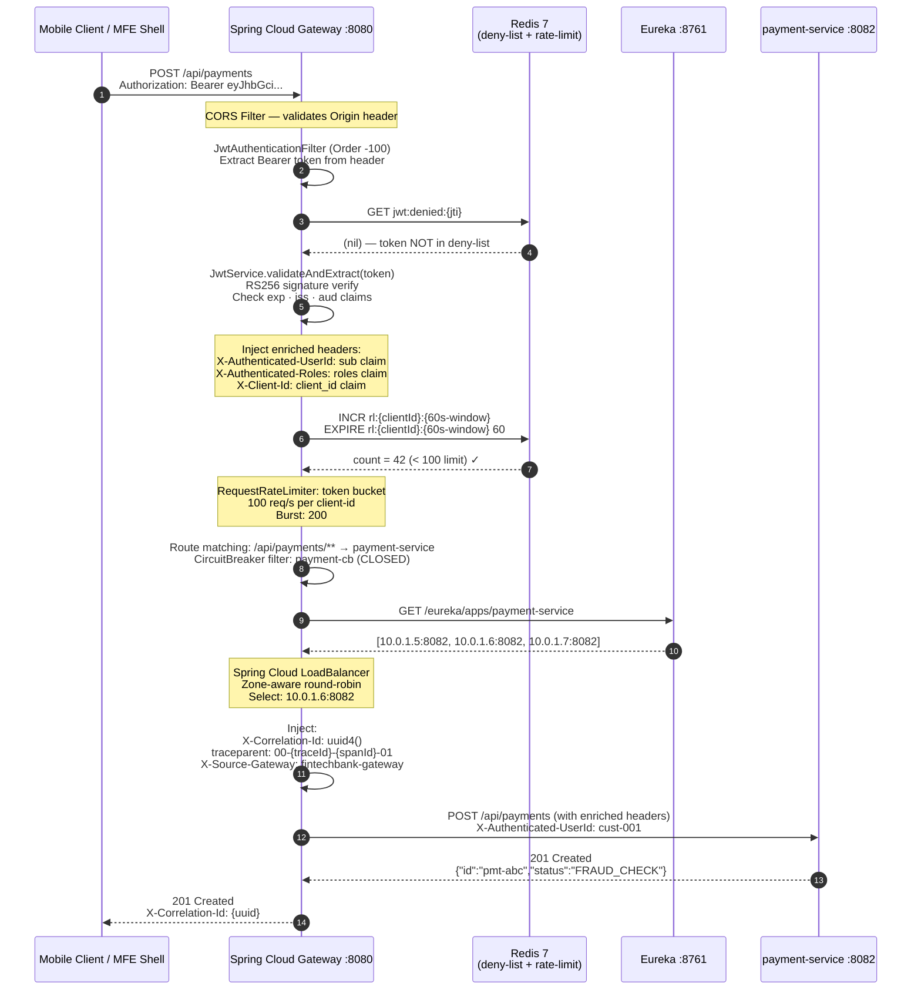

### 1b — Rejected Paths

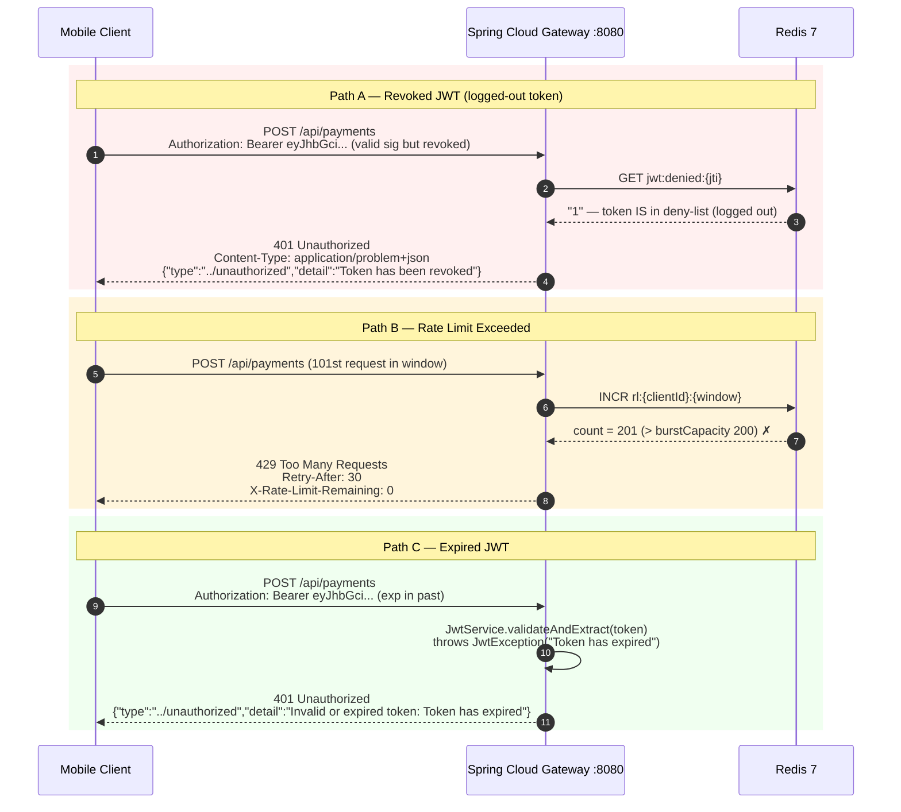

---

## Flow 2: Payment Initiation — Transactional Processing + Kafka Event

> **Scenario:** Authenticated POST reaches payment-service. The service validates, checks idempotency, runs fraud pre-check, persists via `@Transactional`, writes to the outbox table, and emits `payment.initiated` to Kafka using the transactional producer.  
> **Key patterns:** Idempotency guard · `@Transactional` + Kafka transactional producer · Outbox relay · RFC-7807 `ProblemDetail` on fraud rejection · Structured logging with `traceId`.

### 2a — Successful Payment Initiation

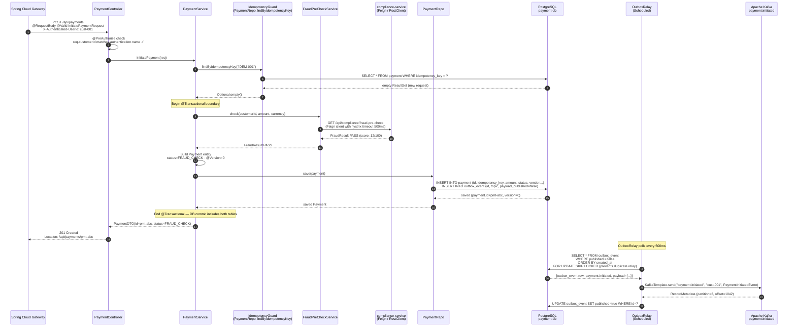

### 2b — Duplicate Idempotency Key (Replay Safety)

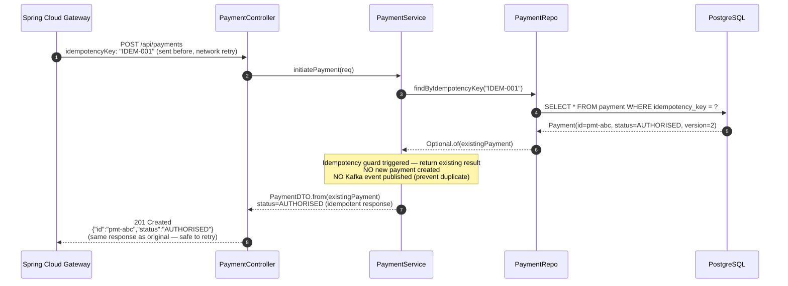

---

## Flow 3: PCI-DSS Card Tokenisation via Vault

> **Scenario:** Customer submits a payment with card details. payment-service calls HashiCorp Vault Transit Secrets Engine to tokenise the PAN before any persistence. Raw PANs never touch the database or appear in logs — only the token is stored.  
> **Key patterns:** Vault Transit Secrets Engine · PAN → Token (one-way at DB boundary) · Token → PAN only for settlement (secure detokenisation call) · PCI-DSS: no raw card data in logs, DB, or Kafka events.

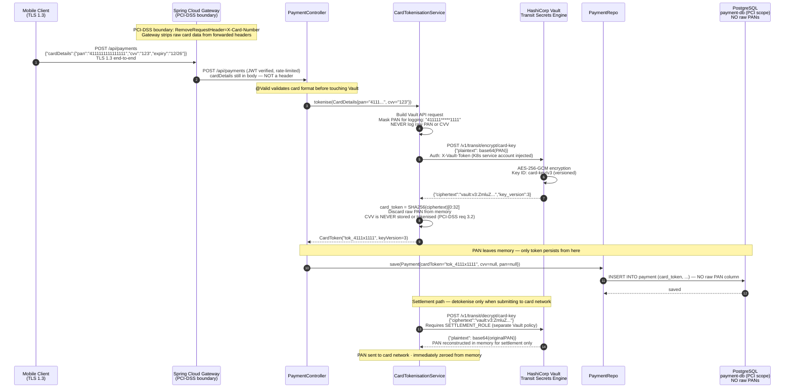

---

## Flow 4: Account Service — Redis Cache-Aside (HIT and MISS Paths)

> **Scenario:** Client requests account balance. The account-service first checks Redis. On a cache hit, it returns immediately. On a cache miss, it queries PostgreSQL, caches the result, and returns. Write operations invalidate the cache.  
> **Key patterns:** Cache-aside (Lazy Loading) · `@Version` optimistic locking for concurrent writes · Redis key `account:balance:{id}` TTL=30s · Cache invalidation-on-write.

### 4a — Cache HIT Path

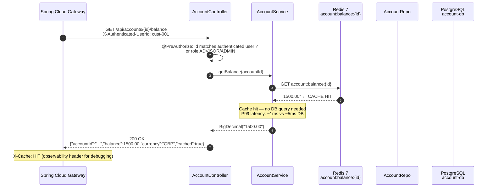

### 4b — Cache MISS Path (DB fallback + cache population)

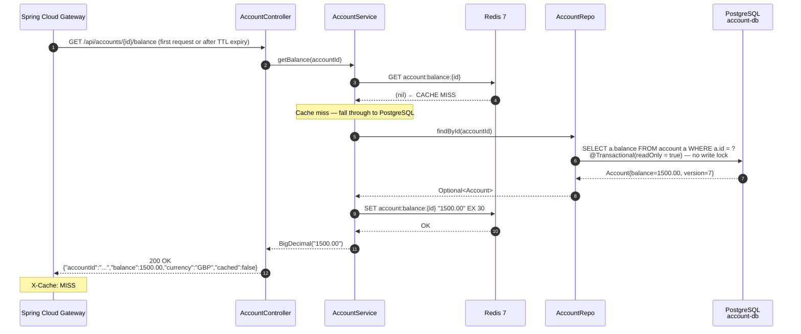

### 4c — Write Path (balance update → cache invalidation)

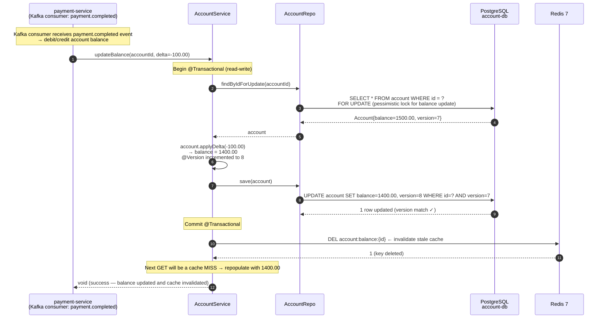

---

## Flow 5: Kafka Event-Driven Compliance / KYC Check

> **Scenario:** payment-service publishes `payment.initiated` to Kafka. compliance-service consumes from `compliance.group`, runs AML risk scoring, and re-publishes `kyc.passed` or `kyc.flagged`. payment-service reacts to the KYC outcome to advance or block the payment.  
> **Key patterns:** Kafka consumer group manual ack · Dead Letter Topic on retry exhaustion · `isolation.level=read_committed` (EOS consumer) · MDC traceId propagation for correlated logging · `@Version` optimistic locking on compliance case entity.

### 5a — KYC Pass Flow

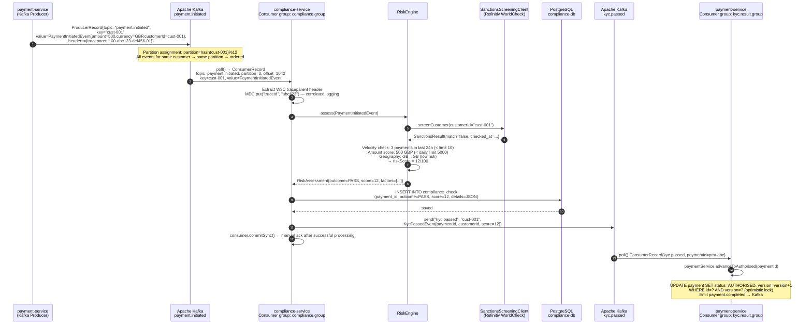

### 5b — KYC Block Flow (SAR Filing)

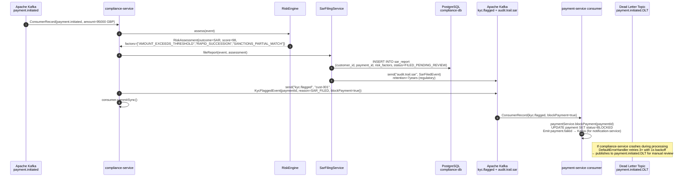

---

## Flow 6: Trading Service — Order Placement, Optimistic Locking, MiFID II Audit

> **Scenario:** Customer places a buy order for FTSE 100 equity. trading-service validates funds via account-service, persists the order with `@Version`, emits a MiFID II Transaction Report to Kafka, and handles the case where two concurrent execution attempts collide via optimistic locking.  
> **Key patterns:** `@Version` optimistic locking · MiFID II LEI-based order ID · Kafka append-only audit trail (7-year retention) · Feign client resilience (circuit breaker + retry) · Optimistic lock collision recovery.

### 6a — Successful Order Placement

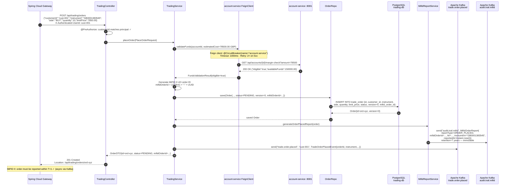

### 6b — Optimistic Locking Collision on Order Execution

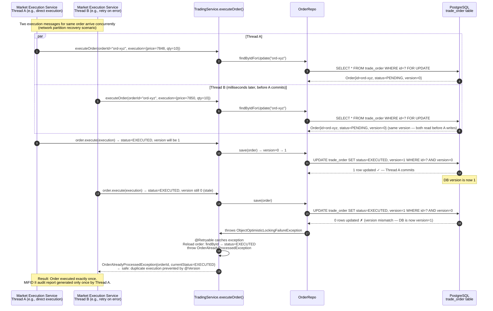

---

## Flow 7: OAuth2 JWT Resource Server Validation Chain

> **Scenario:** An incoming request carries a Bearer JWT. The microservice (running as OAuth2 Resource Server) validates the token without calling auth-service — it fetches the JWKS public key once, caches it, and verifies locally. Roles are extracted and placed into the Spring `SecurityContext`.  
> **Key patterns:** `spring-security-oauth2-resource-server` · JWKS public key caching (5min TTL) · RS256 signature verify · `JwtGrantedAuthoritiesConverter` · `SecurityContext` population for `@PreAuthorize` · PEM rotation safe (multi-key JWKS).

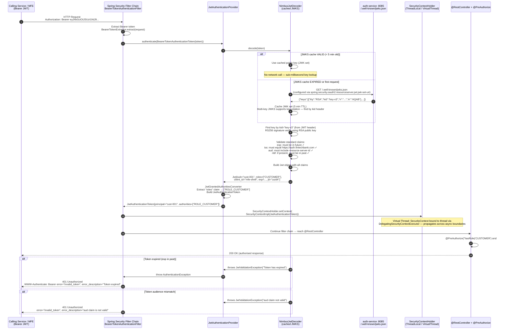

---

## Flow 8: Testcontainers Integration Test Lifecycle

> **Scenario:** A QE runs the payment-service integration test suite. Testcontainers spins up real PostgreSQL 16, Kafka, and Redis containers via Docker, `@ServiceConnection` auto-wires Spring datasource/kafka/redis properties, Liquibase runs migrations, and the tests execute against real infrastructure before teardown.  
> **Key patterns:** `@Testcontainers` + `@SpringBootTest` colocated · `@ServiceConnection` (Spring Boot 3.1+) auto-maps container ports · `@Rollback` per test · `SKIP LOCKED` idempotency in outbox tests · Parallel test execution via thread-isolated containers.

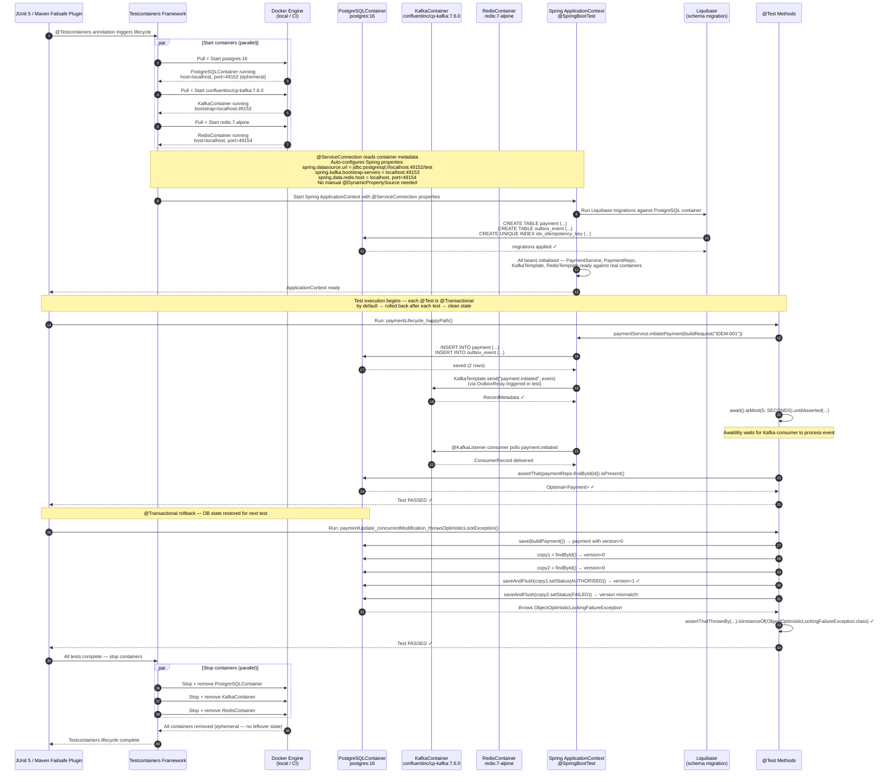

---

## Flow 9: OpenTelemetry Distributed Tracing Across Services

> **Scenario:** A payment initiation request generates a single distributed trace that spans API Gateway, payment-service, Kafka producer, and compliance-service consumer. All spans share the same `traceId` via W3C Trace Context headers, enabling end-to-end request correlation in Grafana/Tempo.  
> **Key patterns:** W3C Trace Context (`traceparent`) header propagation · OpenTelemetry OTLP export · `micrometer-tracing` + `opentelemetry-spring-boot-starter` · MDC `traceId`/`spanId` in structured JSON logs · Kafka header propagation via `ObservationRegistry`.

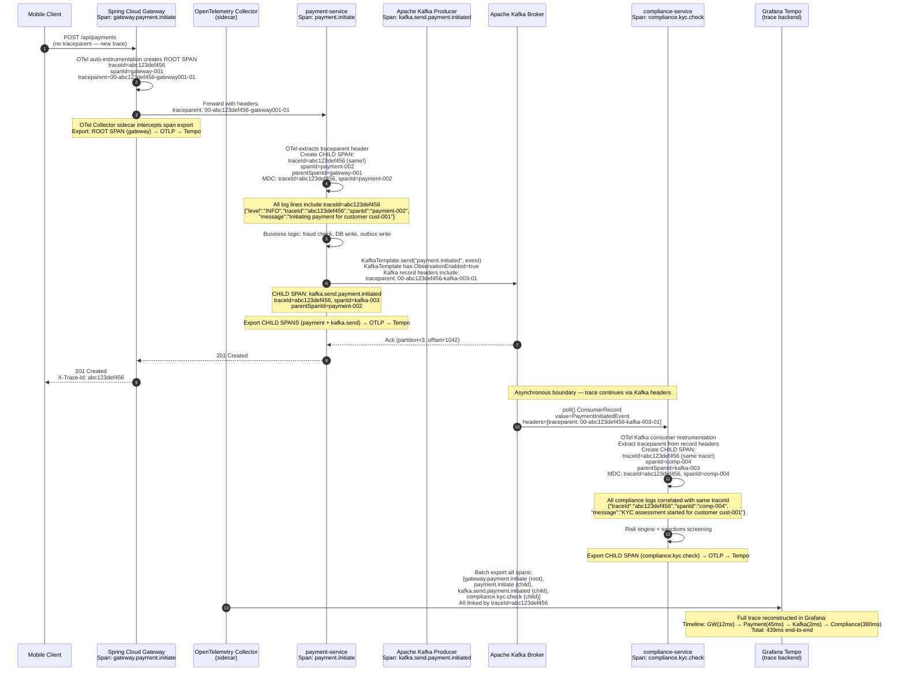

---

## Flow 10: Microservice Canary Deploy — Kubernetes Rolling Update + Argo Rollouts

> **Scenario:** CI/CD pipeline publishes a new payment-service image (v2.3.1). GitHub Actions triggers an Argo Rollouts canary deploy: 10% of traffic to the new version, Prometheus metric gate checks error rate and P99 latency, then progressively promotes to 100% or auto-rollback on threshold breach.  
> **Key patterns:** Argo Rollouts `Rollout` CRD · `AnalysisTemplate` metrics gate · Weighted traffic split · Automated rollback on SLO breach · `readinessProbe` health gate before traffic shift · `PodDisruptionBudget` maintains availability.

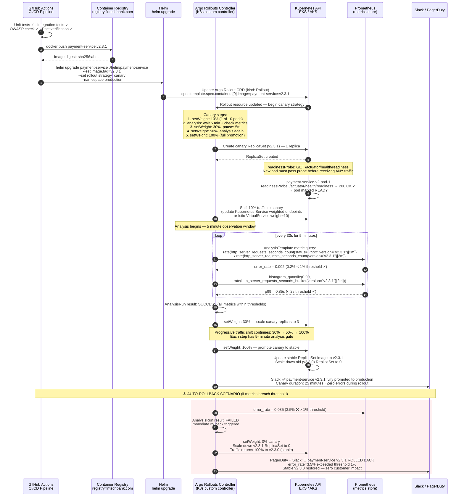

---

*Generated 2025 · Digital Banking & Wealth Platform — Back-End Sequence Diagrams Reference*  
*Stack: Java 21 · Spring Boot 3.3 · Spring Cloud 2023 · Apache Kafka · PostgreSQL 16 · Redis 7 · Kubernetes*  
*Regulatory scope: PCI-DSS Level 1 · SOC 2 Type II · PSD2 · MiFID II*  
*Perspective: Principal Back-End Engineer · Solution Architect · Data Engineer · QE*  
*Flows: 10 — Gateway Security · Payment Pipeline · PCI Tokenisation · Redis Cache-Aside · Kafka KYC · Trading Locking · OAuth2 JWT · Testcontainers · Distributed Tracing · Canary Deploy*
