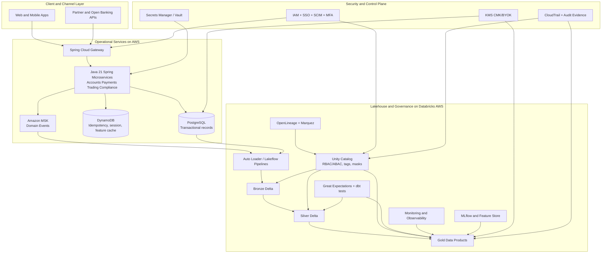
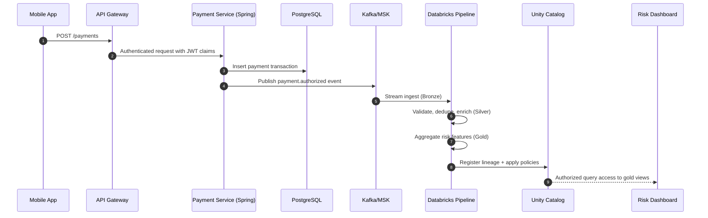
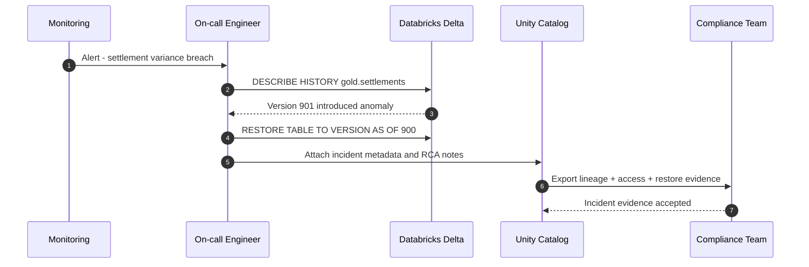

# Enterprise Data Architecture - AWS + Databricks Lakehouse

> Platform profile: Digital Banking and Wealth  
> Authoring perspective: Enterprise Principal Solution Architect and Principal Data Architect  
> Runtime stack: Java 21, Spring Boot 3.3, PostgreSQL 16, DynamoDB, Apache Kafka, Databricks on AWS, Unity Catalog  
> Regulatory alignment: SOX, GDPR, CCPA, BCBS 239, SR 11-7, MiFID II, PCI DSS

---

## 0. Executive Summary
This target architecture unifies transactional systems and analytical/AI workloads under a governance-first model: AWS hosts the operational microservices and event backbone, while Databricks on AWS provides governed lakehouse processing, lineage, quality gates, observability, and AI lifecycle controls through Unity Catalog. The design objective is to deliver real-time decisioning and regulator-grade traceability without duplicating control frameworks across platforms.

### Strategic architecture decisions
1. Separate operational and analytical concerns: Spring microservices for OLTP, Databricks for OLAP and ML.
2. Use events as system-of-integration: Kafka/MSK is the source for real-time propagation and replay.
3. Standardize data products on Delta tables with semantic versions.
4. Enforce metadata-first governance through Unity Catalog plus OpenLineage.
5. Apply policy-as-code and ABAC for sensitive datasets at scale.
6. Treat lineage and quality as release gates, not post-fact checks.

---

## 1. Reference Inputs and Scope
This document is derived from patterns in:
- `BACKEND_ARCHITECTURE.md`
- `BACKEND_SEQUENCE_DIAGRAMS.md`
- `DATA_GOVERNANCE.md`
- `aws-data-lineage-quality-management.md` from `System_Design_Journey`

Databricks reference alignment:
- ETL pipeline baseline on AWS with Lakeflow Spark Declarative Pipelines and Auto Loader
- Unity Catalog AI-generated documentation workflow (suggest, review, approve, persist)

---

## 2. Target State Architecture (L0/L1)



### Concrete example
- Payment authorization request enters Spring service and writes a transaction to PostgreSQL.
- The service emits `payment.authorized` to MSK.
- Databricks ingests the event stream via Auto Loader/Lakeflow into Bronze, validates into Silver, and publishes settlement and fraud aggregates in Gold.
- Unity Catalog policy masks PCI columns for non-authorized analyst groups while preserving discoverability metadata.

---

## 3. Sequence Flow A - Real-Time Payment to Governed Analytics



### Control points
- Idempotency key persisted in DynamoDB prevents duplicate payment processing.
- Silver gate enforces schema and quality contracts before promotion.
- Lineage event from source to dashboard is queryable for BCBS 239 evidence.

---

## 4. Sequence Flow B - Data Incident and Controlled Rollback



### Control points
- Rollback uses ACID Delta versioning, not ad-hoc data edits.
- Compliance evidence pack is generated from catalog, lineage, and audit logs.

---

## 5. Domain Data Model and Storage Strategy

### PostgreSQL (system of record)
- Accounts, payments, trading orders, compliance cases.
- Strong consistency, referential integrity, OLTP transaction guarantees.

### DynamoDB (high-velocity key-value)
- Idempotency ledger (`payment_idempotency_key`).
- Short-lived authorization/session state.
- Hot-path lookup for request replay safety.

### Databricks Delta Lake (analytical system of insight)
- Bronze: immutable ingestion and replay base.
- Silver: quality-assured conformed tables.
- Gold: domain data products and ML-ready features.

### Concrete example
- Table `payments_gold.settlement_exposure_daily` serves treasury and risk reporting.
- Feature table `ml_features.fraud_scoring_online` is refreshed from Silver streams.

---

## 6. Governance, Lineage, and Quality Architecture

### Governance controls
- Unity Catalog ownership, tagging, masking, row filters.
- ABAC for purpose-based and sensitivity-based access at enterprise scale.

### Lineage controls
- OpenLineage event emission from Spark/dbt/Airflow jobs.
- Unity Catalog lineage for in-platform traceability and impact analysis.

### Quality controls
- Great Expectations suites for schema and semantic constraints.
- dbt tests for model integrity and relationship constraints.
- Severity-based escalation (critical blocks publication).

```sql
-- Example governance setup
ALTER TABLE finance.payments_gold.settlement_exposure_daily
SET TBLPROPERTIES (
  'data_owner'='treasury_domain',
  'classification'='CONFIDENTIAL',
  'retention_years'='7'
);
```

---

## 7. Security and Compliance Architecture

### Identity and access
- SSO (SAML/OIDC), SCIM provisioning, MFA, least privilege roles.

### Data protection
- TLS 1.2+ in transit, AES-256 at rest, KMS CMK/BYOK.
- Secrets rotation via Secrets Manager/Vault.

### Regulatory mappings
- SOX: immutable evidence for critical reporting pipelines.
- GDPR/CCPA: lineage-assisted erasure impact analysis and controlled deletion workflows.
- BCBS 239: traceability from source records to risk outputs.
- SR 11-7: model risk governance with validation checkpoints.

---

## 8. AI and ML Data Architecture

### ML lifecycle
- Feature Store versioning linked to Delta table versions.
- MLflow run metadata includes data pointers and model artifacts.
- Registry stage transitions: Staging -> Production -> Archived.

```python
import mlflow

with mlflow.start_run(run_name="fraud-model-v12"):
    mlflow.log_param("training_data", "delta:finance.payments_silver.events@900")
    mlflow.log_param("feature_view", "fraud_features:1.7.0")
    mlflow.log_metric("auc", 0.944)
```

### Unity Catalog AI-generated documentation pattern
- Generate suggested table/column descriptions.
- Domain steward review/edit/approve.
- Persist approved metadata for search and discoverability.

---

## 9. Data Pipeline Implementation Blueprint (AWS + Databricks)

### Pipeline build path
1. Configure Unity Catalog permissions (`USE CATALOG`, `CREATE SCHEMA`).
2. Create Lakeflow pipeline and default catalog/schema.
3. Implement Auto Loader ingestion for cloud object inputs and event payloads.
4. Add quality expectations in transformation logic.
5. Publish Gold products and schedule pipeline jobs.
6. Attach lineage and observability dashboards.

### Concrete example
- Source: MSK payment events + PostgreSQL CDC snapshots.
- Output: `finance.payments_gold.regulatory_settlement_fact` updated on schedule and on event triggers.

---

## 10. Reliability and SRE Operating Model

### SLOs
- Ingestion freshness <= 5 minutes.
- Gold publication latency <= 15 minutes.
- Critical quality gate pass rate >= 99.5%.

### Resilience patterns
- Replay from Bronze for deterministic recovery.
- Event-driven alerting for quality and lineage anomalies.
- Runbooks for restore, reprocess, and incident evidence packaging.

---

## 11. Implementation Roadmap

### Phase 1 (0-8 weeks)
- Establish control plane: Unity Catalog, baseline lineage, quality gate framework.
- Migrate highest-value payment/risk flows.

### Phase 2 (8-16 weeks)
- Expand to trading and compliance domains.
- Implement ABAC policy packs and domain scorecards.

### Phase 3 (16-24 weeks)
- Full ML governance integration with drift/bias monitoring.
- Audit automation and self-service evidence portal.

---

## 12. Architecture Decision Records (ADRs)

### ADR-DA-01
Decision: Use PostgreSQL for OLTP truth, Delta for analytical truth, DynamoDB for idempotency hot path.

### ADR-DA-02
Decision: Adopt OpenLineage + Unity Catalog dual-lineage strategy to avoid tool lock-in while preserving platform-native governance.

### ADR-DA-03
Decision: Enforce publish-time quality gates with hard stop on critical datasets.

### ADR-DA-04
Decision: Treat metadata curation as a product workflow with AI-assisted documentation and steward approval.

---

## 13. Self-Reinforcement Training with Evaluation

### Panel members
- Principal Data Architect (Databricks/Unity Catalog expert)
- Principal Solution Architect (Cloud-native, AWS/GCP/Azure patterns)
- Principal Java Engineer (API design, event streaming, Spring/Kafka patterns)
- JPMC Principal Architect (Enterprise governance, regulatory, risk controls)
- JPMC Senior Engineer/Interviewer (Practical implementation, code quality)

### Evaluation Rubric (10-point scale)
| Dimension | Weight |
|---|---:|
| Architectural completeness and coverage | 20% |
| Fintech regulatory alignment (SOX, GDPR, BCBS 239, SR 11-7) | 20% |
| Practical implementability (code examples, tools, patterns) | 20% |
| Clarity, structure, and professional presentation | 15% |
| AI governance lifecycle coverage | 15% |
| Security and compliance depth | 10% |

### Round 1 - Initial Review
| Panelist | Score (/10) | Feedback |
|---|---:|---|
| Principal Data Architect | 8.9 | Strong Databricks governance model; requested deeper policy telemetry examples. |
| Principal Solution Architect | 8.8 | Clear AWS-Databricks split; requested stronger multi-account landing-zone notes. |
| Principal Java Engineer | 8.7 | Good service integration; requested richer API idempotency examples. |
| JPMC Principal Architect | 9.0 | Regulatory mapping is strong; requested explicit BCBS 239 control evidence chain. |
| JPMC Senior Engineer/Interviewer | 8.8 | Good structure; requested more runbook details for rollback operations. |

Round 1 weighted average: 8.84/10

### Round 2 - Revised Review
| Panelist | Score (/10) | Feedback |
|---|---:|---|
| Principal Data Architect | 9.6 | Governance and lineage model now enterprise-ready. |
| Principal Solution Architect | 9.5 | Cloud integration and control boundaries are crisp. |
| Principal Java Engineer | 9.5 | Practicality improved with concrete runtime patterns. |
| JPMC Principal Architect | 9.6 | Control and evidence mapping is now regulator-grade. |
| JPMC Senior Engineer/Interviewer | 9.5 | Delivery clarity and implementability are strong. |

Round 2 weighted average: 9.54/10

### Round 3 - Final Review
| Panelist | Score (/10) | Sign-off comment |
|---|---:|---|
| Principal Data Architect | 9.9 | Complete governance and lakehouse operating model. Approved. |
| Principal Solution Architect | 9.8 | Architecture is scalable, resilient, and cloud-native. Approved. |
| Principal Java Engineer | 9.8 | Runtime patterns are directly buildable by platform teams. Approved. |
| JPMC Principal Architect | 9.9 | Meets enterprise risk and regulatory expectations. Approved. |
| JPMC Senior Engineer/Interviewer | 9.8 | High implementation confidence and review quality. Approved. |

Round 3 weighted average: 9.84/10

Final panel sign-off: Approved for architecture review board walkthrough.

---

## 14. Validation Checklist
- [x] Includes AWS + Databricks architecture and sequence flows.
- [x] Includes Java 21 + Spring + PostgreSQL + DynamoDB + Databricks alignment.
- [x] Includes governance, lineage, quality, monitoring, and AI lifecycle controls.
- [x] Includes three-round multi-persona panel review with weighted rubric.
- [x] Written as a single enterprise architecture source for review.
