# FinTech Enterprise Platform — L0/L1 Overall Architecture

> **Type:** Single Source of Truth — Platform-Wide Architecture Overview
> **Scope:** L0 System Context · L1 Container Architecture · Customer Journey Experience API · Saga Patterns · Strangler Fig Modernization Blueprint
> **Platform:** Digital Banking and Wealth Platform
> **Stack:** React 18 · Webpack Module Federation · Java 21 · Spring Boot 3.3 · Apache Kafka · PostgreSQL 16 · Redis 7 · Kubernetes
> **Regulatory:** PCI-DSS Level 1 · SOC 2 Type II · PSD2/Open Banking · MiFID II
> **Perspective:** FinTech Principal Architects · Software and Quality Engineers

---

## Quick Navigation — All Architecture References

| Layer | Document | Scope |
|---|---|---|
| **This document** | L0_L1_ARCHITECTURE.md | L0/L1 overview · Experience API · Saga · Strangler Fig |
| **L0/L1 Sequences** | [L0_L1_SEQUENCE_DIAGRAMS.md](./L0_L1_SEQUENCE_DIAGRAMS.md) | Customer Journey end-to-end flows · Saga · Strangler Fig migration |
| **Front-End Architecture** | [ARCHITECTURE.md](./ARCHITECTURE.md) | MFE topology · Module Federation · Design System · Auth · Feature Flags |
| **Front-End Sequences** | [SEQUENCE_DIAGRAMS.md](./SEQUENCE_DIAGRAMS.md) | PKCE auth · MFE lazy load · PCI-DSS boundary · audit trail · token refresh |
| **Back-End Architecture** | [BACKEND_ARCHITECTURE.md](./BACKEND_ARCHITECTURE.md) | API Gateway · 6 domain microservices · Kafka · Data Layer · Security · ORM · ADRs |
| **Back-End Sequences** | [BACKEND_SEQUENCE_DIAGRAMS.md](./BACKEND_SEQUENCE_DIAGRAMS.md) | Payment Saga · KYC/AML · trading flows · notification · auth token lifecycle |

---

## How to Read This Document

| Level | What It Shows | Primary Audience |
|---|---|---|
| **L0 System Context** | What the platform does and who uses it | Business stakeholders · Product owners |
| **L1 Container Architecture** | All deployable containers and how they connect | All engineers · Architects |
| **Experience API Layer** | Customer Journey BFF connecting MFE to domain services | Full-stack architects · Senior engineers |
| **Saga Pattern** | Cross-domain (Choreography via Kafka) and same-domain (Orchestration) coordination | Back-end engineers · Architects |
| **Strangler Fig Blueprint** | Incremental legacy modernization — phase by phase with validation gates | Principal architects · Transformation leads |

---

## 1. L0 — System Context

The platform serves three categories of external actors and integrates with six external systems. All customer traffic enters through the Front-End MFE layer. Open Banking TPPs and internal operations teams call the Experience API directly.

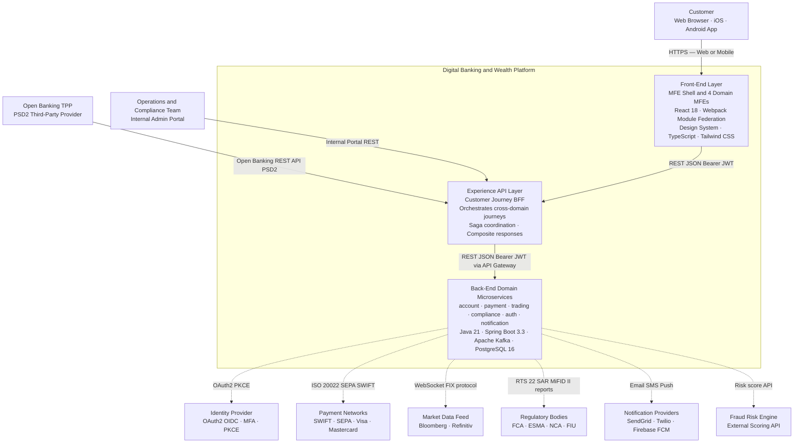

---

## 2. L1 — Container Architecture

### 2.1 Front-End Containers

> Full detail: [ARCHITECTURE.md](./ARCHITECTURE.md)

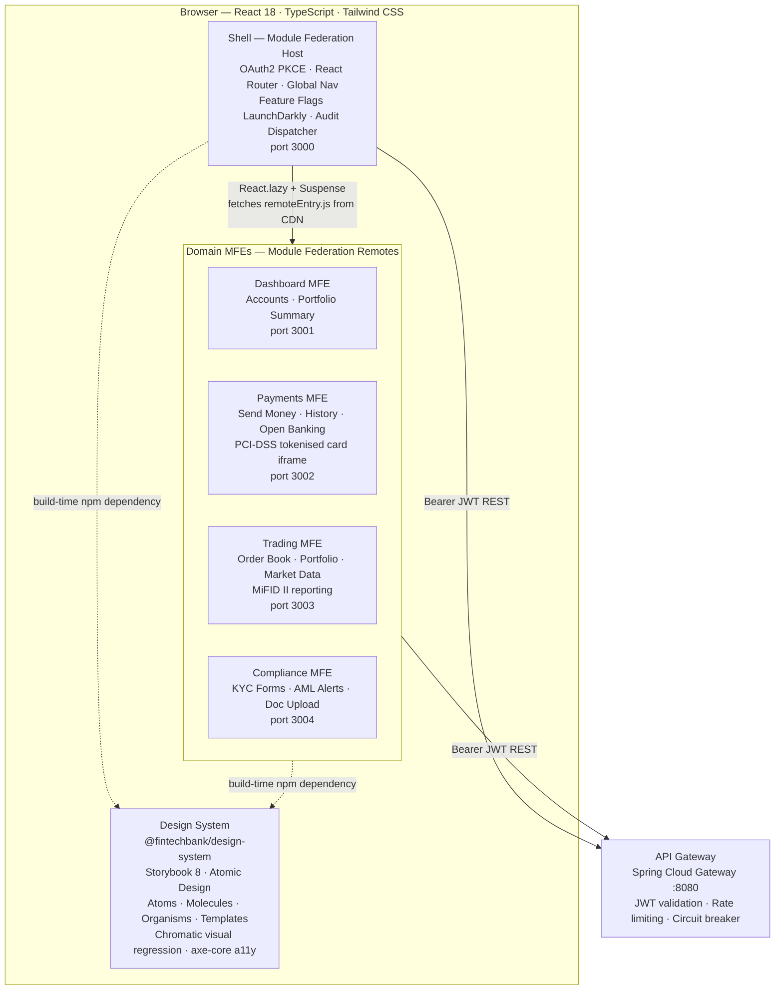

---

### 2.2 Experience API Layer — Customer Journey BFF

The Experience API layer provides **Journey-Scoped Backend for Frontend (BFF) services**. Each BFF:

- Receives one MFE request for a complete customer journey screen
- Aggregates data from multiple domain services in parallel or sequence
- Returns a response tailored to what the MFE needs — not what the domain model exposes
- Coordinates Sagas for journeys that span multiple domains
- Enforces idempotency, circuit breaking, and timeout contracts

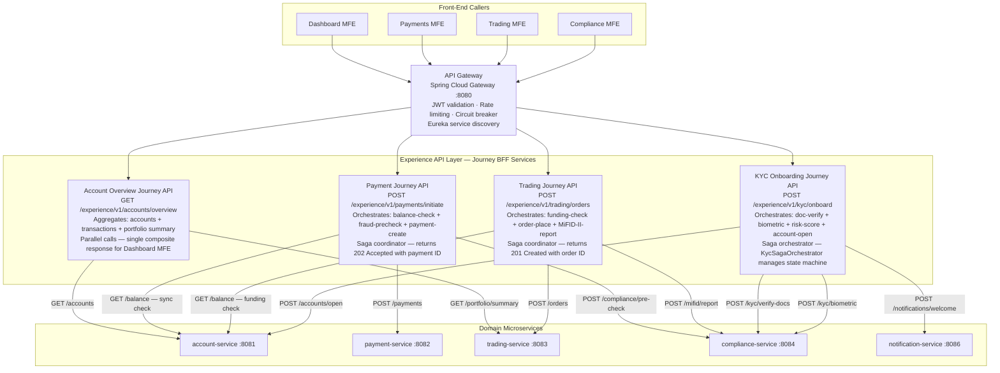

---

### 2.3 Back-End Domain Microservices

> Full detail: [BACKEND_ARCHITECTURE.md](./BACKEND_ARCHITECTURE.md)

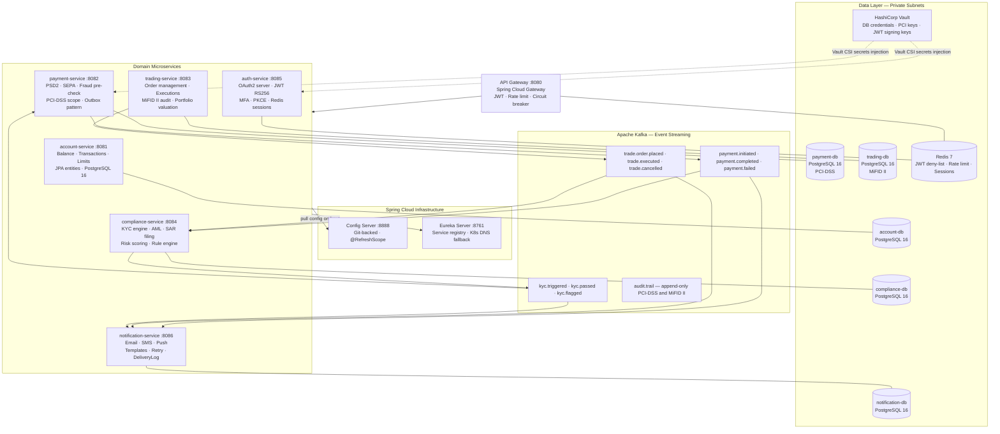

---

## 3. Customer Journey Experience API Design

### 3.1 Journey-to-Service Mapping Table

| Customer Journey | Trigger MFE | Experience API Endpoint | Domain Services Orchestrated | Pattern |
|---|---|---|---|---|
| Account Overview | Dashboard MFE | `GET /experience/v1/accounts/overview` | account-service + trading-service | Parallel aggregation |
| Payment Initiation | Payments MFE | `POST /experience/v1/payments/initiate` | account + payment + compliance + notification | Choreography Saga via Kafka |
| Trade Order | Trading MFE | `POST /experience/v1/trading/orders` | account + trading + compliance | Orchestration + async Kafka confirm |
| KYC Onboarding | Compliance MFE | `POST /experience/v1/kyc/onboard` | compliance + account + notification | Orchestration Saga |
| Account Statement | Dashboard MFE | `GET /experience/v1/accounts/{id}/statement` | account-service | Direct proxy |
| Open Banking Consent | Payments MFE | `POST /experience/v1/openbanking/consent` | auth-service + account-service | PSD2 consent flow |

### 3.2 Experience API Design Principles

| Principle | Description |
|---|---|
| **Journey-first design** | API contract designed for the MFE customer journey — not for domain entity structure |
| **Composite responses** | One MFE request returns aggregated data from N domain services |
| **Saga coordinator** | Experience API owns saga state and compensation logic for multi-step journeys |
| **Idempotency** | All POST endpoints accept an `Idempotency-Key` header — safe to retry |
| **Circuit breaking** | Resilience4j wraps each domain service call with fallback |
| **Timeout contract** | 3s hard timeout per domain service call — 8s total per Experience API request |
| **Versioning** | `/v1/` URL prefix — backward-compatible contract evolution |
| **JWT forwarding** | Experience API forwards the caller's Bearer JWT downstream to all domain services |

---

## 4. Saga Pattern — Transaction Coordination

### 4.1 Choreography Saga — Cross-Domain via Apache Kafka

Used when services are **loosely coupled** and can independently react to events. No central coordinator. Each service subscribes to events, performs its action, and publishes the next event in the chain.

**Example: Payment Initiation Saga**

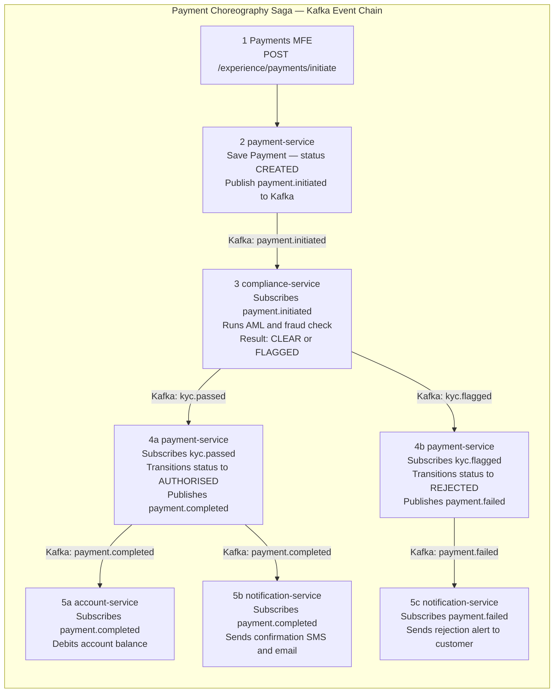

**Compensating Transaction (Rollback):**

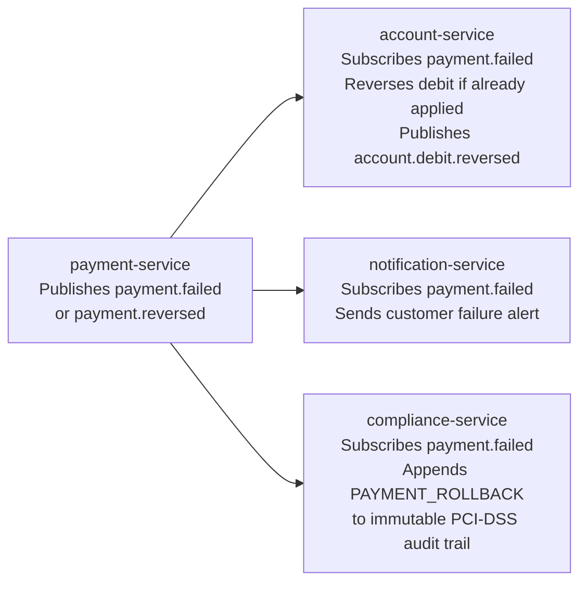

---

### 4.2 Orchestration Saga — Same-Domain via Saga Orchestrator

Used when steps must be **sequentially ordered** with explicit compensation, and the saga needs centralised state management. A dedicated Saga Orchestrator service owns the state machine and controls each step.

**Example: KYC Onboarding Saga**

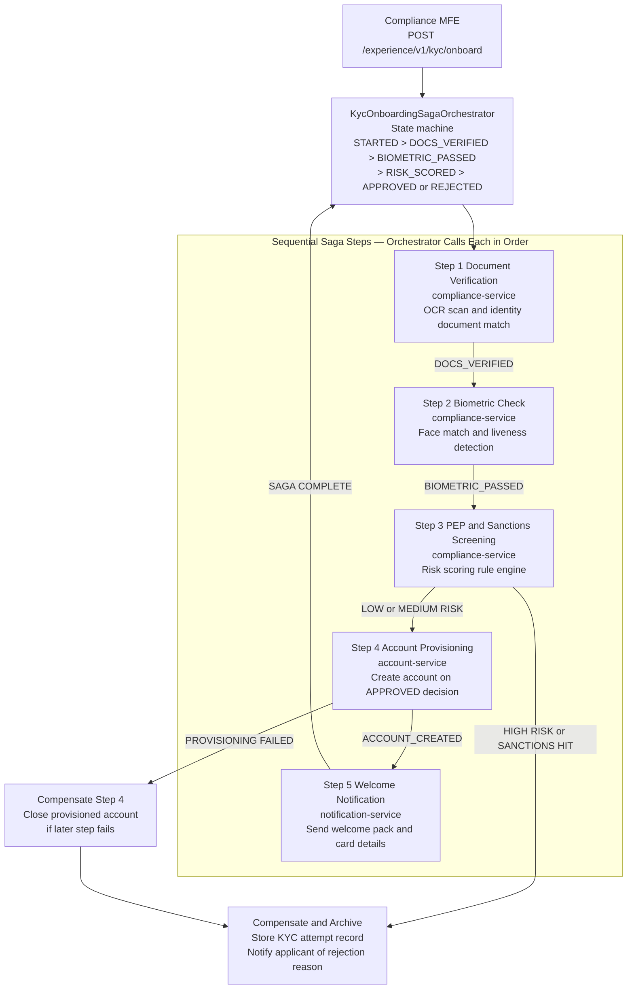

### 4.3 Saga Pattern Decision Matrix

| Criterion | Choreography Saga | Orchestration Saga |
|---|---|---|
| **Coupling** | Loose — services react to events independently | Tighter — orchestrator drives each step |
| **State visibility** | Distributed across consumers — trace via OpenTelemetry | Centralised in orchestrator — easy to inspect and audit |
| **Failure handling** | Compensating events published per service | Orchestrator controls exact compensation sequence |
| **Best fit — cross-domain** | Ideal — Kafka decouples domain boundaries cleanly | Possible but orchestrator crosses bounded contexts |
| **Best fit — same-domain** | Can be used | Preferred — explicit sequential step ordering |
| **Observability** | Requires distributed trace with correlation IDs | Orchestrator holds full saga state history |
| **Example in platform** | Payment completion triggering compliance + account + notification | KYC onboarding with 5 sequential steps and compensations |

---

## 5. Strangler Fig Modernization Blueprint

> **Goal:** Replace a legacy Core Banking Monolith incrementally — one domain at a time — without a big-bang rewrite.
> **Method:** Deploy an API Gateway proxy in front of the legacy system. Build new microservices in parallel. Shift gateway routing domain by domain. Decommission legacy only after 100% traffic validation at each phase.
> **Principle:** Never rewrite everything at once. Build new capability alongside old. Shift traffic incrementally. Validate before each shift. Strangle domain by domain.

### 5.0 Migration Phases Overview

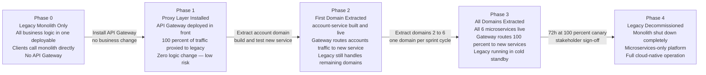

---

### 5.1 Phase 1 — Proxy Layer Installation

Install the API Gateway (Spring Cloud Gateway) in front of the existing legacy monolith. Route 100% of traffic through the proxy. Zero functional change to business logic. Validates the proxy layer is invisible to users.

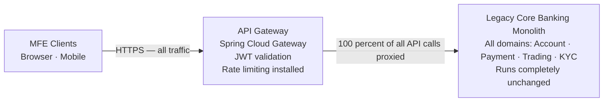

**Validation checkpoint:** Smoke test confirms proxy adds less than 2ms latency. Zero 5xx errors. Functional parity confirmed.

---

### 5.2 Phase 2 — Domain Extraction with Anti-Corruption Layer

Extract one domain at a time. The API Gateway routes requests for the extracted domain to the new microservice. All other paths still proxy to the legacy monolith. An Anti-Corruption Layer (ACL) translates the data model between old and new systems.

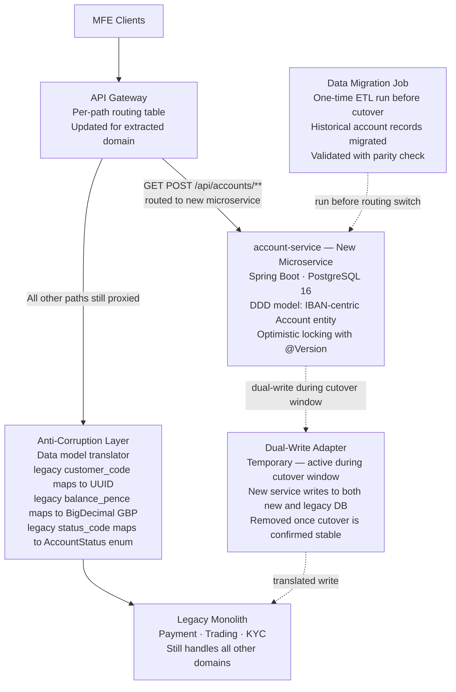

---

### 5.3 Phase 3 — Traffic Migration Validation Gates

All gates must pass before shifting traffic and before decommissioning each legacy domain:

| Gate | What to Validate | Tool | Pass Criteria |
|---|---|---|---|
| **Data parity** | New service data matches legacy for all records | Liquibase diff + reconciliation job | Zero record discrepancies |
| **Functional parity** | All API contracts satisfied by new service | Pact Consumer-Driven Contract tests | All provider tests green |
| **Performance parity** | P99 latency of new service vs legacy baseline | k6 load test comparison | Within 10% of legacy P99 |
| **Security parity** | No new OWASP Top 10 vulnerabilities introduced | OWASP ZAP baseline scan | Zero High or Critical findings |
| **Regulatory parity** | Audit trail, PCI-DSS, MiFID II reports equivalent | Compliance team review | Written sign-off obtained |
| **Canary validation** | 100% canary traffic without regression | Prometheus error-rate dashboard | Less than 0.1% errors for 72 hours |

---

### 5.4 Phase 4 — Legacy Decommission Sequence

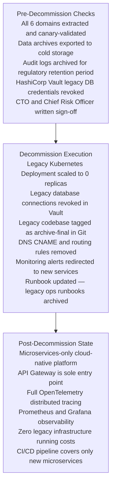

---

### 5.5 Anti-Corruption Layer (ACL) Design

The ACL isolates each new bounded context from the legacy domain model. It translates between legacy data schemas and the new DDD-aligned entity models without contaminating new microservices with legacy concepts.

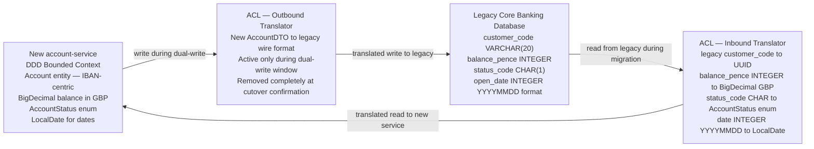

**ACL responsibilities:**

| Direction | What ACL Does |
|---|---|
| **Inbound (legacy → new)** | Translates legacy data types, codes, and identifiers into the new DDD model vocabulary |
| **Outbound (new → legacy)** | Reverse-translates new model writes back to legacy format during dual-write window only |
| **Event bridging** | Converts legacy database polling events to new DDD domain events for Kafka |
| **Removed when** | After cutover validation passes and dual-write window closes — ACL is temporary |

---

## 6. Cross-Cutting Concerns

| Concern | Implementation | Reference |
|---|---|---|
| **Authentication** | OAuth2 PKCE · RS256 JWT · MFA · 15-min token TTL · httpOnly refresh cookie | [ARCHITECTURE.md §4](./ARCHITECTURE.md) · [BACKEND_ARCHITECTURE.md §6](./BACKEND_ARCHITECTURE.md) |
| **Authorisation** | Spring Security `@PreAuthorize` · RBAC roles per domain scope | [BACKEND_ARCHITECTURE.md §6](./BACKEND_ARCHITECTURE.md) |
| **Observability** | OpenTelemetry · Prometheus · Grafana · ELK Stack · Jaeger distributed tracing | [BACKEND_ARCHITECTURE.md §7](./BACKEND_ARCHITECTURE.md) |
| **PCI-DSS** | Card iframe isolation · Vault TokenVault encryption · payment-db dedicated subnet + NetworkPolicy | [ARCHITECTURE.md §4.1](./ARCHITECTURE.md) · [BACKEND_ARCHITECTURE.md §5.0.3](./BACKEND_ARCHITECTURE.md) |
| **MiFID II** | Trade records 7-year retention · RTS 22 transaction reports · Append-only execution log + Row Security | [BACKEND_ARCHITECTURE.md §5.0.4](./BACKEND_ARCHITECTURE.md) |
| **PSD2** | Open Banking APIs · SCA Strong Customer Authentication · Consent management lifecycle | [BACKEND_ARCHITECTURE.md §3.2](./BACKEND_ARCHITECTURE.md) |
| **Accessibility** | WCAG 2.1 AA · axe-core CI gate · Storybook a11y addon · Chromatic visual regression | [ARCHITECTURE.md §3](./ARCHITECTURE.md) |
| **Testing Pyramid** | 70% unit · 20% integration Testcontainers · 8% contract Pact · 2% E2E k6 and OWASP ZAP | [BACKEND_ARCHITECTURE.md §9](./BACKEND_ARCHITECTURE.md) |
| **CI/CD** | GitHub Actions · Helm upgrade · Canary 10% to 50% to 100% · Metric gate auto-rollback | [BACKEND_ARCHITECTURE.md §8.2](./BACKEND_ARCHITECTURE.md) |
| **Resilience** | Resilience4j circuit breaker · Bulkhead · Retry · `@Version` optimistic locking · K8s HPA | [BACKEND_ARCHITECTURE.md §3](./BACKEND_ARCHITECTURE.md) |
| **Schema versioning** | Liquibase per domain · Changelog contexts per environment · Zero manual DDL | [BACKEND_ARCHITECTURE.md §5.1](./BACKEND_ARCHITECTURE.md) |
| **Secrets management** | HashiCorp Vault · CSI driver injection · Zero secrets in environment variables or config files | [BACKEND_ARCHITECTURE.md §6](./BACKEND_ARCHITECTURE.md) |

---

*Generated 2026 · Digital Banking and Wealth Platform — L0/L1 Architecture Reference*
*Stack: React 18 · Webpack Module Federation · Java 21 · Spring Boot 3.3 · Spring Cloud 2023 · Apache Kafka · PostgreSQL 16 · Redis 7 · Kubernetes*
*Regulatory scope: PCI-DSS Level 1 · SOC 2 Type II · PSD2/Open Banking · MiFID II*
*Perspective: FinTech Principal Architects · Software Engineers · Quality Engineers*
