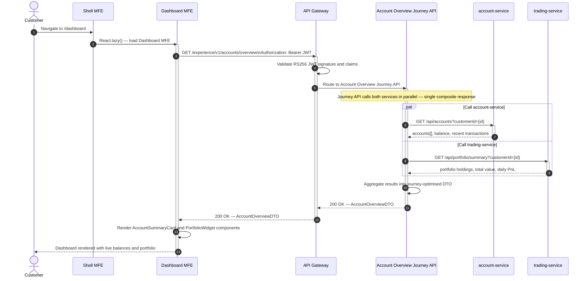
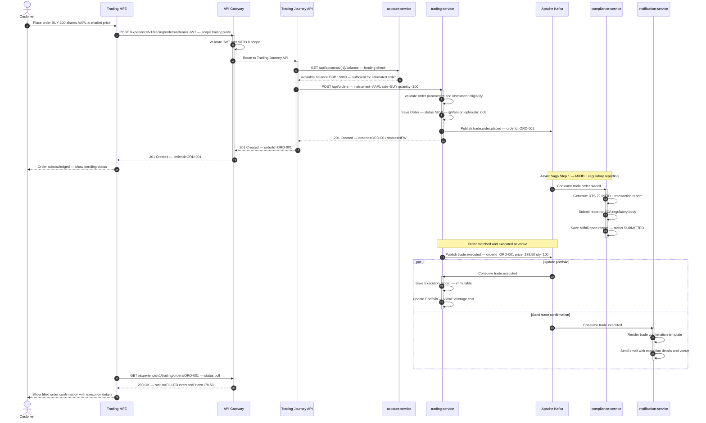
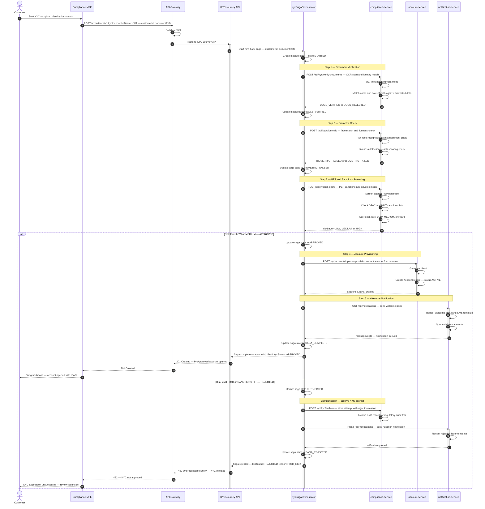
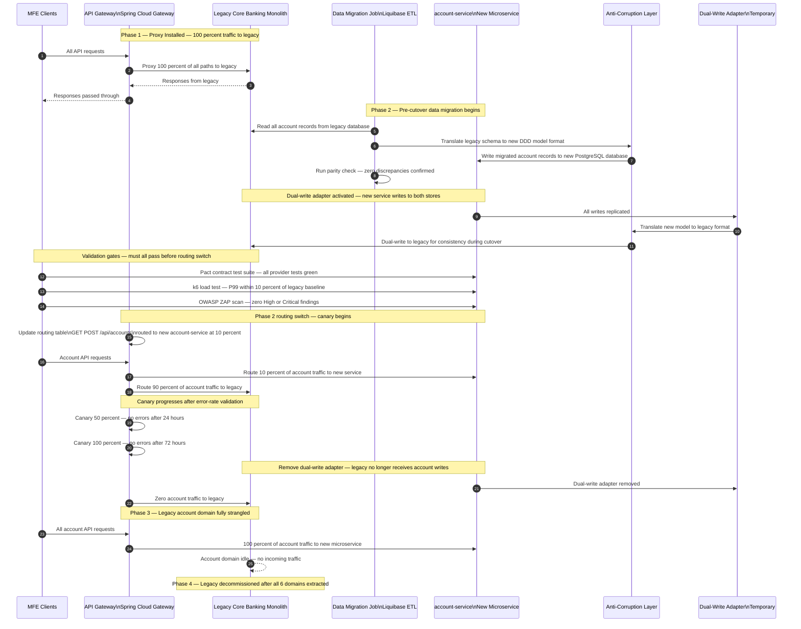
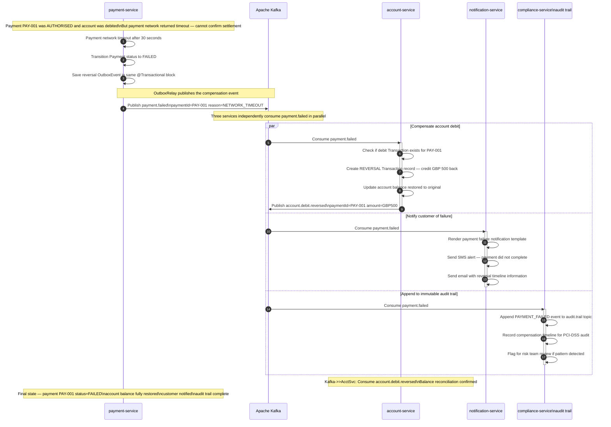

# FinTech Enterprise Platform — L0/L1 Overall Sequence Diagrams

> **Type:** Single Source of Truth — Customer Journey End-to-End Flow Sequences
> **Scope:** L0/L1 customer journeys · Experience API orchestration · Choreography and Orchestration Sagas · Strangler Fig traffic migration
> **Platform:** Digital Banking and Wealth Platform
> **Stack:** React 18 · Webpack Module Federation · Java 21 · Spring Boot 3.3 · Apache Kafka · PostgreSQL 16
> **Regulatory:** PCI-DSS Level 1 · SOC 2 Type II · PSD2/Open Banking · MiFID II
> **Perspective:** FinTech Principal Architects · Software and Quality Engineers

---

## Quick Navigation — All Architecture References

| Layer | Document | Scope |
|---|---|---|
| **L0/L1 Architecture** | [L0_L1_ARCHITECTURE.md](./L0_L1_ARCHITECTURE.md) | L0/L1 diagrams · Experience API · Saga patterns · Strangler Fig blueprint |
| **Front-End Architecture** | [ARCHITECTURE.md](./ARCHITECTURE.md) | MFE topology · Module Federation · Design System · Auth · Feature Flags |
| **Front-End Sequences** | [SEQUENCE_DIAGRAMS.md](./SEQUENCE_DIAGRAMS.md) | PKCE auth · MFE lazy load · PCI-DSS boundary · audit trail · token refresh |
| **Back-End Architecture** | [BACKEND_ARCHITECTURE.md](./BACKEND_ARCHITECTURE.md) | API Gateway · 6 domain microservices · Kafka · Data Layer · Security · ORM · ADRs |
| **Back-End Sequences** | [BACKEND_SEQUENCE_DIAGRAMS.md](./BACKEND_SEQUENCE_DIAGRAMS.md) | Payment Saga · KYC/AML flows · trading · notification · auth token lifecycle |

---

## Diagram Index

| # | Flow | Saga Type | Domains Covered |
|---|---|---|---|
| 1 | [Account Overview — Parallel Aggregation](#flow-1-account-overview--parallel-aggregation) | Synchronous parallel | account-service + trading-service |
| 2 | [Payment Initiation — Choreography Saga](#flow-2-payment-initiation--choreography-saga) | Kafka choreography | payment + compliance + account + notification |
| 3 | [Trade Order Placement — MiFID II](#flow-3-trade-order-placement--mifid-ii) | Sync + async Kafka | account + trading + compliance + notification |
| 4 | [KYC Onboarding — Orchestration Saga](#flow-4-kyc-onboarding--orchestration-saga) | Saga orchestrator | compliance + account + notification |
| 5 | [Strangler Fig — Traffic Cutover](#flow-5-strangler-fig--traffic-cutover) | Infrastructure routing | API Gateway + Legacy Monolith + new microservices |
| 6 | [Saga Compensation — Payment Rollback](#flow-6-saga-compensation--payment-rollback) | Compensating transaction | payment + account + notification + audit |

---

## Flow 1: Account Overview — Parallel Aggregation

> **Journey:** Customer navigates to the Dashboard. The Dashboard MFE calls one Experience API endpoint. The Account Overview Journey API calls two domain services in parallel and returns a single composite response optimised for the Dashboard screen.
>
> **Pattern:** Synchronous parallel aggregation — Promise.all equivalent at the Experience API layer.
>
> → Detailed front-end context: [ARCHITECTURE.md §5.1](./ARCHITECTURE.md) · [BACKEND_ARCHITECTURE.md §3.1](./BACKEND_ARCHITECTURE.md)



---

## Flow 2: Payment Initiation — Choreography Saga

> **Journey:** Customer initiates a payment in the Payments MFE. The Payment Journey API coordinates a balance check synchronously, then creates the payment and triggers an asynchronous Kafka choreography saga across compliance, account, and notification services.
>
> **Pattern:** Kafka Choreography Saga — each service independently subscribes to events and publishes the next event in the chain. The Experience API returns 202 Accepted immediately. The MFE polls for final status.
>
> → Detailed back-end context: [BACKEND_ARCHITECTURE.md §3.2](./BACKEND_ARCHITECTURE.md) · [BACKEND_SEQUENCE_DIAGRAMS.md](./BACKEND_SEQUENCE_DIAGRAMS.md)

```mermaid
sequenceDiagram
    autonumber
    actor Customer as Customer
    participant PayMFE as Payments MFE
    participant GW as API Gateway
    participant ExpPay as Payment Journey API
    participant AcctSvc as account-service
    participant PaySvc as payment-service
    participant Kafka as Apache Kafka
    participant CompSvc as compliance-service
    participant NotifSvc as notification-service

    Customer->>PayMFE: Fill payment form and click Send
    PayMFE->>GW: POST /experience/v1/payments/initiate\nIdempotency-Key: IDEM-001\nBearer JWT
    activate GW
    GW->>GW: Validate JWT — check scope payments:write
    GW->>ExpPay: Route to Payment Journey API
    activate ExpPay

    ExpPay->>AcctSvc: GET /api/accounts/{id}/balance — sync funding check
    activate AcctSvc
    AcctSvc-->>ExpPay: balance GBP 2500 — sufficient for GBP 500 payment
    deactivate AcctSvc

    ExpPay->>PaySvc: POST /api/payments — idempotencyKey=IDEM-001
    activate PaySvc
    PaySvc->>PaySvc: Idempotency check — new request
    PaySvc->>PaySvc: Tokenise card via Vault Transit Encryption
    PaySvc->>PaySvc: Save Payment — status CREATED — @Transactional
    PaySvc->>PaySvc: Save OutboxEvent row in same transaction

    PaySvc-->>ExpPay: 202 Accepted — paymentId=PAY-001 status=FRAUD_CHECK
    deactivate PaySvc

    ExpPay-->>GW: 202 Accepted — paymentId=PAY-001
    deactivate ExpPay
    GW-->>PayMFE: 202 Accepted — paymentId=PAY-001
    deactivate GW

    PayMFE-->>Customer: Show processing spinner with paymentId

    Note over PaySvc,Kafka: OutboxRelay polls outbox — publishes event asynchronously

    PaySvc->>Kafka: Publish payment.initiated — paymentId=PAY-001

    Note over Kafka,CompSvc: Choreography Saga Step 1 — compliance AML check

    Kafka->>CompSvc: Consume payment.initiated
    activate CompSvc
    CompSvc->>CompSvc: Run AML rule engine — check transaction patterns
    CompSvc->>CompSvc: Check PEP and sanctions screening

    alt AML check CLEAR
        CompSvc->>Kafka: Publish kyc.passed — paymentId=PAY-001
        deactivate CompSvc

        Note over Kafka,PaySvc: Choreography Saga Step 2 — payment authorisation

        Kafka->>PaySvc: Consume kyc.passed
        activate PaySvc
        PaySvc->>PaySvc: Transition Payment to AUTHORISED
        PaySvc->>Kafka: Publish payment.completed — paymentId=PAY-001
        deactivate PaySvc

        Note over Kafka,AcctSvc: Choreography Saga Step 3 — parallel debit and notification

        par Debit account balance
            Kafka->>AcctSvc: Consume payment.completed
            activate AcctSvc
            AcctSvc->>AcctSvc: Debit account — GBP 500
            AcctSvc->>AcctSvc: Create Transaction record
            deactivate AcctSvc
        and Send confirmation notification
            Kafka->>NotifSvc: Consume payment.completed
            activate NotifSvc
            NotifSvc->>NotifSvc: Render payment confirmation template
            NotifSvc->>NotifSvc: Send SMS and email to customer
            deactivate NotifSvc
        end

    else AML check FLAGGED
        CompSvc->>Kafka: Publish kyc.flagged — paymentId=PAY-001
        deactivate CompSvc
        Kafka->>PaySvc: Consume kyc.flagged
        activate PaySvc
        PaySvc->>PaySvc: Transition Payment to REJECTED
        PaySvc->>Kafka: Publish payment.failed — paymentId=PAY-001
        deactivate PaySvc
        Kafka->>NotifSvc: Consume payment.failed — send rejection alert
    end

    PayMFE->>GW: GET /experience/v1/payments/PAY-001/status — status polling
    GW-->>PayMFE: 200 OK — status=AUTHORISED or status=REJECTED
    PayMFE-->>Customer: Show payment result screen
```

---

## Flow 3: Trade Order Placement — MiFID II

> **Journey:** Customer places a trade order in the Trading MFE. The Trading Journey API synchronously checks available funding, then places the order with the trading-service. The execution and MiFID II regulatory reporting happen asynchronously via Kafka.
>
> **Pattern:** Synchronous orchestration for the critical path (funding check + order placement) combined with async Kafka events for reporting and notification.
>
> → Detailed context: [BACKEND_ARCHITECTURE.md §3.3](./BACKEND_ARCHITECTURE.md) · [BACKEND_SEQUENCE_DIAGRAMS.md](./BACKEND_SEQUENCE_DIAGRAMS.md)



---

## Flow 4: KYC Onboarding — Orchestration Saga

> **Journey:** New customer starts KYC onboarding in the Compliance MFE. The KYC Journey API delegates to a central `KycOnboardingSagaOrchestrator` that manages the state machine and calls each step sequentially. Each step has an explicit compensation action if it fails.
>
> **Pattern:** Orchestration Saga — centralised state machine with sequential steps and controlled compensation.
>
> → Detailed context: [BACKEND_ARCHITECTURE.md §3.4](./BACKEND_ARCHITECTURE.md)



---

## Flow 5: Strangler Fig — Traffic Cutover

> **Journey:** Platform migration team extracts the `account-service` domain from the legacy monolith. This flow shows the full cutover sequence — from data migration through dual-write validation to final routing switch and legacy retirement.
>
> **Pattern:** Strangler Fig — incremental traffic migration via API Gateway routing table update, validated by parity checks and canary progression.
>
> → Architecture detail: [L0_L1_ARCHITECTURE.md §5](./L0_L1_ARCHITECTURE.md)



---

## Flow 6: Saga Compensation — Payment Rollback

> **Journey:** A payment that was partially completed encounters a failure after the account was debited (e.g., payment network timeout after authorisation). The Choreography Saga triggers compensating transactions to restore consistency across all affected services.
>
> **Pattern:** Compensating transaction chain — each service subscribes to `payment.failed` or `payment.reversed` and executes its own compensation action in parallel. The audit trail receives an immutable compensation record.
>
> → Architecture detail: [L0_L1_ARCHITECTURE.md §4.1](./L0_L1_ARCHITECTURE.md) · [BACKEND_ARCHITECTURE.md §3.2](./BACKEND_ARCHITECTURE.md)



---

## Validation Checkpoints — Step-by-Step Verification Guide

Use these checkpoints to validate each flow in your environment:

### Flow 1 — Account Overview
| Step | What to Verify | Expected Result |
|---|---|---|
| MFE → Gateway | JWT is attached to request | Request reaches API Gateway with Authorization header |
| Gateway → Experience API | JWT validated, route matched | HTTP 200 response within 300ms |
| Parallel calls | Both services called concurrently | account-service and trading-service called simultaneously |
| Composite response | Single response for Dashboard | Response contains accounts array and portfolio summary |

### Flow 2 — Payment Initiation
| Step | What to Verify | Expected Result |
|---|---|---|
| Idempotency key | Duplicate key returns same result | Second call returns same paymentId without duplicate payment |
| Funding check | Insufficient balance rejected | HTTP 422 with INSUFFICIENT_FUNDS error before payment created |
| Saga starts | 202 Accepted returned | MFE receives paymentId immediately — saga runs in background |
| Kafka event | payment.initiated published | compliance-service consumer lag moves to 0 within 30s |
| AML check | Both paths tested | kyc.passed triggers AUTHORISED — kyc.flagged triggers REJECTED |
| Account debit | Balance updated after completion | account balance decremented by payment amount |

### Flow 3 — Trade Order
| Step | What to Verify | Expected Result |
|---|---|---|
| Funding check | Order rejected if insufficient | HTTP 422 before order created |
| MiFID II report | Created after execution | mifid_transaction_report row inserted with SUBMITTED status |
| Portfolio update | Reflects execution | Portfolio quantity and average cost updated after trade.executed |

### Flow 4 — KYC Onboarding Saga
| Step | What to Verify | Expected Result |
|---|---|---|
| Saga state | Visible in orchestrator | Saga record moves through each state transition |
| Compensation | Triggered on HIGH RISK | Account provisioning rolled back if risk step fails |
| Account opened | Created on APPROVED | New account with IBAN created and active |

### Flow 5 — Strangler Fig Cutover
| Step | What to Verify | Expected Result |
|---|---|---|
| Data parity | Before routing switch | Zero record discrepancies between legacy and new DB |
| Canary 10% | First traffic to new service | Error rate below 0.1% — Grafana dashboard confirms |
| Full cutover | 100% to new service | Legacy receives zero account domain traffic |
| Dual-write removed | No writes to legacy | Legacy account DB shows zero new writes |

### Flow 6 — Saga Compensation
| Step | What to Verify | Expected Result |
|---|---|---|
| Compensation idempotency | payment.failed consumed twice | account reversal applied only once — idempotency guard |
| Balance restored | After reversal | account balance equals pre-payment value |
| Audit trail | Immutable record appended | audit.trail contains PAYMENT_FAILED event with full context |

---

*Generated 2026 · Digital Banking and Wealth Platform — L0/L1 Sequence Diagrams Reference*
*Stack: React 18 · Webpack Module Federation · Java 21 · Spring Boot 3.3 · Spring Cloud 2023 · Apache Kafka · PostgreSQL 16 · Redis 7 · Kubernetes*
*Regulatory scope: PCI-DSS Level 1 · SOC 2 Type II · PSD2/Open Banking · MiFID II*
*Perspective: FinTech Principal Architects · Software Engineers · Quality Engineers*
