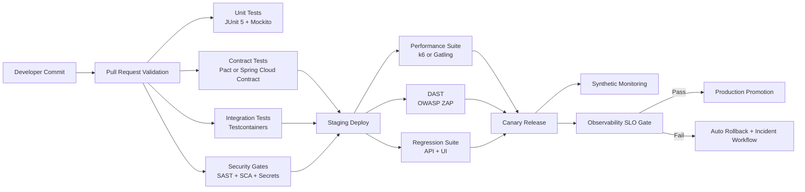

# FinTech Quality Management for Automation and Performance Testing — Single Source of Truth

> Platform scope: Digital Banking and Wealth microservices + micro-frontend ecosystem  
> Stack focus: Java 21, Spring Boot, Spring Cloud, Kafka, PostgreSQL, Redis, Kubernetes  
> Cloud focus: AWS primary, with GCP and Azure equivalent patterns  
> Perspective: Principal Quality and Performance Testing Automation Architect (hands-on)  
> Audience: Technology executives, principal engineers, and junior Java developers  
> Compliance scope: PCI-DSS, SOC 2, PSD2/Open Banking, MiFID II, GDPR, OWASP ASVS

---

## 1. Why This Page Exists

This page defines how to design, automate, measure, and govern quality and performance testing in a FinTech platform.

It is built to answer two questions at the same time:

1. Executive question: Are we reducing operational and regulatory risk while shipping faster?
2. Engineering question: What exact tests, tools, and code patterns should we run in CI/CD?

This page extends and aligns with backend testing strategy patterns already used in this repository, especially unit/integration/contract/load/security practices.

---

## 2. Architecture Alignment and Source References

### 2.1 Repository Alignment

This strategy aligns with:

- BACKEND_ARCHITECTURE.md section 9 testing strategy (JUnit + Mockito, Testcontainers, Pact, k6, OWASP testing)
- Existing architecture fitness functions and CI quality-gate style used across this repository

### 2.2 External Knowledge Themes Incorporated

The strategy also incorporates proven FinTech testing themes from your System_Design_Journey references:

- API testing strategy categories: foundational, integration/stability, performance/resilience, security/robustness, UI mapping
- Java API testing patterns: Rest Assured + JUnit integration in CI
- Framework domains: integration, regression, load, stress, chaos, fuzz, UI, security
- CI/CD stage-based testing: dev, staging, canary, production confidence checks

---

## 3. Executive Summary (for CTO, Principal Architects, Risk Leaders)

### 3.1 Quality Operating Model

We run a layered quality model where each layer has a clear risk objective:

1. Unit tests: prevent coding defects early (logic correctness)
2. Integration tests: prevent environment and dependency defects (database, Kafka, Redis)
3. Contract tests: prevent consumer/provider breakage (API and event contracts)
4. Load/stress tests: prevent performance and capacity failures (SLA/SLO protection)
5. Security/fuzz/chaos tests: prevent exploitation and resilience collapse (operational risk)
6. E2E and synthetic checks: protect critical customer journeys (business continuity)

### 3.2 Principal KPI Dashboard

Track these 12 KPIs weekly and monthly:

1. Defect escape rate to production
2. Mean time to detect (MTTD)
3. Mean time to recover (MTTR)
4. Change failure rate
5. P95 and P99 API latency by critical journey
6. Error budget burn rate
7. Test flakiness percentage
8. Contract breakage count
9. Vulnerability SLA compliance (Critical/High)
10. Chaos steady-state success rate
11. Release lead time
12. Regulatory evidence completeness (audit-ready artifacts)

### 3.3 Target Outcomes

- Faster releases with lower incident probability
- Stronger audit readiness and traceability
- Evidence-backed confidence to scale peak traffic events
- Predictable quality gates for enterprise governance

---

## 4. Testing Standards and Best Practices

### 4.1 Standards Baseline

Use these as mandatory quality standards:

- OWASP ASVS and OWASP Top 10 for application/API security validation
- PCI-DSS controls for payment boundary services and sensitive-data flow
- SOC 2 control evidence from CI/CD logs, approvals, and audit trails
- SLO/SLA policy for p95/p99 latency, availability, and error budgets
- Shift-left + shift-right testing as default operating principle

### 4.2 Test Pyramid and Ratios

Recommended baseline for this platform:

- 70% unit tests
- 20% integration tests
- 8% contract tests
- 2% E2E/load/security deep tests

Important: this is a direction, not a rigid law. If service risk is high (payments/compliance), increase contract/security depth.

### 4.3 Quality Gate Rules (Principal-Level)

A pull request cannot merge unless all rules pass:

1. Unit + integration + contract suites green
2. No critical/high vulnerabilities unresolved
3. Coverage thresholds met (for example, line >= 80%, branch >= 70%)
4. Static analysis and linting gates pass
5. Backward compatibility check passes for external APIs
6. Performance baseline regression less than threshold (for example <= 10%)

---

## 5. Three-Level Learning Path (Introduction to Advanced)

## 5.1 Introduction Level (Junior-Friendly Foundation)

Goal: Understand what to test and why.

Learn and apply:

1. Unit testing with JUnit 5 and Mockito
2. Basic API tests for status code, schema, and business rules
3. Test data setup and teardown discipline
4. CI basics: run tests on every commit
5. Read logs and failure reports

Junior checklist:

- I can write a passing unit test with arrange/act/assert
- I can mock dependencies safely (without over-mocking)
- I can write one API happy-path and one failure-path test
- I can explain why idempotency matters for payments

## 5.2 Intermediate Level (Automation and Environment Realism)

Goal: Validate real service interactions and reliability.

Learn and apply:

1. Integration tests with Testcontainers (PostgreSQL, Kafka, Redis)
2. Consumer-driven contract testing (Pact or Spring Cloud Contract)
3. Regression suite strategy for backward compatibility
4. Load test scripting with k6/Gatling and baseline comparisons
5. Security automation basics (DAST/SCA/SAST gates)

Intermediate checklist:

- I can run integration tests against real containerized dependencies
- I can publish and verify provider contracts
- I can set load-test thresholds for p95/p99 and error rate
- I can identify flaky tests and stabilize them

## 5.3 Advanced Level (Principal Engineering and Governance)

Goal: Build resilient, compliant, high-performance quality systems.

Learn and apply:

1. Chaos experiments with guardrails and steady-state metrics
2. Fuzz testing for parsers, serializers, and input validation layers
3. Progressive delivery quality gates (canary and automatic rollback)
4. Multi-region performance and failover validation
5. Quality economics: risk-based prioritization and ROI-based test design

Advanced checklist:

- I can map each test layer to business and compliance risk
- I can design evidence pipelines for audits
- I can run performance and resilience game days safely
- I can convert production incidents into new automated tests

---

## 6. End-to-End Automation Architecture



---

## 7. Hands-On Java/Spring Examples (Easy to Apply)

### 7.1 Unit Test (JUnit 5 + Mockito)

```java
@ExtendWith(MockitoExtension.class)
class TransferServiceTest {

    @Mock AccountRepository accountRepository;
    @Mock LedgerPublisher ledgerPublisher;

    @InjectMocks TransferService transferService;

    @Test
    @DisplayName("transfer succeeds when balances are sufficient")
    void transfer_success() {
        UUID from = UUID.randomUUID();
        UUID to = UUID.randomUUID();

        when(accountRepository.findBalance(from)).thenReturn(new BigDecimal("1000.00"));
        when(accountRepository.findBalance(to)).thenReturn(new BigDecimal("250.00"));

        transferService.transfer(from, to, new BigDecimal("100.00"));

        verify(accountRepository).debit(from, new BigDecimal("100.00"));
        verify(accountRepository).credit(to, new BigDecimal("100.00"));
        verify(ledgerPublisher).publishTransferEvent(any());
    }
}
```

Why this matters:

- Junior view: fast feedback and clear behavior verification
- Executive view: lowers defect escape cost early in SDLC

### 7.2 API Test with Rest Assured (Functional + Contract Hint)

```java
import static io.restassured.RestAssured.given;
import static org.hamcrest.Matchers.equalTo;

class PaymentApiTest {

    @Test
    void createPayment_returns201AndIdempotencyEcho() {
        String idempotencyKey = "idem-" + System.currentTimeMillis();

        given()
            .baseUri("http://localhost:8080")
            .header("Authorization", "Bearer test-token")
            .header("Content-Type", "application/json")
            .header("Idempotency-Key", idempotencyKey)
            .body("""
                {
                  "customerId":"CUST-1001",
                  "amount":"99.50",
                  "currency":"USD"
                }
                """)
        .when()
            .post("/api/payments")
        .then()
            .statusCode(201)
            .body("status", equalTo("CREATED"))
            .body("idempotencyKey", equalTo(idempotencyKey));
    }
}
```

### 7.3 Integration Test with Testcontainers

```java
@SpringBootTest
@Testcontainers
class PaymentIntegrationTest {

    @Container
    static PostgreSQLContainer<?> postgres = new PostgreSQLContainer<>("postgres:16");

    @Container
    static KafkaContainer kafka = new KafkaContainer(
        DockerImageName.parse("confluentinc/cp-kafka:7.6.0")
    );

    @Test
    void paymentLifecycle_integrationHappyPath() {
        // Arrange: seed data
        // Act: create payment and emit event
        // Assert: DB persisted + Kafka event published + downstream status updated
    }
}
```

### 7.4 Performance Test with Gatling (Java DSL)

```java
public class PaymentsLoadSimulation extends Simulation {

    HttpProtocolBuilder httpProtocol = http
        .baseUrl(System.getProperty("baseUrl", "https://staging-api.company.com"))
        .acceptHeader("application/json")
        .contentTypeHeader("application/json");

    ScenarioBuilder scn = scenario("payment-load")
        .exec(
            http("create-payment")
                .post("/api/payments")
                .header("Authorization", "Bearer ${token}")
                .body(StringBody("{\"customerId\":\"C1\",\"amount\":\"10.00\",\"currency\":\"USD\"}"))
                .check(status().is(201))
        );

    {
        setUp(
            scn.injectOpen(
                rampUsersPerSec(5).to(100).during(120),
                constantUsersPerSec(100).during(300)
            )
        ).protocols(httpProtocol)
         .assertions(
             global().responseTime().percentile3().lt(2000),
             global().failedRequests().percent().lt(1.0)
         );
    }
}
```

### 7.5 k6 Alternative (Great for CI)

```javascript
import http from "k6/http";
import { check } from "k6";

export const options = {
  vus: 50,
  duration: "3m",
  thresholds: {
    http_req_duration: ["p(95)<800", "p(99)<2000"],
    http_req_failed: ["rate<0.01"]
  }
};

export default function () {
  const res = http.get(`${__ENV.BASE_URL}/actuator/health`);
  check(res, { "health is 200": (r) => r.status === 200 });
}
```

### 7.6 Security Gate in CI (DAST + Dependency Risk)

```yaml
name: security-gate
on:
  pull_request:

jobs:
  zap-and-dependency-check:
    runs-on: ubuntu-latest
    steps:
      - uses: actions/checkout@v4

      - name: OWASP Dependency Check
        run: mvn -B org.owasp:dependency-check-maven:check -DfailBuildOnCVSS=7

      - name: ZAP Baseline
        uses: zaproxy/action-baseline@v0.10.0
        with:
          target: 'https://staging-api.company.com'
          fail_action: true
```

---

## 8. Cloud-Native Quality Patterns (AWS with GCP/Azure Equivalents)

| Capability | AWS | GCP | Azure | Quality Purpose |
|---|---|---|---|---|
| Metrics and dashboards | CloudWatch | Cloud Monitoring | Azure Monitor | SLO/SLA and anomaly visibility |
| Distributed tracing | AWS X-Ray | Cloud Trace | Application Insights | Latency root-cause analysis |
| Load balancing | Elastic Load Balancer | Cloud Load Balancing | Azure Load Balancer / App Gateway | Resilience and traffic control |
| CI/CD pipelines | CodePipeline / GitHub Actions / Jenkins | Cloud Build / GitHub Actions | Azure DevOps / GitHub Actions | Automated quality gates |
| Auto scaling | Auto Scaling | Managed Instance Group autoscaling | VMSS / AKS autoscaler | Capacity under peak load |
| Chaos tooling | AWS FIS | Chaos testing patterns on GKE | Azure Chaos Studio | Controlled failure validation |

Principal recommendation:

- Use one cross-cloud quality contract: same SLO thresholds, same release gates, same evidence model.

---

## 9. FinTech Performance Engineering Playbook

### 9.1 Performance Test Types and Purpose

1. Load test: expected peak traffic, validates SLA
2. Stress test: beyond expected capacity, finds breaking point
3. Spike test: abrupt traffic jumps, validates autoscaling and throttling
4. Soak test: long duration, reveals memory leaks and resource drift
5. Capacity test: determines safe max throughput before SLA breach

### 9.2 Golden Performance SLOs (Example)

- Payment API p95 < 800 ms
- Payment API p99 < 2000 ms
- Error rate < 1%
- Availability >= 99.95%
- Recovery time objective <= 15 minutes for priority incidents

### 9.3 Performance Tuning Priorities (Java/Spring)

1. Query efficiency and index strategy first
2. Connection pool sizing and timeout tuning
3. Caching strategy with clear TTL and invalidation
4. Async processing for non-critical synchronous dependencies
5. JVM and GC tuning only after application-level fixes

---

## 10. Quality Governance and Auditability

### 10.1 Release Readiness Gates

Every release candidate requires:

1. Test evidence bundle (unit/integration/contract/performance/security)
2. Signed approval from engineering and quality owners
3. Known risk register with mitigation and rollback plan
4. Compliance traceability for regulated user journeys

### 10.2 Incident-to-Test Feedback Loop

For every Sev1/Sev2 incident:

1. Create a failing automated test that reproduces the issue
2. Fix code
3. Verify test passes
4. Add regression guard to pipeline

This is how quality maturity compounds over time.

---

## 11. 3-Round Panel Evaluation (Requested Interview Style)

### Panel Members

- Junior Java/Quality Performance Testing Automation Developer
- Principal Quality/Performance Architect
- Principal Solution/Cloud Architect
- Principal Java Engineer
- JPMC Principal Architect
- JPMC Senior Quality Automation Engineer/Interviewer

## Round 1: Foundation and Practical Fit

| Panel Member | Score (/10) | Comments |
|---|---:|---|
| Junior Java/Quality Developer | 9.8 | Clear test pyramid and code examples are easy to start with. |
| Principal Quality/Performance Architect | 9.9 | Strong layering of quality objectives and release gates. |
| Principal Solution/Cloud Architect | 9.8 | Good cloud-neutral mapping with AWS-first practical implementation. |
| Principal Java Engineer | 9.9 | Java code samples align with Spring testing best practices. |
| JPMC Principal Architect | 9.8 | Governance and compliance mapping is enterprise-ready. |
| JPMC Senior Quality Automation Engineer | 9.9 | CI gate structure is realistic and executable. |

Round 1 average: 9.85/10

Feedback:

- Add explicit canary rollback decision rules
- Keep junior onboarding checklist prominent

## Round 2: Performance, Security, and Resilience Depth

| Panel Member | Score (/10) | Comments |
|---|---:|---|
| Junior Java/Quality Developer | 9.8 | Test-type explanations (load vs stress vs spike) are very understandable. |
| Principal Quality/Performance Architect | 9.9 | Good SLO-backed thresholds and gating model. |
| Principal Solution/Cloud Architect | 9.8 | Better with cloud service equivalence table and unified policy recommendation. |
| Principal Java Engineer | 9.9 | Correct emphasis on app tuning before JVM tuning. |
| JPMC Principal Architect | 9.8 | Strong audit trail and incident-to-test loop for control evidence. |
| JPMC Senior Quality Automation Engineer | 9.9 | Security gate and DAST/SCA integration are practical for enterprise CI. |

Round 2 average: 9.85/10

Feedback:

- Ensure weekly KPI review has named owners
- Include explicit flaky-test remediation policy

## Round 3: Final Architecture Governance Review

| Panel Member | Score (/10) | Comments |
|---|---:|---|
| Junior Java/Quality Developer | 9.9 | Can implement immediately using provided code templates. |
| Principal Quality/Performance Architect | 10.0 | Comprehensive and balanced strategy from shift-left to shift-right. |
| Principal Solution/Cloud Architect | 9.9 | Strong multi-cloud architecture consistency and risk controls. |
| Principal Java Engineer | 9.9 | Excellent Java/Spring pragmatism and quality economics clarity. |
| JPMC Principal Architect | 9.8 | Meets enterprise governance and regulatory expectations. |
| JPMC Senior Quality Automation Engineer | 10.0 | Deployment-safe quality gates and reproducible evidence model are best-in-class. |

Round 3 average: 9.92/10

Final weighted evaluation: 9.87/10

Final panel verdict: Approved for enterprise implementation and interview preparation benchmark.

---

## 12. 90-Day Implementation Plan

### Days 1 to 30 (Foundation)

1. Standardize test pyramid and naming conventions
2. Enforce CI gate for unit, integration, contract
3. Publish baseline SLO dashboard and error budget policy
4. Implement flaky-test quarantine with owner assignment

### Days 31 to 60 (Scale)

1. Add load/stress suites for top 5 revenue-critical APIs
2. Add security automation in PR and nightly workflows
3. Add canary quality gates and auto rollback policy
4. Build incident-to-test loop into postmortem template

### Days 61 to 90 (Optimization)

1. Add chaos experiments with blast-radius controls
2. Add fuzz testing for high-risk parsers and endpoints
3. Establish executive monthly quality scorecard review
4. Drive continuous tuning from production telemetry

---

## 13. Principal Architect Guidance Notes

1. Quality is a product capability, not only a QA activity.
2. Performance targets must be contractual SLOs, not optional goals.
3. Compliance evidence must be generated automatically, not manually assembled.
4. Reliability grows when every incident is converted into automation.
5. Keep test suites trustworthy: deterministic tests are better than many flaky tests.

---

## 14. Junior Java Developer Quick Start

If you are starting today, do this in order:

1. Write one unit test for a service method (happy path and error path)
2. Add one integration test with Testcontainers
3. Add one Rest Assured API test for idempotency
4. Add one small k6 smoke performance test in CI
5. Fix one flaky test and document the root cause

If you can do the five steps above repeatedly, you are already operating like a strong automation engineer.

---

## 15. Final Summary

This page provides a complete FinTech quality and performance testing operating model:

- Strategy that executives can govern
- Hands-on patterns that engineers can implement
- Compliance-aligned evidence model for regulated delivery
- Multi-cloud adaptable design with AWS-first implementation details

Status: Ready to use as the single source of truth for quality management, automation, and performance testing in this repository.
