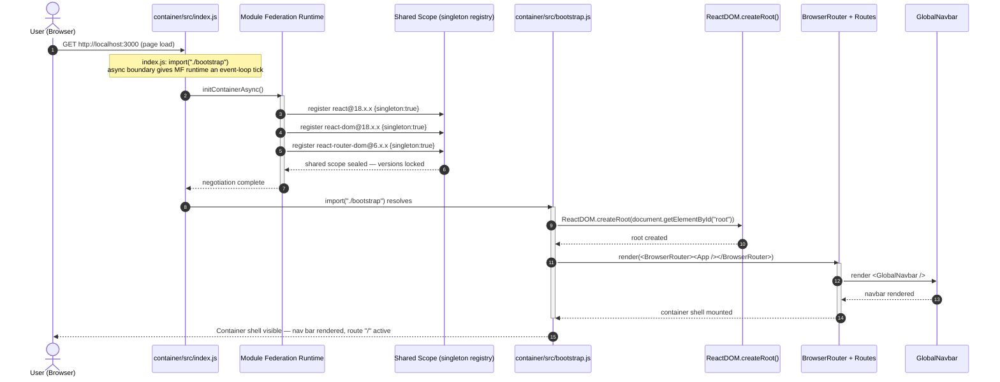
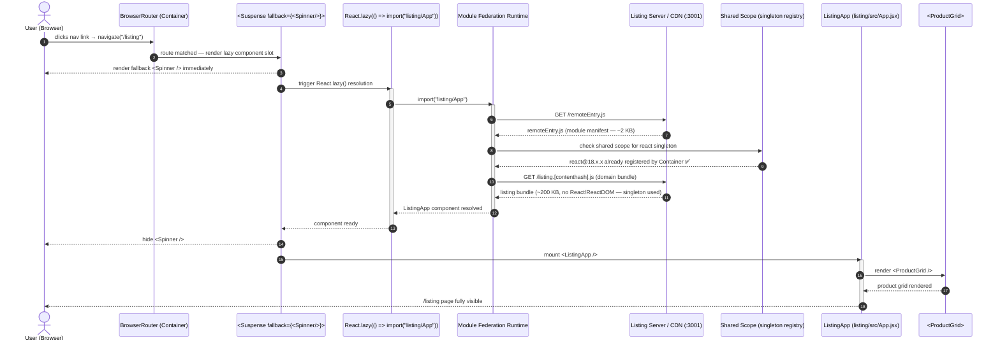
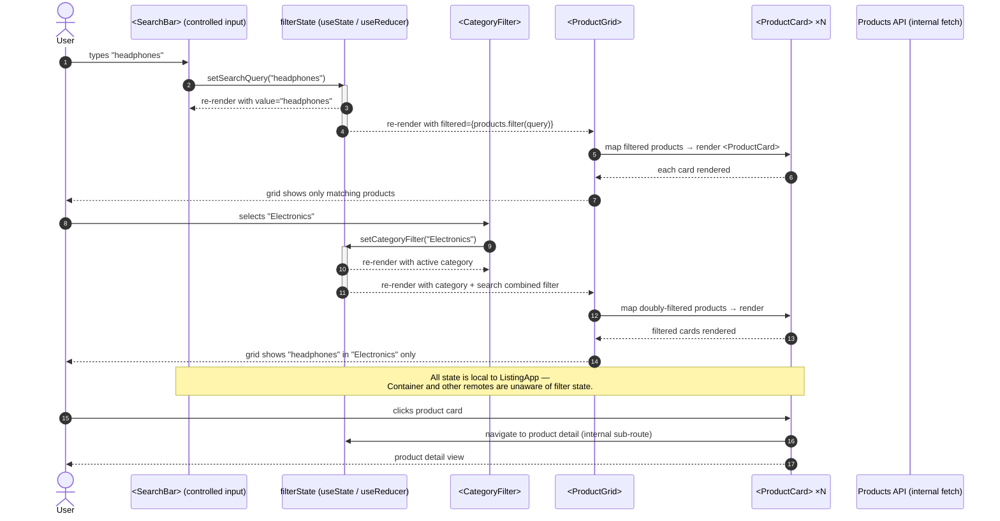
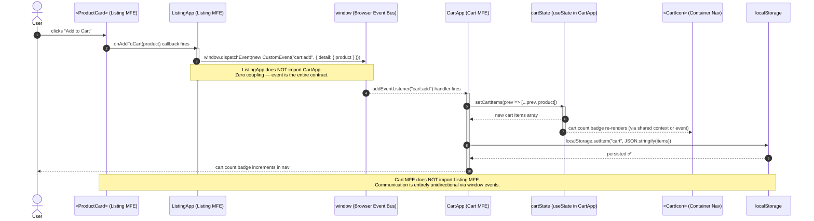
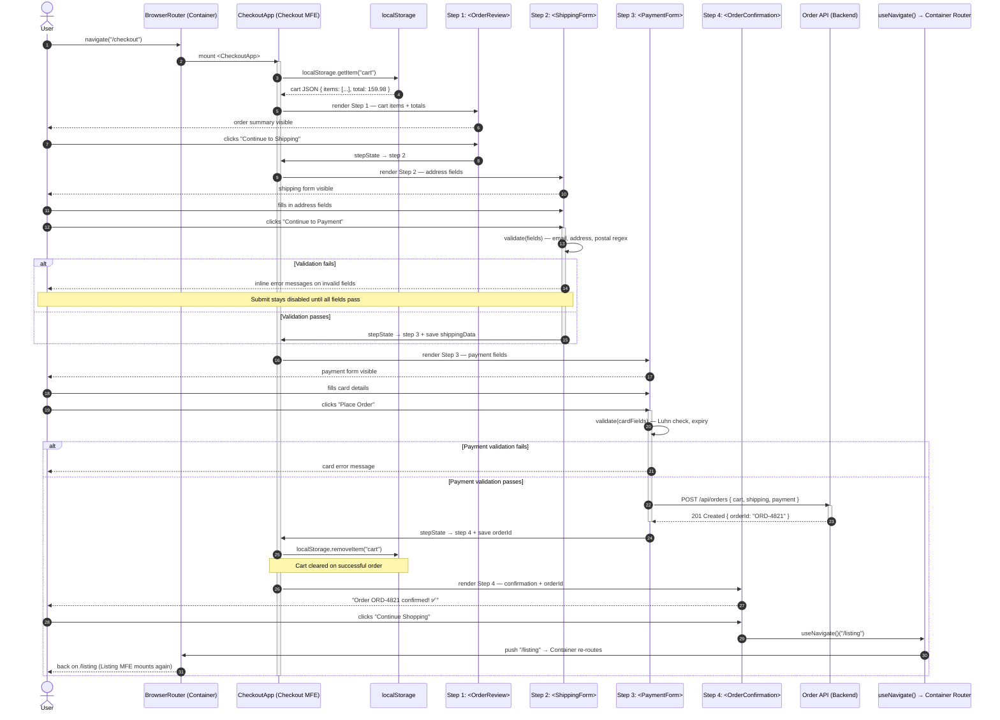
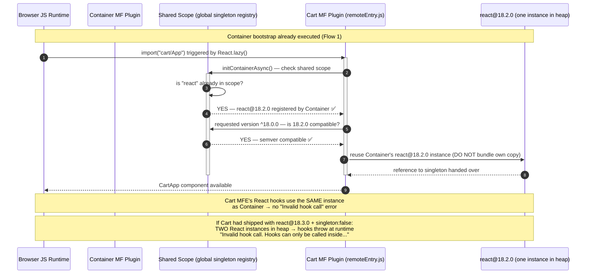
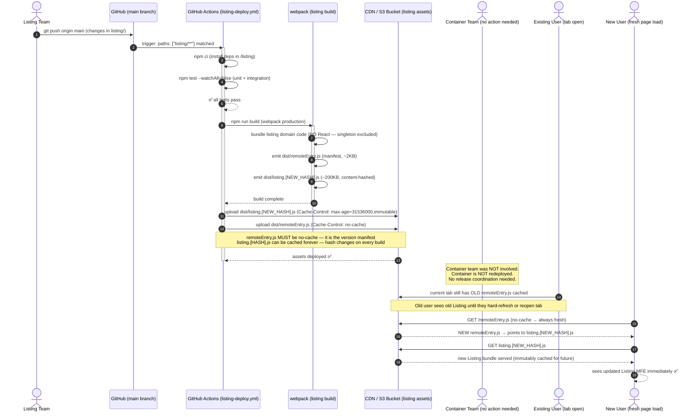
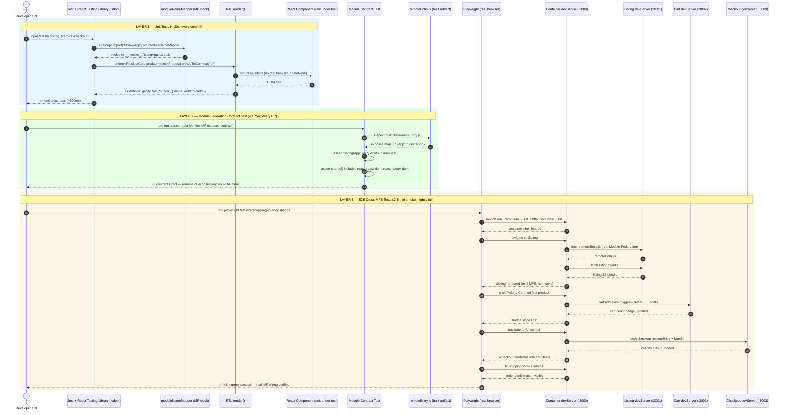

# Micro-Frontend Architecture with React — Sequence Diagrams

> **Module:** E-Commerce Platform · Webpack Module Federation · React 18 · Tailwind CSS  
> **Principal architect view:** End-to-end request, load, state, and deployment flows from browser through all MFE layers.  
> **Ordering:** Flows are aligned 1-to-1 with §4 Layer Summary Tables in [ARCHITECTURE.md](./ARCHITECTURE.md).

---

## Diagram Index

| # | Flow | Trigger | Layers Covered | §4 Alignment |
|---|---|---|---|---|
| 1 | Container bootstrap + Module Federation negotiation | First page load | Browser → Container entry → MF runtime | §4.0 Container |
| 2 | Listing MFE lazy load via React.lazy + Suspense | Navigate to `/listing` | Container → remoteEntry.js → ListingApp mount | §4.1 Listing |
| 3 | Product search and filter | User types in SearchBar | Listing internal — SearchBar → filter state → ProductGrid | §4.1 Listing |
| 4 | Add to Cart — cross-MFE Custom Event bus | Click "Add to Cart" | Listing → window event → Cart MFE | §4.2 Cart |
| 5 | Checkout multi-step form submission | Navigate to `/checkout` | Container → Checkout MFE → 4-step form | §4.3 Checkout |
| 6 | Shared singleton version negotiation | Any remote loads | MF runtime → shared scope → singleton resolution | §4.4 Shared Module Design |
| 7 | Independent MFE deploy + container auto-discovery | CI/CD push to `listing` | GitHub Actions → webpack build → CDN deploy → browser | §4.5 Infrastructure |
| 8 | Test execution — unit → contract → E2E | `npm test` / CI | Jest → RTL → Module contract → Playwright | §4.6 Testing |

---

## Flow 1: Container Bootstrap + Module Federation Negotiation

> **§4.0 Container — Shell Host Application**  
> **Feature:** `index.js` bootstrap indirection + Module Federation shared singleton negotiation.  
> The browser downloads the container bundle. Before any React code runs, the Module Federation runtime intercepts the async import boundary (`import("./bootstrap")`) and negotiates shared module versions with all registered remotes. Only after this negotiation resolves does `ReactDOM.createRoot()` execute.



### Flow 1 — Layer Call Chain

```
Browser (HTTP GET /)
    │
    ▼
container/src/index.js   ← synchronous webpack entry
    │ import("./bootstrap")   ← async boundary — gives MF runtime a tick
    ▼
Module Federation Runtime  ← intercepts dynamic import
    │ initContainerAsync()
    │ registers react, react-dom, react-router-dom as singletons
    ▼
Shared Scope  ← version negotiation registry
    │ seals shared scope — versions cannot change after this point
    ▼
container/src/bootstrap.js  ← actual React initialisation
    │ ReactDOM.createRoot()
    │ render(<BrowserRouter><App /></BrowserRouter>)
    ▼
React tree mounted — BrowserRouter owns window.history
    │
    ▼
User sees container shell (nav + empty route slot)
```

### Flow 1 — Bootstrap Anti-Pattern

```js
// ❌ WRONG — direct import in index.js (no async boundary)
import React from "react";
import ReactDOM from "react-dom/client";
import App from "./App";
// ^^^ MF runtime has NO event-loop tick to negotiate shared modules
// → remotes may load their own bundled React instead of the singleton
ReactDOM.createRoot(document.getElementById("root")).render(<App />);

// ✅ CORRECT — async bootstrap indirection
// index.js:
import("./bootstrap");   // ← MF runtime negotiates BEFORE React initialises

// bootstrap.js:
import React from "react";
import ReactDOM from "react-dom/client";
import App from "./App";
ReactDOM.createRoot(document.getElementById("root")).render(<App />);
```

---

## Flow 2: Listing MFE Lazy Load — React.lazy + Suspense + remoteEntry.js

> **§4.1 Listing — Product Listing Micro-Frontend**  
> **Feature:** `React.lazy()` dynamic import + Module Federation remote fetch + Suspense fallback lifecycle.  
> When the user navigates to `/listing`, React Router matches the route. The `React.lazy()` wrapper triggers a dynamic `import("listing/App")`. The browser has not yet downloaded the Listing bundle — Module Federation intercepts this import, fetches `remoteEntry.js` from the Listing server (port 3001), resolves the shared React singleton, and returns the `ListingApp` component. The Suspense boundary displays a loading fallback until the component is ready to render.



### Flow 2 — Layer Call Chain

```
User clicks /listing nav link
    │
    ▼
BrowserRouter (Container)
    │ route matched: /listing → <ListingPage>
    ▼
<Suspense fallback={<LoadingSpinner />}>
    │ React.lazy(() => import("listing/App"))
    │ → Suspense immediately renders fallback (spinner)
    ▼
Module Federation Runtime
    │ GET remoteEntry.js from Listing server / CDN
    │ Resolve react singleton from Container's shared scope
    │ GET listing bundle (no React included — singleton reused)
    ▼
ListingApp component available
    │ Suspense hides spinner — mounts <ListingApp>
    ▼
ProductGrid → ProductCard[] renders
    │
    ▼
User sees product catalogue
```

### Flow 2 — Standalone vs Container Execution Paths

| Trigger | Path Taken | Bootstrap File Used | Router |
|---|---|---|---|
| `npm start` inside `/listing` | `listing/src/index.js` → `bootstrap.js` | `listing/src/bootstrap.js` | Own `<BrowserRouter>` (standalone) |
| Container navigates to `/listing` | `import("listing/App")` via MF | `container/src/bootstrap.js` | Container's `<BrowserRouter>` |
| Jest unit test | Direct `import App from "./App"` | Not used — import is synchronous in JSDOM | `<MemoryRouter>` in test |

---

## Flow 3: Product Search and Filter

> **§4.1 Listing — Product Listing Micro-Frontend (internal flow)**  
> **Feature:** Controlled input → React state → filtered render cycle — entirely within the Listing MFE boundary.  
> The user types in the `<SearchBar>`. This triggers a React state update in the `<App>` or a context/hook that holds the filter state. `<ProductGrid>` is a pure component — it re-renders with the filtered array. No cross-MFE communication occurs; this is a purely internal Listing MFE flow.



### Flow 3 — Layer Call Chain

```
User types in <SearchBar>
    │ onChange → setSearchQuery(value)
    ▼
filterState (useState in ListingApp or dedicated hook)
    │ derivedProducts = useMemo(() => products.filter(q, cat), [query, category])
    ▼
<ProductGrid products={filteredProducts} />
    │ map() → <ProductCard key={id} product={p} onAddToCart={handler} />
    ▼
<ProductCard> renders: image | name | price | "Add to Cart" button
    │
    ▼
User sees filtered product grid
```

### Flow 3 — State Colocation Rule

```
Listing MFE state boundary:
┌─────────────────────────────────────────────────────┐
│  <ListingApp>                                       │
│  ├── filterState: { query: "", category: "" }       │  
│  ├── <SearchBar>  ← reads + writes filterState      │
│  ├── <CategoryFilter> ← reads + writes filterState  │
│  └── <ProductGrid products={filtered}> ← reads only │
│       └── <ProductCard> ×N  ← props only, no state  │
└─────────────────────────────────────────────────────┘
         │
         │ ← NO state leaves this boundary
         │    (only cart events cross to Cart MFE — see Flow 4)
```

---

## Flow 4: Add to Cart — Cross-MFE Custom Event Bus

> **§4.2 Cart — Shopping Cart Micro-Frontend**  
> **Feature:** Decoupled cross-MFE communication via `window` Custom Events.  
> The user clicks "Add to Cart" inside the Listing MFE. Listing knows nothing about the Cart MFE's internal state or API. It fires a browser `CustomEvent` on `window`. The Cart MFE has registered a `window.addEventListener("cart:add", handler)` at mount. This event-driven model maintains strict MFE isolation — neither remote imports the other directly.



### Flow 4 — Layer Call Chain

```
User clicks "Add to Cart" in ProductCard (Listing MFE)
    │
    ▼
onAddToCart(product) — prop callback fires
    │
    ▼
window.dispatchEvent(new CustomEvent("cart:add", { detail: { product } }))
    │ ListingApp does NOT reference CartApp — zero import
    ▼
window event bubbles — CartApp's listener catches it
    │ registered at CartApp mount: window.addEventListener("cart:add", handler)
    ▼
CartApp: setCartItems([...prev, product])
    │ localStorage.setItem("cart", serialized items)
    ▼
CartIcon in Container nav re-renders with updated count
    │
    ▼
User sees cart badge increment immediately
```

### Flow 4 — Cross-MFE Communication Pattern Comparison

| Pattern | Coupling | Example in Flow 4 | Breaks If |
|---|---|---|---|
| Custom Event (used here) | Zero | `window.dispatchEvent / addEventListener` | Event name typo — fails silently at runtime |
| Shared Zustand store | Low (shared module) | `useCartStore()` in both MFEs | Shared module version mismatch |
| Props drilling via Container | Medium | Container passes `onAddToCart` as prop to both remotes | Container must know about both remotes |
| Direct MFE import | High | `import CartStore from "cart/store"` | Cart MFE deploy breaks Listing at runtime |
| Backend API as source of truth | None (async) | POST /api/cart/:userId | Network latency on every add-to-cart |

---

## Flow 5: Checkout Multi-Step Form Submission

> **§4.3 Checkout — Order Checkout Micro-Frontend**  
> **Feature:** Multi-step form progression with per-step validation, cart data handoff from Cart MFE via `localStorage`, and order submission.  
> The user navigates to `/checkout`. `CheckoutApp` reads the cart from `localStorage` (the Cart MFE's persistence layer). The form progresses through four sequential steps, each validated before advancing. On final submission, the order is posted to the Order API and the user is shown a confirmation screen. Navigation back to `/listing` is handled by `useNavigate()` — which resolves against the Container's router.



### Flow 5 — Layer Call Chain

```
User navigates to /checkout
    │
    ▼
BrowserRouter (Container) matches route
    │ React.lazy() fetches checkout remoteEntry.js if not yet loaded
    ▼
<CheckoutApp> mounts
    │ reads localStorage.getItem("cart") — Cart MFE's persisted state
    ▼
Step 1 — <OrderReview>:  display items + total  →  user confirms
    │
    ▼
Step 2 — <ShippingForm>: address fields + client-side validation
    │ validate(): regex per field → inline errors on blur
    │ all fields valid → advance
    ▼
Step 3 — <PaymentForm>:  card fields + Luhn check
    │ POST /api/orders → 201 Created { orderId }
    ▼
Step 4 — <OrderConfirmation>:  orderId displayed
    │ localStorage.removeItem("cart")
    │ useNavigate()("/listing")  → Container BrowserRouter routes back
    ▼
User returns to Listing MFE
```

### Flow 5 — Form Validation Sequence (Step 2 Detail)

```
User submits ShippingForm
    │
    ▼
validate(fields):
    ├── email: /^[^\s@]+@[^\s@]+\.[^\s@]+$/.test(email)   → ✅ or inline error
    ├── address: length >= 5                               → ✅ or inline error
    ├── city: non-empty                                    → ✅ or inline error
    └── postal: /^\d{5}(-\d{4})?$/.test(postal)           → ✅ or inline error
         │
         │ ALL pass?
         ▼
    setCurrentStep(3)
    setFormData(prev => ({ ...prev, shipping: fields }))
         │
         │ ANY fail?
         ▼
    setErrors({ email: "Invalid email format", ... })
    → inline messages rendered below each field
    → submit button stays disabled
```

---

## Flow 6: Shared Singleton Version Negotiation

> **§4.4 Shared Module Design**  
> **Feature:** Module Federation runtime shared scope negotiation — `singleton: true` enforcement across Container + all three remotes.  
> This flow shows the sequence the MF runtime executes when a second remote (e.g., `cart`) loads AFTER the Container has already sealed the shared scope with `react@18.2.0`. The runtime detects the already-registered singleton and reuses it — the Cart bundle ships without React/ReactDOM, saving ~1.1 MB of duplicate code.



### Flow 6 — Singleton Resolution Outcomes

```
Scenario A — Happy path (both at 18.2.0, singleton: true):
┌─────────────────────────────────────────────────────────────────┐
│  Container seals scope: react@18.2.0                           │
│  Cart loads: requires react ^18.0.0                            │
│  → 18.2.0 satisfies ^18.0.0 → REUSE Container's instance      │
│  → Cart bundle: react NOT included → -130KB                    │
└─────────────────────────────────────────────────────────────────┘

Scenario B — Version mismatch (18.2.0 vs 18.3.0, singleton: true):
┌─────────────────────────────────────────────────────────────────┐
│  Container seals scope: react@18.2.0                           │
│  Cart loads: requires react@18.3.0 exactly                     │
│  → ^18.3.0 does NOT satisfy @18.2.0 (already locked)          │
│  → Warning logged: "Shared module is not available"            │
│  → MF falls back to Cart's own bundled react@18.3.0            │
│  → TWO React instances → hooks CRASH at runtime               │
└─────────────────────────────────────────────────────────────────┘

FIX: Use ^18.0.0 requiredVersion in all four MFEs' shared{} configs
     and align all package.json to the same minor version.
```

### Flow 6 — Shared Scope State Transitions

| Phase | Owner | Shared Scope State | react Instances in Heap |
|---|---|---|---|
| Before Container loads | — | Empty | 0 |
| Container `initContainerAsync()` | Container | `react@18.2.0` sealed | 1 |
| Listing loads (first remote) | Listing MF | Queries scope → reuses | 1 |
| Cart loads (second remote) | Cart MF | Queries scope → reuses | 1 |
| Checkout loads (third remote) | Checkout MF | Queries scope → reuses | 1 |
| All four MFEs active | All | Sealed at 18.2.0 | **1 (correct)** |
| Cart has `singleton: false` (broken) | Cart MF | Ignores scope — loads own | **2 (broken)** |

---

## Flow 7: Independent MFE Deploy + Container Auto-Discovery

> **§4.5 Infrastructure and Deployment**  
> **Feature:** Path-filtered CI/CD pipeline — a change to `listing/` triggers only the Listing pipeline. The Container never redeploys; it auto-discovers the new `remoteEntry.js` on the next user page load.  
> This is the core operational value of Micro-Frontend Architecture: **Teams ship independently.**



### Flow 7 — Layer Call Chain

```
Listing team git push → listing/ path filter matches CI
    │
    ▼
GitHub Actions: npm ci → npm test → npm run build
    │ Webpack output:
    │   dist/remoteEntry.js           (~2 KB manifest — NO-CACHE)
    │   dist/listing.[h4sh].js        (~200 KB domain bundle — IMMUTABLE)
    │   dist/vendors.[h4sh].js        (any non-shared 3rd party — IMMUTABLE)
    ▼
S3/CDN upload:
    │ remoteEntry.js      → Cache-Control: no-cache
    │ *.js (hashed)       → Cache-Control: max-age=31536000, immutable
    ▼
Container DOES NOT redeploy — no action
    ▼
Next user page load:
    │ Browser fetches remoteEntry.js (always fresh)
    │ remoteEntry.js points to new listing.[h4sh].js
    │ Browser fetches new bundle (or hits cache if hash unchanged)
    ▼
User sees new Listing features ✅
```

### Flow 7 — CDN Cache Strategy Reference

| Asset | Cache-Control | Reason |
|---|---|---|
| `remoteEntry.js` | `no-cache` | Version manifest — must always be current |
| `listing.[hash].js` | `max-age=31536000, immutable` | Content-hashed — hash changes on rebuild; safe to cache forever |
| `vendors.[hash].js` | `max-age=31536000, immutable` | Same — hash is deterministic from content |
| `index.html` (container) | `no-cache` | Entry point — must always serve latest container shell |

---

## Flow 8: Test Execution — Unit → Contract → E2E

> **§4.6 Testing Strategy**  
> **Feature:** Full test pyramid execution — from sub-second unit tests through Module Federation contract validation to full cross-MFE Playwright E2E.  
> Each layer of the test pyramid provides a distinct quality signal. The layers run in increasing cost and decreasing frequency: unit on every file save, contract on every PR, full E2E nightly.



### Flow 8 — Layer Call Chain

```
UNIT LAYER (every commit):
Jest + RTL in jsdom
    │ moduleNameMapper mocks all Module Federation imports
    │ render(<ProductCard>) → assert DOM output, event handlers
    │ render(<CartApp>) with mock items → assert totals
    │ render(<CheckoutApp>) with mock cart → assert step transitions
    ▼ Pass: < 30 seconds

CONTRACT LAYER (every PR):
Contract test reads built remoteEntry.js
    │ assert exposes["./App"] exists
    │ assert shared[] singletons declared
    ▼ Pass: < 60 seconds — catches exposes key renames before they reach production

E2E LAYER (smoke every PR, full nightly):
Playwright with real devServers on :3000/:3001/:3002/:3003
    │ Real Module Federation wiring (no mocks)
    │ browse → add-to-cart → checkout → confirm
    ▼ Pass: 2–5 min smoke | 10–20 min full
```

### Flow 8 — Test Isolation Matrix

| What is tested | Tool | Module Federation | Network calls | Speed |
|---|---|---|---|---|
| `<ProductCard>` renders correctly | Jest + RTL | Mocked (`moduleNameMapper`) | Mocked (MSW) | ~50ms |
| Listing standalone app flow | Jest + RTL | Not needed (direct import) | Mocked (MSW) | ~500ms |
| `remoteEntry.js` exposes correct keys | Contract test | Real built artifact | None | ~5s |
| Container loads all 3 remotes at routes | Playwright | REAL (devServer) | Real / MSW | ~30s |
| Full shopping journey (browse→cart→checkout) | Playwright | REAL (devServer) | Real / stub API | ~60s |
| Cart count persists across navigation | Playwright | REAL (devServer) | Real / localStorage | ~20s |

### Flow 8 — Quality Engineer's Test Pyramid Ratios

```
                        /\
                       /  \    10% — E2E (Playwright)
                      / E2E\   Full journey, real MF wiring
                     /──────\
                    /        \  20% — Integration / Contract
                   / Contract \  remoteEntry contract + standalone MFE
                  /────────────\
                 /              \
                /   Unit Tests   \  70% — Unit (Jest + RTL)
               /  (per component) \  Pure component, no MF, no network
              /────────────────────\

Principal QE Rule:
  An inverted pyramid (mostly E2E) → brittle, slow CI pipeline.
  A missing contract layer → exposes key renames silently break production.
  A missing unit base → component regressions caught too late = expensive.
```

---

*Generated 2026-03-06 · Principal architect and quality engineer analysis of `Micro-Frontend Architecture with React` (React 18 · Webpack Module Federation · Tailwind CSS · React Router DOM · Playwright · Jest · React Testing Library)*
