# FinTech Enterprise Micro-Frontend Architecture — Sequence Diagrams

> **Platform:** Digital Banking & Wealth Platform · Webpack Module Federation · React 18 · Storybook 8 · TypeScript  
> **Perspective:** Principal Front-End Solution Architect · Principal Front-End Quality Engineer  
> **Regulatory scope:** PCI-DSS Level 1 · SOC 2 Type II · PSD2 / Open Banking · WCAG 2.1 AA  
> **Ordering:** Flows are aligned 1-to-1 with §5 Layer Summary Tables in [ARCHITECTURE.md](./ARCHITECTURE.md).

---

## Diagram Index

| # | Flow | Trigger | Layers Covered | §5 Alignment |
|---|---|---|---|---|
| 1 | Shell bootstrap + OAuth2 PKCE auth + Module Federation negotiation | First page load | Browser → Shell entry → IdP → MF runtime → AuthContext | §5.0 Shell |
| 2 | Dashboard MFE lazy load with auth guard | Navigate to `/dashboard` | Shell → AuthGuard → remoteEntry.js → DashboardApp | §5.1 Dashboard |
| 3 | Design System component resolution (Storybook → npm → MFE) | MFE renders `<Button>` | Storybook → Chromatic → npm publish → MFE build | §3 Design System |
| 4 | Cross-MFE payment initiation with PCI-DSS boundary + audit trail | User initiates payment | Payments MFE → PCI iframe → PCI vault → Payment API → Audit | §5.2 Payments |
| 5 | Feature flag evaluation for new trading instrument rollout | User opens Trading MFE | LaunchDarkly → feature flag client → conditional render | §5.3 Trading |
| 6 | Shared singleton version negotiation + auth context reuse | Dashboard MFE loads | MF runtime → shared scope → auth-context singleton | §5.5 Shared Modules |
| 7 | Canary deployment + automated metric gate + rollback | CI/CD push to `payments` | GitHub Actions → webpack → CDN canary → metric gate | §5.6 Infrastructure |
| 8 | Test pyramid — Storybook interaction → axe-core → Chromatic → Playwright E2E | `npm test` / CI | Storybook → axe → Chromatic → Playwright | §5.7 Testing |
| 9 | Silent token refresh mid-session + 401 recovery | access_token nearing expiry | AuthContext → IdP /token → silent refresh → API retry | §4 Auth Layer |
| 10 | Compliance audit trail — append-only event flow | User submits payment | AuditClient → Audit API → Kafka → Compliance MFE / SIEM | §6.1 Audit Trail |

---

## Flow 1: Shell Bootstrap · OAuth2 PKCE Auth · Module Federation Negotiation

> **§5.0 Shell — Auth-Gated Host Application**  
> **Feature:** `index.ts` async bootstrap indirection + OAuth2 PKCE auth flow + Module Federation shared singleton negotiation.  
> The browser downloads the shell bundle. The async import boundary gives the MF runtime a tick to negotiate shared module versions. In parallel, `AuthProvider` detects no access token in memory and initiates the OAuth2 PKCE redirect. On return from the IdP, the auth code is exchanged for an access token, stored in React context (memory only), and the platform shell renders with the user's role context loaded.

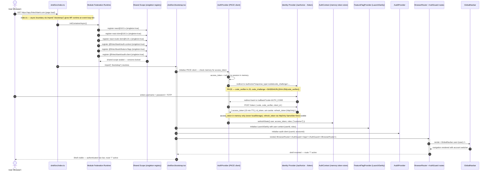

### Flow 1 — Layer Call Chain

```
Browser GET https://app.fintechbank.com
    │
    ▼
shell/src/index.ts   ← async boundary import("./bootstrap")
    │
    ▼
Module Federation Runtime  ← negotiates 6 shared singletons
    │  seals shared scope — react, auth-context, feature-flags, audit-client locked
    ▼
shell/src/bootstrap.tsx
    │  AuthProvider — no token in memory → PKCE redirect to IdP
    │  User authenticates → code returned to /callback
    │  POST /token → access_token (memory) + refresh_token (httpOnly cookie)
    │  FeatureFlagProvider.init(userId, roles)
    │  AuditProvider.init(userId, sessionId)
    ▼
React tree mounted
    │  BrowserRouter → AuthGuard → GlobalNavbar
    ▼
User sees authenticated platform shell
```

### Flow 1 — Security Properties of Bootstrap

| Property | Mechanism | Attack Mitigated |
|---|---|---|
| PKCE code_challenge | SHA-256 of code_verifier in redirect | Auth code interception (MITM) |
| access_token in memory | React context only — no persistence | XSS token exfiltration |
| refresh_token httpOnly cookie | SameSite=Strict; Secure | XSS + CSRF token theft |
| Async MF bootstrap boundary | `import("./bootstrap")` | Module Federation shared scope race condition |
| CSP nonce on script tags | Server-generated per-request | Inline script injection |

---

## Flow 2: Dashboard MFE Lazy Load with Auth Guard

> **§5.1 Dashboard — Account Overview Micro-Frontend**  
> **Feature:** Route-level AuthGuard check → React.lazy() → Module Federation remoteEntry fetch → Dashboard MFE mount with inherited auth context.  
> When the user navigates to `/dashboard`, the AuthGuard validates the access token before React.lazy() fires. If the token is valid, Module Federation fetches the Dashboard remoteEntry, resolves the auth-context singleton from the shared scope, and mounts the DashboardApp — which can immediately call APIs using the inherited access token without re-authenticating.

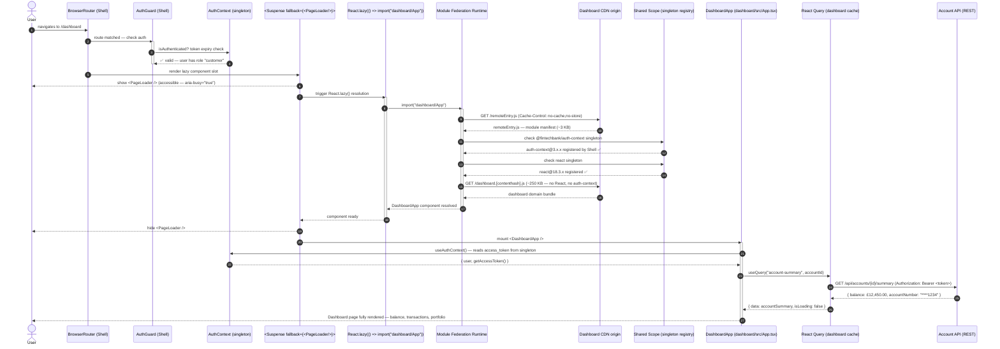

### Flow 2 — Layer Call Chain

```
User navigates to /dashboard
    │
    ▼
BrowserRouter (Shell) — route matched
    │
    ▼
AuthGuard — validates access_token in AuthContext
    │ token valid → continue
    │ token expired → trigger silent refresh (see Flow 9) → continue
    │ no token → redirect to /login
    ▼
<Suspense fallback={<PageLoader aria-busy="true" />}>
    │ React.lazy(() => import("dashboard/App"))
    │ → PageLoader renders immediately
    ▼
Module Federation Runtime
    │ GET remoteEntry.js (no-cache,no-store)
    │ Resolve auth-context singleton from Shell's shared scope
    │ Resolve react singleton from Shell's shared scope
    │ GET dashboard bundle (no React, no auth-context — both are singletons)
    ▼
DashboardApp mounts
    │ useAuthContext() — reads access_token from shared singleton
    │ React Query — GET /api/accounts with Authorization: Bearer header
    ▼
User sees account summary, portfolio, recent transactions
```

---

## Flow 3: Design System Component Resolution — Storybook → Chromatic → npm → MFE Build

> **§3 Design System Library Architecture**  
> **Feature:** End-to-end lifecycle of a new Design System component: story written in Storybook → visual regression via Chromatic → accessibility gate → npm publish → consumed in Payments MFE.  
> This flow traces a `<CurrencyInput>` component from creation through the Storybook-powered CI pipeline to production use in the Payments MFE. It illustrates how the Design System is the single source of truth — no MFE rebuilds its own input fields.

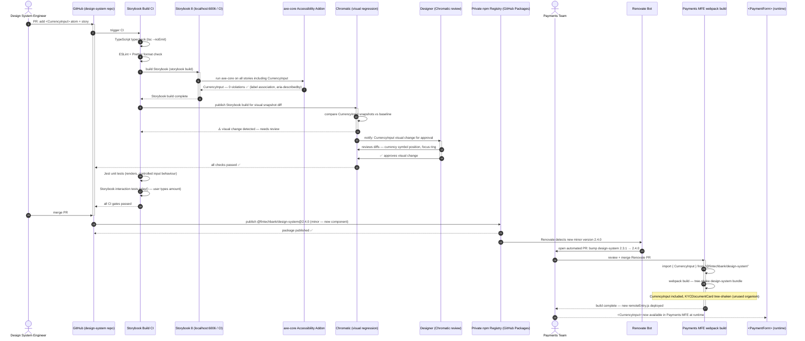

### Flow 3 — Design System Governance Gates

```
Pull Request opened to design-system repo
    │
    ├── 1. TypeScript typecheck (0 errors)
    ├── 2. ESLint / Prettier (0 lint errors)
    ├── 3. Jest unit tests (component logic — controlled input, prop types)
    ├── 4. Storybook interaction tests (play() functions — user events)
    ├── 5. axe-core accessibility scan (0 WCAG 2.1 AA violations) ← HARD GATE
    ├── 6. Chromatic visual snapshot diff ← requires designer approval on change
    └── 7. Coverage threshold ≥ 90% statements ← HARD GATE
              │
              ▼
         All gates pass → merge → npm publish (semver)
              │
              ▼
         Renovate bot opens PRs in all downstream MFEs (patch = auto-merge, minor = review)
```

---

## Flow 4: Cross-MFE Payment Initiation · PCI-DSS Boundary · Audit Trail

> **§5.2 Payments — Regulated Payment Micro-Frontend**  
> **Feature:** User initiates a card payment → Payments MFE hands off to PCI iframe → card tokenisation → payment submission → audit events dispatched throughout.  
> This flow is the highest-stakes sequence in the platform. It crosses the PCI-DSS boundary (via sandboxed iframe), triggers PSD2 Strong Customer Authentication (SCA), and dispatches three immutable audit events. No raw card data (PAN, CVV, expiry) ever enters the React application or the Payments MFE's JS heap.

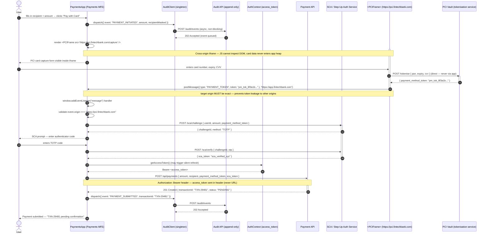

### Flow 4 — PCI-DSS Boundary Rules

| Rule | Implementation | PCI Requirement |
|---|---|---|
| No raw card data in app JS heap | iframe is cross-origin — parent cannot read DOM | PCI-DSS Req 3 (protect stored data) |
| postMessage target origin is exact | `"https://pci.fintechbank.com"` only — wildcard `"*"` is forbidden | Prevents token exfiltration |
| Tokenisation before leaving PCI scope | PCIVault returns opaque token — PAN never leaves PCI iframe | PCI-DSS Req 4 (encrypt in transit) |
| SCA for payments above threshold | PSD2 RTS Article 5 — €30+ requires Strong Customer Authentication | Regulatory compliance |
| Audit event on initiate + submit | AuditClient dispatches immutable events on every payment action | PCI-DSS Req 10 (logging) |

---

## Flow 5: Feature Flag Evaluation for Trading Instrument Rollout

> **§5.3 Trading — Market Data and Order Management Micro-Frontend**  
> **Feature:** LaunchDarkly feature flag evaluation controls which order types are visible to which user segments before regulatory approval has been granted for all users.  
> The `useFeatureFlag` hook connects to the LaunchDarkly client (a shared singleton initialised in the Shell with the user's context). Flag evaluation is synchronous after initialisation — no network call per evaluation. A kill switch can disable a trading feature for all users within seconds, without a code deployment.

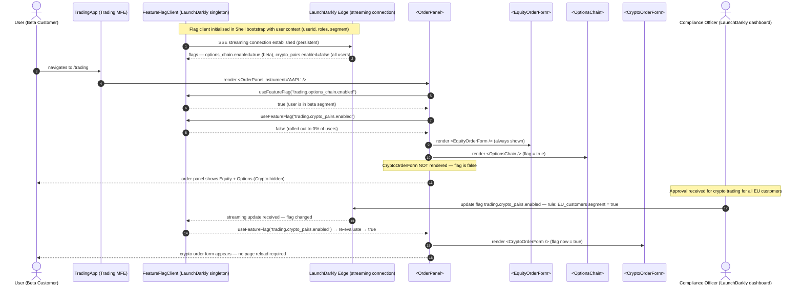

### Flow 5 — Feature Flag Kill Switch (Emergency)

```
Scenario: A critical bug found in OptionsChain — must disable immediately

Compliance Officer / On-call Engineer:
    │
    └── LaunchDarkly dashboard: toggle trading.options_chain.enabled → false (all users)
              │
              ▼
    LaunchDarkly edge SDKs receive streaming update within ~500ms
              │
              ▼
    FlagClient (singleton in Shell) fires change event
              │
              ▼
    React re-renders OrderPanel:
      useFeatureFlag("trading.options_chain.enabled") → false
      <OptionsChain> unmounts immediately
              │
              ▼
    All users: OptionsChain hidden — zero deployment required
    Options orders in progress: gracefully interrupted — user sees "Feature temporarily unavailable"
```

---

## Flow 6: Shared Singleton Version Negotiation + auth-context Reuse

> **§5.5 Shared Module Design**  
> **Feature:** Module Federation runtime shared scope negotiation — all six singletons (react, auth-context, feature-flags, audit-client, etc.) are resolved from the shell's registered scope when Dashboard MFE loads.  
> This flow shows the exact sequence: the Dashboard MFE's `initContainerAsync()` queries the shared scope for each singleton, finds them already registered by the Shell, and receives a reference to the same instance — not a duplicate. Critically, the `access_token` stored in the auth-context singleton is **the same object in the JS heap** that the Shell manages. Dashboard's API calls use the correct, latest token without any re-authentication.

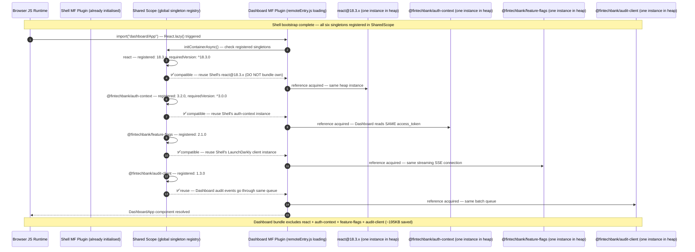

### Flow 6 — Singleton Resolution Failure Scenarios

```
Scenario A — Happy path (all singletons compatible):
┌──────────────────────────────────────────────────────────────────────┐
│  Shell seals: react@18.3.0, auth-context@3.2.0, feature-flags@2.1.0 │
│  Dashboard requires: ^18.3.0, ^3.0.0, ^2.0.0                        │
│  → All semver compatible → singletons REUSED                         │
│  → Dashboard bundle: no duplicate auth/react/flags code              │
└──────────────────────────────────────────────────────────────────────┘

Scenario B — auth-context minor mismatch (3.2.0 vs 3.0.0):
┌──────────────────────────────────────────────────────────────────────┐
│  Shell: auth-context@3.2.0, Dashboard requires: ^3.0.0              │
│  → ^3.0.0 SATISFIED by @3.2.0 → reuse Shell's instance              │
│  → New minor features in 3.2.0 available to Dashboard               │
└──────────────────────────────────────────────────────────────────────┘

Scenario C — auth-context major version mismatch (CRITICAL):
┌──────────────────────────────────────────────────────────────────────┐
│  Shell: auth-context@3.2.0, Dashboard requires: ^4.0.0              │
│  → Major version mismatch → Module Federation warns and loads own    │
│  → TWO auth-context instances in heap                                 │
│  → Dashboard's instance has NO access_token (Shell set it in v3 instance)│
│  → All Dashboard API calls get 401 Unauthorized                      │
│  FIX: Pin all MFEs and Shell to same auth-context major version.     │
│  Coordinate via RFC process before any major version bump.           │
└──────────────────────────────────────────────────────────────────────┘
```

---

## Flow 7: Canary Deployment · Metric Gate · Automated Rollback

> **§5.6 Infrastructure and Deployment**  
> **Feature:** Payments MFE code pushed to `main` → CI quality gates → canary deploy (5% traffic) → metric gate evaluation → full promotion or automated rollback.  
> In a regulated environment, a broken payment form is a P0 incident requiring FCA incident reporting. The canary strategy limits blast radius to 5% of traffic. Automated metric gates (error rate, p99 latency) gate promotion without manual intervention — promotion happens in minutes if metrics are nominal, rollback in seconds if they are not.

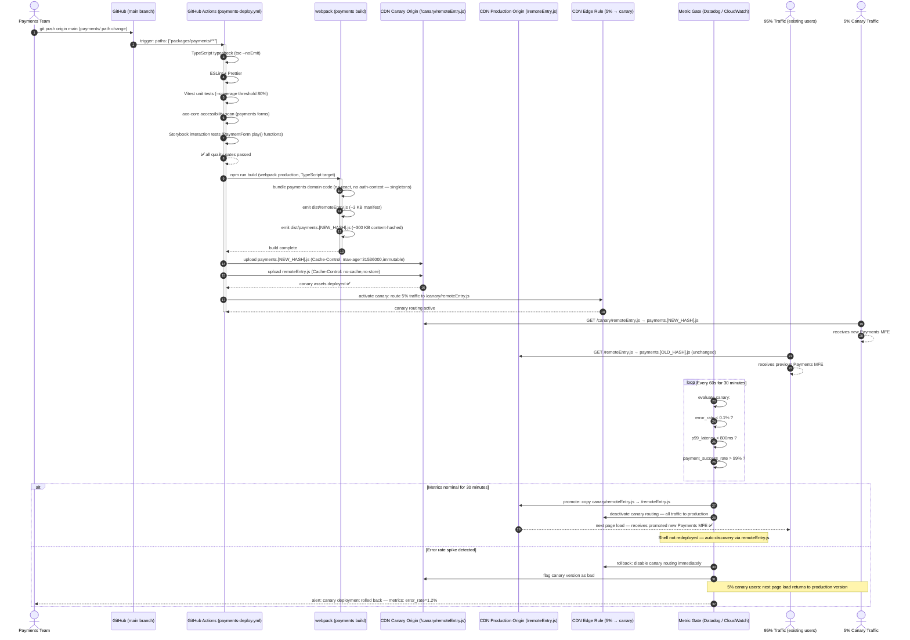

### Flow 7 — CDN Cache Strategy (FinTech Tightening)

| Asset | Cache-Control | Reason |
|---|---|---|
| `remoteEntry.js` (production) | `no-cache, no-store` | Zero TTL — regulatory requirement: deploy must be immediately visible |
| `remoteEntry.js` (canary) | `no-cache, no-store` | Same — canary must be promotable without cache flush |
| `payments.[hash].js` | `max-age=31536000, immutable` | Content-hashed — hash guarantees immutability |
| `shell/index.html` | `no-cache` | Entry point — must always serve current shell version |
| API responses | `no-store` | Financial data must never be cached at CDN layer |

---

## Flow 8: Test Pyramid — Storybook Interaction → axe-core → Chromatic → Playwright E2E

> **§5.7 Testing Strategy**  
> **Feature:** Full FinTech-grade quality pipeline — from Storybook interaction tests through WCAG accessibility gates to Chromatic visual regression and real-browser Playwright E2E with PCI iframe verification.  
> Each layer provides a distinct quality signal. Storybook interaction tests catch component-level regressions in seconds. axe-core catches accessibility regressions before they reach users. Chromatic catches visual regressions before they reach the Design System consumer MFEs. Playwright verifies real Module Federation wiring, real auth context, and real payment form flows.

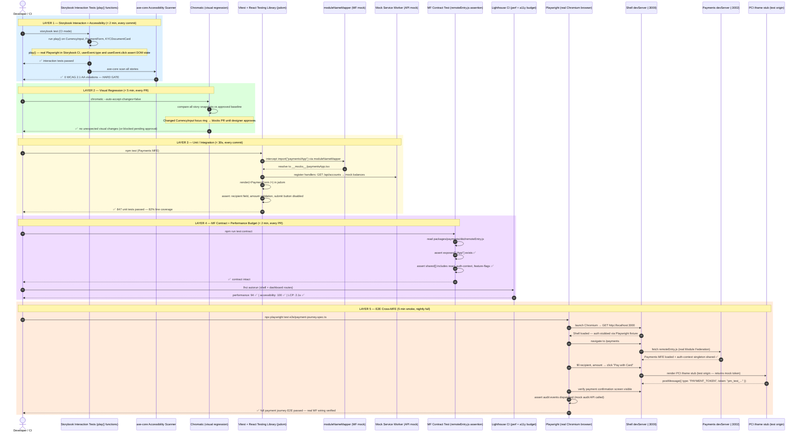

### Flow 8 — Quality Engineer's FinTech Test Matrix

| What is tested | Tool | MF wiring | Auth | Network | Speed |
|---|---|---|---|---|---|
| Component renders, variants, interactions | Storybook play() + axe | Mocked | Not needed | Mocked | < 2 min |
| WCAG 2.1 AA compliance | axe-core (jest-axe + Storybook) | Mocked | Not needed | None | < 1 min |
| Visual pixel regression vs design baseline | Chromatic | Storybook build | Not needed | None | 2–5 min |
| Payment form validation, useQuery hooks | Vitest + RTL + MSW | Mocked (moduleNameMapper) | Mocked | Mocked (MSW) | < 30s |
| remoteEntry.js exposes correct keys + shared[] | Contract test | Real built artifact | Not needed | None | < 30s |
| Core Web Vitals, performance budget | Lighthouse CI | Real webpack build | Mock user | Real localhost | 3–5 min |
| Full auth + MFE load + payment journey | Playwright | REAL devServer | Auth fixture | Real / stub API | 5–10 min |
| Cross-MFE audit trail event dispatch | Playwright + mock audit API | REAL | Auth fixture | Mock audit | ~2 min |

### Flow 8 — QE Principal Rules (FinTech Addendum)

```
                          /\
                         /  \    5% — E2E (Playwright)
                        /    \   Full auth + payment journey + audit trail
                       /  E2E \
                      /────────\
                     /          \  10% — Contract + Lighthouse CI
                    / Contract    \  remoteEntry keys + perf budget
                   / Performance   \
                  /──────────────────\
                 /                    \  25% — Chromatic + axe-core
                / Visual + A11y Tests  \  Visual regression + WCAG gates
               /──────────────────────────\
              /                            \
             /        Unit Tests            \  60% — Vitest + RTL + Storybook play()
            /  (per component + per MFE)     \  Controlled components, hooks, state machines
           /──────────────────────────────────\

FinTech additional rule: Accessibility (axe) is HORIZONTAL — it runs at EVERY layer.
  Not just unit tests. Not just E2E. Every story, every integration test, every Playwright spec
  must produce 0 axe-core WCAG 2.1 AA violations. This is non-negotiable under the EAA (June 2025).
```

---

## Flow 9: Silent Token Refresh Mid-Session + 401 Recovery

> **§4 Authentication and Authorization Layer**  
> **Feature:** Access token nears expiry while user is on the Payments MFE → `AuthContext` silently refreshes using the httpOnly refresh token cookie → API calls resume transparently.  
> This is the most common and most invisible authentication flow. The user is filling in a payment form when their 15-minute access token expires. Without silent refresh, the next API call returns 401 and the user loses their form input. With the interceptor pattern, the access_token is refreshed in the background and the failing request is retried — the user never knows it happened.

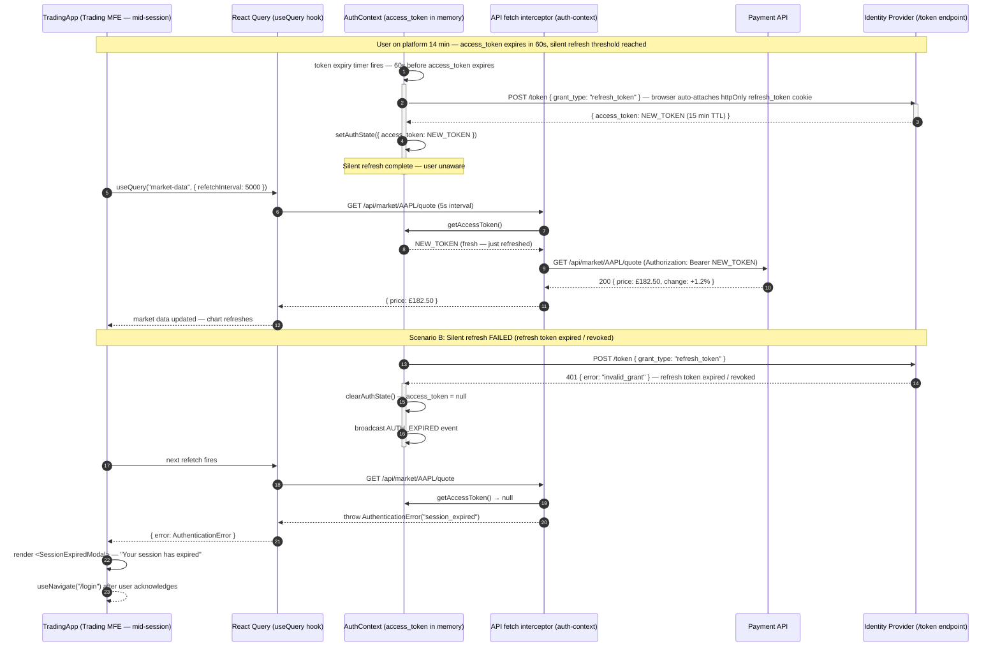

---

## Flow 10: Compliance Audit Trail — Append-Only Event Pipeline

> **§6.1 Audit Trail Architecture**  
> **Feature:** From a user action in the Payments MFE through the AuditClient singleton → Audit API → append-only Kafka topic → consumed by the Compliance MFE and SIEM.  
> Every significant financial action dispatches an immutable audit event. Events are signed with HMAC, stored in an append-only event store (Apache Kafka), and consumed by the Compliance MFE for officer review and by the SIEM for real-time anomaly detection. This flow satisfies PCI-DSS Requirement 10 (audit logging) and GDPR Article 30 (records of processing activities).

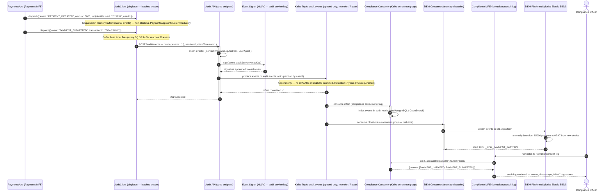

### Flow 10 — Audit Event Structure

```ts
// @fintechbank/audit-client/src/types.ts
interface AuditEvent {
  eventId:         string;           // UUID v4 — immutable identifier
  event:           AuditEventType;   // "PAYMENT_INITIATED" | "PAYMENT_SUBMITTED" | ...
  domain:          string;           // "payments" | "trading" | "compliance"
  userId:          string;           // from auth context
  sessionId:       string;           // browser session identifier
  clientTimestamp: string;           // ISO-8601 — when JS dispatched the event
  serverTimestamp: string;           // ISO-8601 — when Audit API received it (authoritative)
  ipAddress:       string;           // server-enriched (never from client JS)
  payload:         Record<string, unknown>; // domain-specific — PAN never included
  signature:       string;           // HMAC-SHA256(eventId + serverTimestamp + payload, auditKey)
}
```

### Flow 10 — Regulatory Compliance Property Map

| Requirement | How audit trail satisfies it |
|---|---|
| PCI-DSS Req 10 (track access to cardholder data) | Every PAYMENT_INITIATED event logged with userId, timestamp, masked recipient |
| GDPR Art 30 (records of processing activities) | Append-only events serve as processing records; 7-year retention |
| FCA SYSC 10A (trade surveillance) | SIEM consumer triggers alerts on anomalous trading patterns |
| SOC 2 CC7 (monitoring of system anomalies) | SIEM platform consumes audit topic in real time |
| GDPR right to erasure | Audit logs are NOT subject to erasure (regulatory retention obligation supersedes) |

---

*Generated 2026-03-06 · Principal Front-End Solution Architect · Principal Front-End Quality Engineer · Digital Banking & Wealth Platform (React 18 · Webpack Module Federation · Storybook 8 · TypeScript · OAuth2 PKCE · PCI-DSS · WCAG 2.1 AA · LaunchDarkly · Playwright · Chromatic)*

---

## Flow 1: Container Bootstrap + Module Federation Negotiation

> **§4.0 Container — Shell Host Application**  
> **Feature:** `index.js` bootstrap indirection + Module Federation shared singleton negotiation.  
> The browser downloads the container bundle. Before any React code runs, the Module Federation runtime intercepts the async import boundary (`import("./bootstrap")`) and negotiates shared module versions with all registered remotes. Only after this negotiation resolves does `ReactDOM.createRoot()` execute.

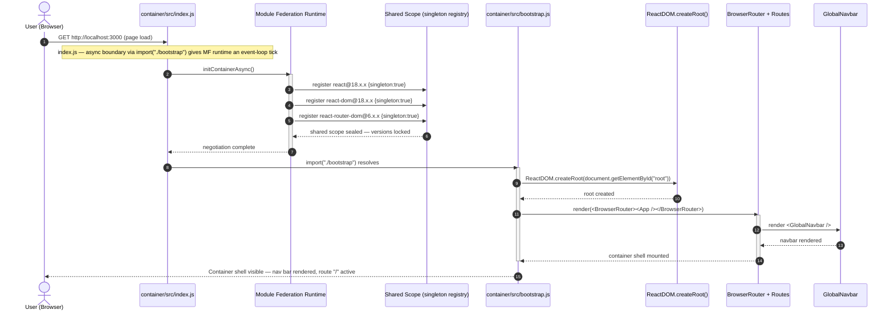

### Flow 1 — Layer Call Chain

```
Browser (HTTP GET /)
    │
    ▼
container/src/index.js   ← synchronous webpack entry
    │ import("./bootstrap")   ← async boundary — gives MF runtime a tick
    ▼
Module Federation Runtime  ← intercepts dynamic import
    │ initContainerAsync()
    │ registers react, react-dom, react-router-dom as singletons
    ▼
Shared Scope  ← version negotiation registry
    │ seals shared scope — versions cannot change after this point
    ▼
container/src/bootstrap.js  ← actual React initialisation
    │ ReactDOM.createRoot()
    │ render(<BrowserRouter><App /></BrowserRouter>)
    ▼
React tree mounted — BrowserRouter owns window.history
    │
    ▼
User sees container shell (nav + empty route slot)
```

### Flow 1 — Bootstrap Anti-Pattern

```js
// ❌ WRONG — direct import in index.js (no async boundary)
import React from "react";
import ReactDOM from "react-dom/client";
import App from "./App";
// ^^^ MF runtime has NO event-loop tick to negotiate shared modules
// → remotes may load their own bundled React instead of the singleton
ReactDOM.createRoot(document.getElementById("root")).render(<App />);

// ✅ CORRECT — async bootstrap indirection
// index.js:
import("./bootstrap");   // ← MF runtime negotiates BEFORE React initialises

// bootstrap.js:
import React from "react";
import ReactDOM from "react-dom/client";
import App from "./App";
ReactDOM.createRoot(document.getElementById("root")).render(<App />);
```

---

## Flow 2: Listing MFE Lazy Load — React.lazy + Suspense + remoteEntry.js

> **§4.1 Listing — Product Listing Micro-Frontend**  
> **Feature:** `React.lazy()` dynamic import + Module Federation remote fetch + Suspense fallback lifecycle.  
> When the user navigates to `/listing`, React Router matches the route. The `React.lazy()` wrapper triggers a dynamic `import("listing/App")`. The browser has not yet downloaded the Listing bundle — Module Federation intercepts this import, fetches `remoteEntry.js` from the Listing server (port 3001), resolves the shared React singleton, and returns the `ListingApp` component. The Suspense boundary displays a loading fallback until the component is ready to render.

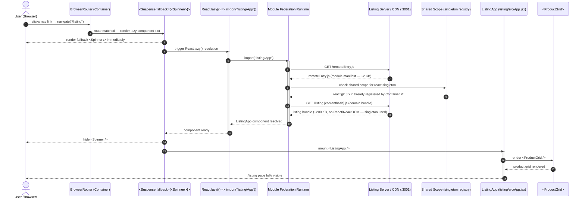

### Flow 2 — Layer Call Chain

```
User clicks /listing nav link
    │
    ▼
BrowserRouter (Container)
    │ route matched: /listing → <ListingPage>
    ▼
<Suspense fallback={<LoadingSpinner />}>
    │ React.lazy(() => import("listing/App"))
    │ → Suspense immediately renders fallback (spinner)
    ▼
Module Federation Runtime
    │ GET remoteEntry.js from Listing server / CDN
    │ Resolve react singleton from Container's shared scope
    │ GET listing bundle (no React included — singleton reused)
    ▼
ListingApp component available
    │ Suspense hides spinner — mounts <ListingApp>
    ▼
ProductGrid → ProductCard[] renders
    │
    ▼
User sees product catalogue
```

### Flow 2 — Standalone vs Container Execution Paths

| Trigger | Path Taken | Bootstrap File Used | Router |
|---|---|---|---|
| `npm start` inside `/listing` | `listing/src/index.js` → `bootstrap.js` | `listing/src/bootstrap.js` | Own `<BrowserRouter>` (standalone) |
| Container navigates to `/listing` | `import("listing/App")` via MF | `container/src/bootstrap.js` | Container's `<BrowserRouter>` |
| Jest unit test | Direct `import App from "./App"` | Not used — import is synchronous in JSDOM | `<MemoryRouter>` in test |

---

## Flow 3: Product Search and Filter

> **§4.1 Listing — Product Listing Micro-Frontend (internal flow)**  
> **Feature:** Controlled input → React state → filtered render cycle — entirely within the Listing MFE boundary.  
> The user types in the `<SearchBar>`. This triggers a React state update in the `<App>` or a context/hook that holds the filter state. `<ProductGrid>` is a pure component — it re-renders with the filtered array. No cross-MFE communication occurs; this is a purely internal Listing MFE flow.

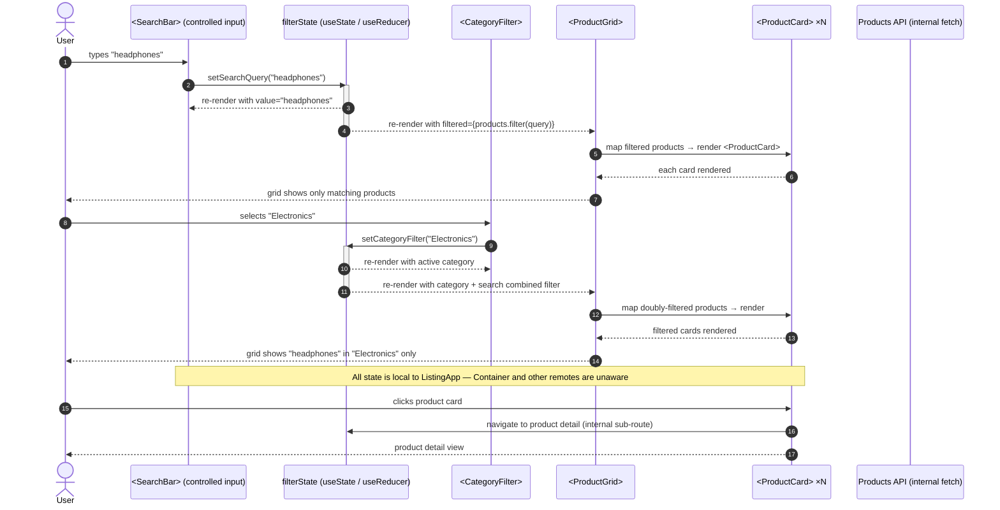

### Flow 3 — Layer Call Chain

```
User types in <SearchBar>
    │ onChange → setSearchQuery(value)
    ▼
filterState (useState in ListingApp or dedicated hook)
    │ derivedProducts = useMemo(() => products.filter(q, cat), [query, category])
    ▼
<ProductGrid products={filteredProducts} />
    │ map() → <ProductCard key={id} product={p} onAddToCart={handler} />
    ▼
<ProductCard> renders: image | name | price | "Add to Cart" button
    │
    ▼
User sees filtered product grid
```

### Flow 3 — State Colocation Rule

```
Listing MFE state boundary:
┌─────────────────────────────────────────────────────┐
│  <ListingApp>                                       │
│  ├── filterState: { query: "", category: "" }       │  
│  ├── <SearchBar>  ← reads + writes filterState      │
│  ├── <CategoryFilter> ← reads + writes filterState  │
│  └── <ProductGrid products={filtered}> ← reads only │
│       └── <ProductCard> ×N  ← props only, no state  │
└─────────────────────────────────────────────────────┘
         │
         │ ← NO state leaves this boundary
         │    (only cart events cross to Cart MFE — see Flow 4)
```

---

## Flow 4: Add to Cart — Cross-MFE Custom Event Bus

> **§4.2 Cart — Shopping Cart Micro-Frontend**  
> **Feature:** Decoupled cross-MFE communication via `window` Custom Events.  
> The user clicks "Add to Cart" inside the Listing MFE. Listing knows nothing about the Cart MFE's internal state or API. It fires a browser `CustomEvent` on `window`. The Cart MFE has registered a `window.addEventListener("cart:add", handler)` at mount. This event-driven model maintains strict MFE isolation — neither remote imports the other directly.

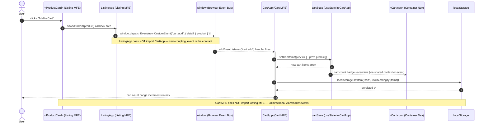

### Flow 4 — Layer Call Chain

```
User clicks "Add to Cart" in ProductCard (Listing MFE)
    │
    ▼
onAddToCart(product) — prop callback fires
    │
    ▼
window.dispatchEvent(new CustomEvent("cart:add", { detail: { product } }))
    │ ListingApp does NOT reference CartApp — zero import
    ▼
window event bubbles — CartApp's listener catches it
    │ registered at CartApp mount: window.addEventListener("cart:add", handler)
    ▼
CartApp: setCartItems([...prev, product])
    │ localStorage.setItem("cart", serialized items)
    ▼
CartIcon in Container nav re-renders with updated count
    │
    ▼
User sees cart badge increment immediately
```

### Flow 4 — Cross-MFE Communication Pattern Comparison

| Pattern | Coupling | Example in Flow 4 | Breaks If |
|---|---|---|---|
| Custom Event (used here) | Zero | `window.dispatchEvent / addEventListener` | Event name typo — fails silently at runtime |
| Shared Zustand store | Low (shared module) | `useCartStore()` in both MFEs | Shared module version mismatch |
| Props drilling via Container | Medium | Container passes `onAddToCart` as prop to both remotes | Container must know about both remotes |
| Direct MFE import | High | `import CartStore from "cart/store"` | Cart MFE deploy breaks Listing at runtime |
| Backend API as source of truth | None (async) | POST /api/cart/:userId | Network latency on every add-to-cart |

---

## Flow 5: Checkout Multi-Step Form Submission

> **§4.3 Checkout — Order Checkout Micro-Frontend**  
> **Feature:** Multi-step form progression with per-step validation, cart data handoff from Cart MFE via `localStorage`, and order submission.  
> The user navigates to `/checkout`. `CheckoutApp` reads the cart from `localStorage` (the Cart MFE's persistence layer). The form progresses through four sequential steps, each validated before advancing. On final submission, the order is posted to the Order API and the user is shown a confirmation screen. Navigation back to `/listing` is handled by `useNavigate()` — which resolves against the Container's router.

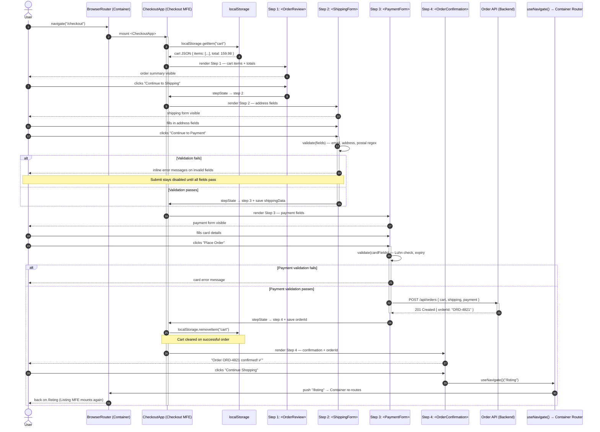

### Flow 5 — Layer Call Chain

```
User navigates to /checkout
    │
    ▼
BrowserRouter (Container) matches route
    │ React.lazy() fetches checkout remoteEntry.js if not yet loaded
    ▼
<CheckoutApp> mounts
    │ reads localStorage.getItem("cart") — Cart MFE's persisted state
    ▼
Step 1 — <OrderReview>:  display items + total  →  user confirms
    │
    ▼
Step 2 — <ShippingForm>: address fields + client-side validation
    │ validate(): regex per field → inline errors on blur
    │ all fields valid → advance
    ▼
Step 3 — <PaymentForm>:  card fields + Luhn check
    │ POST /api/orders → 201 Created { orderId }
    ▼
Step 4 — <OrderConfirmation>:  orderId displayed
    │ localStorage.removeItem("cart")
    │ useNavigate()("/listing")  → Container BrowserRouter routes back
    ▼
User returns to Listing MFE
```

### Flow 5 — Form Validation Sequence (Step 2 Detail)

```
User submits ShippingForm
    │
    ▼
validate(fields):
    ├── email: /^[^\s@]+@[^\s@]+\.[^\s@]+$/.test(email)   → ✅ or inline error
    ├── address: length >= 5                               → ✅ or inline error
    ├── city: non-empty                                    → ✅ or inline error
    └── postal: /^\d{5}(-\d{4})?$/.test(postal)           → ✅ or inline error
         │
         │ ALL pass?
         ▼
    setCurrentStep(3)
    setFormData(prev => ({ ...prev, shipping: fields }))
         │
         │ ANY fail?
         ▼
    setErrors({ email: "Invalid email format", ... })
    → inline messages rendered below each field
    → submit button stays disabled
```

---

## Flow 6: Shared Singleton Version Negotiation

> **§4.4 Shared Module Design**  
> **Feature:** Module Federation runtime shared scope negotiation — `singleton: true` enforcement across Container + all three remotes.  
> This flow shows the sequence the MF runtime executes when a second remote (e.g., `cart`) loads AFTER the Container has already sealed the shared scope with `react@18.2.0`. The runtime detects the already-registered singleton and reuses it — the Cart bundle ships without React/ReactDOM, saving ~1.1 MB of duplicate code.

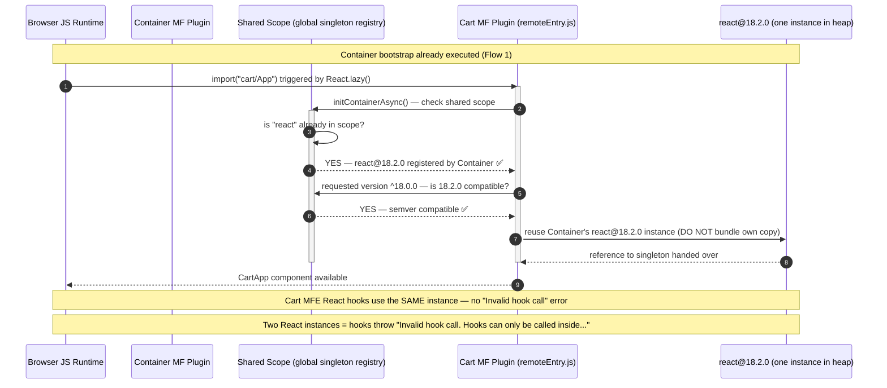

### Flow 6 — Singleton Resolution Outcomes

```
Scenario A — Happy path (both at 18.2.0, singleton: true):
┌─────────────────────────────────────────────────────────────────┐
│  Container seals scope: react@18.2.0                           │
│  Cart loads: requires react ^18.0.0                            │
│  → 18.2.0 satisfies ^18.0.0 → REUSE Container's instance      │
│  → Cart bundle: react NOT included → -130KB                    │
└─────────────────────────────────────────────────────────────────┘

Scenario B — Version mismatch (18.2.0 vs 18.3.0, singleton: true):
┌─────────────────────────────────────────────────────────────────┐
│  Container seals scope: react@18.2.0                           │
│  Cart loads: requires react@18.3.0 exactly                     │
│  → ^18.3.0 does NOT satisfy @18.2.0 (already locked)          │
│  → Warning logged: "Shared module is not available"            │
│  → MF falls back to Cart's own bundled react@18.3.0            │
│  → TWO React instances → hooks CRASH at runtime               │
└─────────────────────────────────────────────────────────────────┘

FIX: Use ^18.0.0 requiredVersion in all four MFEs' shared{} configs
     and align all package.json to the same minor version.
```

### Flow 6 — Shared Scope State Transitions

| Phase | Owner | Shared Scope State | react Instances in Heap |
|---|---|---|---|
| Before Container loads | — | Empty | 0 |
| Container `initContainerAsync()` | Container | `react@18.2.0` sealed | 1 |
| Listing loads (first remote) | Listing MF | Queries scope → reuses | 1 |
| Cart loads (second remote) | Cart MF | Queries scope → reuses | 1 |
| Checkout loads (third remote) | Checkout MF | Queries scope → reuses | 1 |
| All four MFEs active | All | Sealed at 18.2.0 | **1 (correct)** |
| Cart has `singleton: false` (broken) | Cart MF | Ignores scope — loads own | **2 (broken)** |

---

## Flow 7: Independent MFE Deploy + Container Auto-Discovery

> **§4.5 Infrastructure and Deployment**  
> **Feature:** Path-filtered CI/CD pipeline — a change to `listing/` triggers only the Listing pipeline. The Container never redeploys; it auto-discovers the new `remoteEntry.js` on the next user page load.  
> This is the core operational value of Micro-Frontend Architecture: **Teams ship independently.**

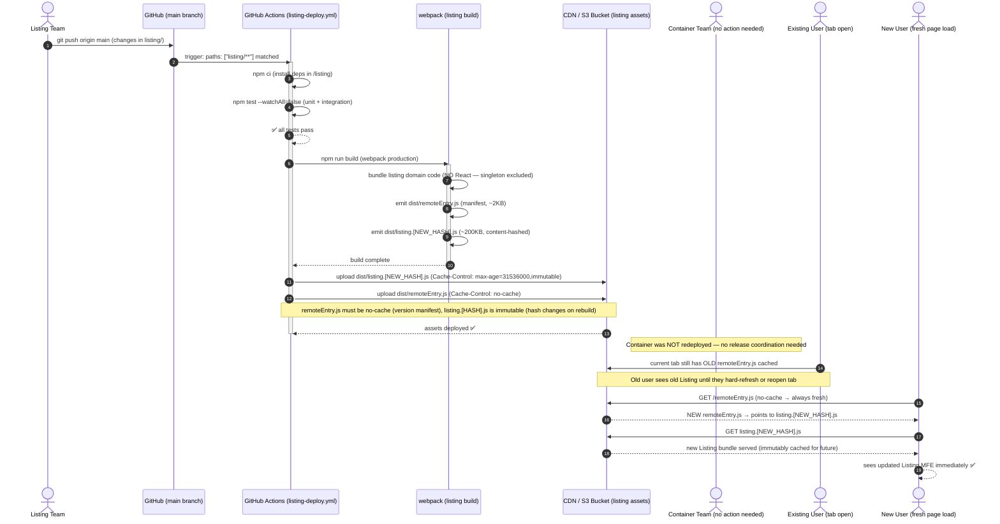

### Flow 7 — Layer Call Chain

```
Listing team git push → listing/ path filter matches CI
    │
    ▼
GitHub Actions: npm ci → npm test → npm run build
    │ Webpack output:
    │   dist/remoteEntry.js           (~2 KB manifest — NO-CACHE)
    │   dist/listing.[h4sh].js        (~200 KB domain bundle — IMMUTABLE)
    │   dist/vendors.[h4sh].js        (any non-shared 3rd party — IMMUTABLE)
    ▼
S3/CDN upload:
    │ remoteEntry.js      → Cache-Control: no-cache
    │ *.js (hashed)       → Cache-Control: max-age=31536000, immutable
    ▼
Container DOES NOT redeploy — no action
    ▼
Next user page load:
    │ Browser fetches remoteEntry.js (always fresh)
    │ remoteEntry.js points to new listing.[h4sh].js
    │ Browser fetches new bundle (or hits cache if hash unchanged)
    ▼
User sees new Listing features ✅
```

### Flow 7 — CDN Cache Strategy Reference

| Asset | Cache-Control | Reason |
|---|---|---|
| `remoteEntry.js` | `no-cache` | Version manifest — must always be current |
| `listing.[hash].js` | `max-age=31536000, immutable` | Content-hashed — hash changes on rebuild; safe to cache forever |
| `vendors.[hash].js` | `max-age=31536000, immutable` | Same — hash is deterministic from content |
| `index.html` (container) | `no-cache` | Entry point — must always serve latest container shell |

---

## Flow 8: Test Execution — Unit → Contract → E2E

> **§4.6 Testing Strategy**  
> **Feature:** Full test pyramid execution — from sub-second unit tests through Module Federation contract validation to full cross-MFE Playwright E2E.  
> Each layer of the test pyramid provides a distinct quality signal. The layers run in increasing cost and decreasing frequency: unit on every file save, contract on every PR, full E2E nightly.

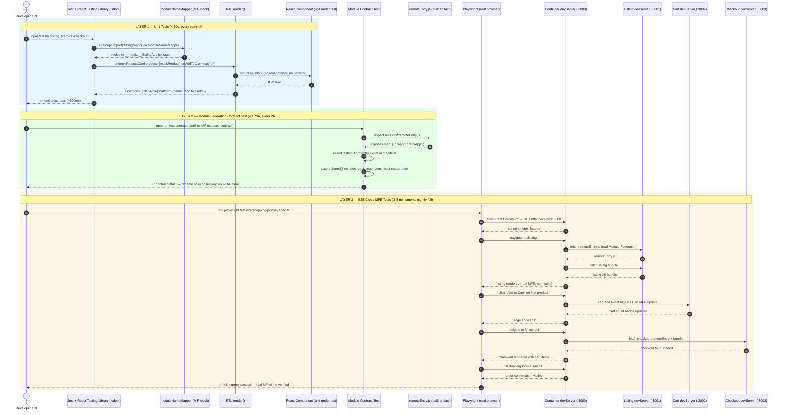

### Flow 8 — Layer Call Chain

```
UNIT LAYER (every commit):
Jest + RTL in jsdom
    │ moduleNameMapper mocks all Module Federation imports
    │ render(<ProductCard>) → assert DOM output, event handlers
    │ render(<CartApp>) with mock items → assert totals
    │ render(<CheckoutApp>) with mock cart → assert step transitions
    ▼ Pass: < 30 seconds

CONTRACT LAYER (every PR):
Contract test reads built remoteEntry.js
    │ assert exposes["./App"] exists
    │ assert shared[] singletons declared
    ▼ Pass: < 60 seconds — catches exposes key renames before they reach production

E2E LAYER (smoke every PR, full nightly):
Playwright with real devServers on :3000/:3001/:3002/:3003
    │ Real Module Federation wiring (no mocks)
    │ browse → add-to-cart → checkout → confirm
    ▼ Pass: 2–5 min smoke | 10–20 min full
```

### Flow 8 — Test Isolation Matrix

| What is tested | Tool | Module Federation | Network calls | Speed |
|---|---|---|---|---|
| `<ProductCard>` renders correctly | Jest + RTL | Mocked (`moduleNameMapper`) | Mocked (MSW) | ~50ms |
| Listing standalone app flow | Jest + RTL | Not needed (direct import) | Mocked (MSW) | ~500ms |
| `remoteEntry.js` exposes correct keys | Contract test | Real built artifact | None | ~5s |
| Container loads all 3 remotes at routes | Playwright | REAL (devServer) | Real / MSW | ~30s |
| Full shopping journey (browse→cart→checkout) | Playwright | REAL (devServer) | Real / stub API | ~60s |
| Cart count persists across navigation | Playwright | REAL (devServer) | Real / localStorage | ~20s |

### Flow 8 — Quality Engineer's Test Pyramid Ratios

```
                        /\
                       /  \    10% — E2E (Playwright)
                      / E2E\   Full journey, real MF wiring
                     /──────\
                    /        \  20% — Integration / Contract
                   / Contract \  remoteEntry contract + standalone MFE
                  /────────────\
                 /              \
                /   Unit Tests   \  70% — Unit (Jest + RTL)
               /  (per component) \  Pure component, no MF, no network
              /────────────────────\

Principal QE Rule:
  An inverted pyramid (mostly E2E) → brittle, slow CI pipeline.
  A missing contract layer → exposes key renames silently break production.
  A missing unit base → component regressions caught too late = expensive.
```

---

*Generated 2026-03-06 · Principal architect and quality engineer analysis of `Micro-Frontend Architecture with React` (React 18 · Webpack Module Federation · Tailwind CSS · React Router DOM · Playwright · Jest · React Testing Library)*
